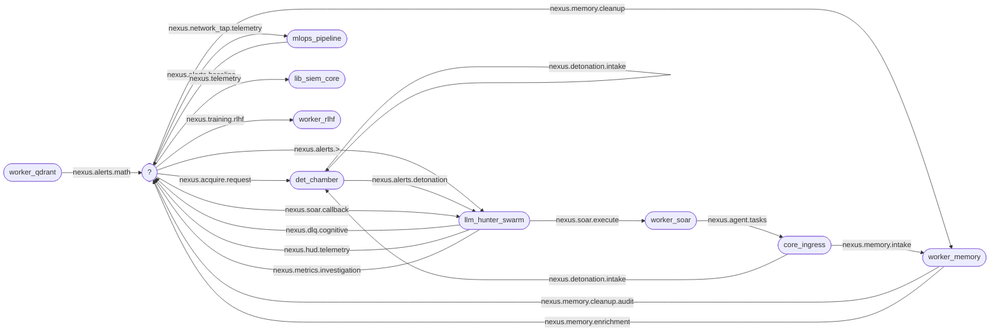

# Code Graph - how Sentinel Nexus is wired together

> **Generated** from source by `gen_code_graph.py` (do not edit by hand; `--check` drift-guards it in CI). Machine-readable twin: `code_graph.json`.

## How to use this

Start a change by finding the **logic flow**, not the file. This repo is event-driven across Python + Rust, so the fastest trace is the **NATS subject bus** below: pick the subject your change touches -> see who *publishes* and who *consumes* it -> that is the call chain across services. Then drill in:

- **Subjects** - every event, its producers/consumers/stream.
- **HTTP endpoints** - synchronous service<->caller edges (`/api/*`).
- **Stores** - which components read/write each S3 bucket / Qdrant collection.
- **Component index** - per service: build (Dockerfile), deploy (Ansible role @ host), test section, Rust crate deps, and how many GRC controls it carries.
- **GRC controls** - control -> implementing components -> the tests that prove it.
- **Infrastructure inventory** - Ansible roles, Terraform resources, config files.
- **Pipelines** - the ordered `deploy` and `mlops` stages.
- **Python imports** - intra-repo call chains in the Python planes.

`code_graph.json` is the same data for `jq`/grep.

## NATS subject bus (the nervous system)

## Subjects

| Subject | Producers | Consumers | Stream | Also mentions |
|---|---|---|---|---|
| `$2` | - | - | $1 | - |
| `middleware.dlq.>` | - | - | MiddlewareStream_DLQ | nats_streams |
| `middleware.telemetry.*` | - | - | MiddlewareStream | nats_streams |
| `nexus.*.telemetry` | - | - | Tier5_Telemetry | nats_streams, worker_s3_archive |
| `nexus.acquire.request` | - | det_chamber | Nexus_Acquire_Request | llm_hunter_swarm, nats_streams |
| `nexus.agent.tasks` | worker_soar | core_ingress | - | - |
| `nexus.alerts.>` | - | llm_hunter_swarm | - | - |
| `nexus.alerts.baseline` | mlops_pipeline | - | Nexus_Baseline_Alerts | nats_streams |
| `nexus.alerts.detonation` | det_chamber | llm_hunter_swarm | Nexus_Alerts_Detonation | nats_streams |
| `nexus.alerts.math` | worker_qdrant | - | Nexus_Math_Alerts | nats_streams |
| `nexus.c2.telemetry` | - | - | - | mlops_pipeline |
| `nexus.deepsensor.telemetry` | - | - | - | mlops_pipeline |
| `nexus.detonation.intake` | core_ingress, det_chamber | det_chamber | Nexus_Detonation_Intake | nats_streams |
| `nexus.dlq` | - | - | - | lib_siem_core, worker_rlhf, worker_s3_archive |
| `nexus.dlq.>` | - | - | Nexus_DLQ | nats_streams |
| `nexus.dlq.cognitive` | llm_hunter_swarm | - | - | - |
| `nexus.hud.telemetry` | llm_hunter_swarm | - | - | - |
| `nexus.macos.telemetry` | - | - | - | mlops_pipeline |
| `nexus.memory.cleanup` | - | worker_memory | - | - |
| `nexus.memory.cleanup.audit` | worker_memory | - | - | - |
| `nexus.memory.enrichment` | worker_memory | - | Nexus_Memory_Enrichment | nats_streams |
| `nexus.memory.intake` | core_ingress | worker_memory | Nexus_Memory_Intake | nats_streams |
| `nexus.metrics.investigation` | llm_hunter_swarm | - | Nexus_Metrics_Investigation | nats_streams |
| `nexus.network_tap.telemetry` | - | mlops_pipeline | - | - |
| `nexus.pyrit` | - | - | - | mlops_pipeline |
| `nexus.rsi` | - | - | - | mlops_pipeline |
| `nexus.sensor.telemetry` | - | - | - | mlops_pipeline |
| `nexus.sentinel.telemetry` | - | - | - | mlops_pipeline |
| `nexus.soar.callback` | - | llm_hunter_swarm | Nexus_SOAR_Callback | nats_streams |
| `nexus.soar.execute` | llm_hunter_swarm | worker_soar | Nexus_SOAR_Execute | nats_streams |
| `nexus.telemetry` | - | lib_siem_core | - | - |
| `nexus.ti.status` | - | - | - | worker_ti_ingest |
| `nexus.training.rlhf` | - | worker_rlhf | - | - |
| `nexus.training.rlhf.judge_scores` | - | - | - | mlops_pipeline |
| `nexus.training.rlhf.records` | - | - | Nexus_RLHF_Training | nats_streams, worker_rlhf |
| `nexus.trellix.telemetry` | - | - | - | mlops_pipeline |

## HTTP endpoints (service <-> caller)

| Endpoint | Service | Methods | Callers |
|---|---|---|---|
| `/api/v1/artifact` | core_ingress | post | det_chamber |
| `/api/v1/evidence` | core_ingress | post | nats_streams, worker_memory |
| `/api/v1/tasks` | core_ingress | get | det_chamber, on_host_agent, worker_soar |
| `/api/v1/telemetry` | core_ingress | post | middleware |

## Stores (who touches each S3 bucket / Qdrant collection)

| Store | Kind | Touched by |
|---|---|---|
| `qdrant_swarm_memory` | qdrant | llm_hunter_swarm |
| `qdrant_ti_corpus` | qdrant | looking_glass, worker_ti_ingest |
| `s3_cold_archive` | s3 | llm_hunter_swarm, worker_s3_archive |
| `s3_memory_evidence` | s3 | core_ingress, worker_memory |
| `s3_quarantine` | s3 | det_chamber |

## Component index

Each component: language, how it's **built** (Dockerfile), **deployed** (Ansible role + host group), **tested** (run_tests.sh section), and the subjects it speaks.

| Component | Lang | Build | Deploy (role @ host) | Test section | Pub -> Sub | Crate deps | Controls | Files |
|---|---|---|---|---|---|---|---|---|
| **core_ingress** | rust | services/core_ingress/Dockerfile | rust_ingress @ ingress | services | 2->1 | - | 1 | 2 |
| **det_chamber** | python | det_chamber/agents/Dockerfile | - | detchamber | 2->2 | - | 0 | 14 |
| **ir_playbooks** | mixed | operations/playbooks/Dockerfile | - | services | 0->0 | - | 0 | 410 |
| **lib_siem_core** | rust | libs/lib_siem_core/Dockerfile | - | services | 0->1 | - | 2 | 2 |
| **llm_hunter_swarm** | python | analytics/llm_hunter/Dockerfile | nexus_hunter @ analytics | analytics | 4->3 | - | 25 | 39 |
| **looking_glass** | svelte-ts | services/looking_glass/Dockerfile | - | services | 0->0 | - | 0 | 4 |
| **middleware** | rust | middleware/src/Dockerfile | - | services | 0->0 | - | 0 | 6 |
| **mlops_pipeline** | python | mlops/scripts/Dockerfile | - | offline | 1->1 | - | 2 | 52 |
| **nats_streams** | shell | infrastructure/nats/Dockerfile | - | services | 0->0 | - | 0 | 1 |
| **on_host_agent** | python | operations/agent/Dockerfile | - | services | 0->0 | - | 0 | 2 |
| **worker_elastic** | rust | middleware/src/Dockerfile | - | services | 0->0 | lib_etl, lib_middleware | 0 | 1 |
| **worker_memory** | python | services/worker_memory/Dockerfile | memory_worker @ analytics | memory | 2->2 | - | 0 | 3 |
| **worker_nexus** | rust | middleware/src/Dockerfile | - | services | 0->0 | lib_middleware | 0 | 1 |
| **worker_qdrant** | rust | services/worker_qdrant/Dockerfile | rust_podman_worker @ workers | services | 1->0 | lib_siem_core | 0 | 1 |
| **worker_rlhf** | rust | services/worker_rlhf/Dockerfile | rust_podman_worker @ workers | services | 0->1 | lib_siem_core | 1 | 1 |
| **worker_rules** | rust | services/worker_rules/Dockerfile | rust_podman_worker @ workers | services | 0->0 | lib_siem_core | 0 | 1 |
| **worker_s3_archive** | rust | services/worker_s3_archive/Dockerfile | rust_podman_worker @ workers | services | 0->0 | - | 0 | 1 |
| **worker_soar** | rust | services/worker_soar/Dockerfile | rust_podman_worker @ workers | services | 1->1 | lib_siem_core | 1 | 2 |
| **worker_splunk** | rust | middleware/src/Dockerfile | - | services | 0->0 | lib_etl, lib_middleware | 0 | 1 |
| **worker_sql** | rust | middleware/src/Dockerfile | - | services | 0->0 | lib_etl, lib_middleware | 0 | 1 |
| **worker_ti_ingest** | python | services/worker_ti_ingest/Dockerfile | ti_ingest_worker @ ti | mlops | 0->0 | - | 0 | 4 |

## GRC controls -> components + tests

Joins the governance dossier into the graph: each control's implementing components and the tests that prove it.

| Control | Status | Components | Tests |
|---|---|---|---|
| `AI-GROUNDING` | implemented | llm_hunter_swarm | tests/lab_governance/test_ai_controls.py::TestGroundingEnforcement |
| `AI-MEMORY-TTL` | implemented | llm_hunter_swarm | tests/lab_governance/test_ai_controls.py::TestMemoryTTL |
| `AI-PROVENANCE` | implemented | llm_hunter_swarm | tests/lab_governance/test_ai_controls.py::TestProvenanceDisclosure |
| `AI-REVIEW-BOARD` | implemented | llm_hunter_swarm | tests/lab_analytics_hunter/test_review_board.py, tests/lab_analytics_hunter/test_review_board_simulation.py |
| `IAC-HARDENING` | implemented | - | infrastructure/tests/test_infrastructure.py |
| `ING-DLQ-BREAKER` | implemented | lib_siem_core | tests/test_worker_contracts.py |
| `ING-ZERO-TRUST` | implemented | core_ingress | tests/test_worker_contracts.py |
| `NC-1-BIAS-AUDIT` | implemented | llm_hunter_swarm | tests/lab_governance/test_nist_controls_wave2.py::TestBiasAudit |
| `NC-10-VERDICT-LINEAGE` | implemented | llm_hunter_swarm | tests/lab_governance/test_ai_controls.py::TestVerdictLineage, tests/lab_governance/test_nist_controls_wave4.py::TestVerdictLedger |
| `NC-11-ENERGY-ACCOUNTING` | implemented | llm_hunter_swarm | tests/lab_governance/test_ai_controls.py::TestInferenceEnergy, tests/lab_governance/test_nist_controls_wave4.py::TestEnergyAccounting |
| `NC-2-CALIBRATION` | implemented | llm_hunter_swarm | tests/lab_governance/test_nist_controls_wave2.py::TestCalibrationLedger |
| `NC-3-FRONTIER-PIN` | implemented | llm_hunter_swarm | tests/lab_governance/test_nist_controls_wave2.py::TestFrontierPinEnforcement |
| `NC-4-RETENTION` | documented | - | - |
| `NC-6-ENERGY` | documented | - | - |
| `NC-7-ENDPOINT-ABUSE` | implemented | llm_hunter_swarm | tests/lab_governance/test_ai_controls.py::TestEndpointQuota, tests/lab_governance/test_ai_controls.py::TestVolumeAnomaly, tests/lab_governance/test_ai_controls.py::TestMembershipInferenceSignal, tests/lab_governance/test_ai_controls.py::TestEndpointAbuseReport, tests/lab_governance/test_nist_controls_wave4.py::TestEndpointAbuseMonitor |
| `NC-8-OVER-RELIANCE` | implemented | llm_hunter_swarm | tests/lab_governance/test_ai_controls.py::TestOverReliance, tests/lab_governance/test_nist_controls_wave4.py::TestRelianceLedger |
| `NC-9-ACTIVE-LEARNING` | implemented | llm_hunter_swarm | tests/lab_governance/test_ai_controls.py::TestActiveLearningFailure, tests/lab_governance/test_nist_controls_wave4.py::TestActiveLearning |
| `SEC-BLAST-RADIUS` | implemented | llm_hunter_swarm | tests/lab_analytics_hunter/test_hunter_contracts.py |
| `SEC-CANARY` | implemented | llm_hunter_swarm | tests/lab_agentic_swarm/test_agentic_swarm_contracts.py |
| `SEC-DLP-EGRESS` | implemented | llm_hunter_swarm | tests/lab_redteam/test_cognitive_bypass.py |
| `SEC-DUCKDB-SANDBOX` | implemented | llm_hunter_swarm | tests/lab_analytics_hunter/test_query_cookbook.py |
| `SEC-ENDPOINT-ID` | implemented | lib_siem_core | tests/test_worker_contracts.py |
| `SEC-FAILOVER` | implemented | llm_hunter_swarm | tests/test_worker_contracts.py |
| `SEC-IDEMPOTENT-SOAR` | implemented | llm_hunter_swarm, worker_soar | tests/lab_agentic_swarm/test_agentic_swarm_contracts.py |
| `SEC-MODEL-DOS` | implemented | llm_hunter_swarm | tests/lab_agentic_swarm/test_agentic_swarm_contracts.py |
| `SEC-OUTPUT-SCHEMA` | implemented | llm_hunter_swarm | tests/lab_agentic_swarm/test_agentic_swarm_contracts.py |
| `SEC-REGRESSION-GATE` | implemented | mlops_pipeline | tests/lab_mlops_serving/test_mlops_serving.py |
| `SEC-RLHF-QUARANTINE` | implemented | worker_rlhf | tests/test_worker_contracts.py |
| `SEC-SANITIZER` | implemented | llm_hunter_swarm | tests/lab_redteam/test_cognitive_bypass.py |
| `SEC-SUPPLY-CHAIN` | implemented | - | tests/lab_mlops_serving/test_mlops_serving.py |
| `SEC-TRAINING-HYGIENE` | implemented | mlops_pipeline | tests/lab_mlops_serving/test_mlops_serving.py |
| `SEC-VECTOR-DIM` | implemented | llm_hunter_swarm | tests/lab_analytics_hunter/test_hunter_contracts.py |
| `SIEM-CONFIG-CONTRACT` | implemented | llm_hunter_swarm | tests/lab_analytics_hunter/test_siem_config.py |
| `SIEM-COUNTERPART-DISPROOF` | implemented | llm_hunter_swarm | tests/lab_analytics_hunter/test_siem_review_board.py |
| `SIEM-E2E` | implemented | - | tests/lab_siem_federation/test_siem_federation_e2e.py |
| `SIEM-TOOL-GUARD` | implemented | llm_hunter_swarm | tests/lab_analytics_hunter/test_siem_query.py |

## Infrastructure inventory

**Ansible roles** (20): `bare_metal_base`, `common_hardening`, `det_chamber_linux`, `det_chamber_sandbox`, `gpu_inference`, `haproxy_node`, `internal_networking`, `looking_glass`, `memory_worker`, `minio_node`, `nats_node`, `nexus_hunter`, `observability_node`, `opencti_node`, `podman_setup`, `qdrant_node`, `redis_node`, `rust_ingress`, `rust_podman_worker`, `ti_ingest_worker`

**Terraform resources** (66):

| Type | Name |
|---|---|
| `aws_cloudwatch_event_rule` | guardduty_auto_respond |
| `aws_cloudwatch_event_target` | guardduty_lambda |
| `aws_cloudwatch_log_group` | block_ip |
| `aws_cloudwatch_log_group` | isolate |
| `aws_iam_instance_profile` | worker_profile |
| `aws_iam_policy` | lambda_containment |
| `aws_iam_policy` | s3_archive_policy |
| `aws_iam_role` | lambda_containment |
| `aws_iam_role` | worker_role |
| `aws_iam_role_policy_attachment` | lambda_containment |
| `aws_iam_role_policy_attachment` | worker_s3_attach |
| `aws_instance` | analytics_nodes |
| `aws_instance` | ingress_nodes |
| `aws_instance` | management_node |
| `aws_instance` | nats_nodes |
| `aws_instance` | qdrant_nodes |
| `aws_instance` | redis_nodes |
| `aws_instance` | worker_nodes |
| `aws_key_pair` | nexus_admin |
| `aws_kms_key` | eks_secrets |
| `aws_kms_key` | memory_evidence |
| `aws_kms_key` | quarantine |
| `aws_lambda_function` | aws_block_ip |
| `aws_lambda_function` | aws_isolate |
| `aws_lambda_function_url` | aws_block_ip |
| `aws_lambda_function_url` | aws_isolate |
| `aws_lambda_permission` | allow_eventbridge_isolate |
| `aws_security_group` | external_ingress |
| `aws_security_group` | internal_mesh |
| `aws_ssm_parameter` | hmac_secret |
| `aws_ssm_parameter` | n8n_callback_url |
| `azurerm_automation_account` | nexus |
| `azurerm_automation_runbook` | nsg_isolation |
| `azurerm_automation_webhook` | nsg_isolation |
| `azurerm_resource_group` | containment |
| `azurerm_resource_group` | evidence |
| `azurerm_role_assignment` | automation_network_contributor |
| `azurerm_storage_account` | evidence |
| `azurerm_storage_container` | evidence |
| `azurerm_storage_container_immutability_policy` | evidence |
| `google_cloudfunctions_function` | gcp_isolate |
| `google_cloudfunctions_function_iam_member` | invoker |
| `google_project_iam_member` | containment_compute_admin |
| `google_project_iam_member` | containment_storage_admin |
| `google_service_account` | containment |
| `google_storage_bucket` | evidence |
| `google_storage_bucket` | function_source |
| `google_storage_bucket_object` | function_source |
| `hyperv_vhd` | cuckoo_vhd |
| `hyperv_vhd` | detchamber_windows_sandbox_vhd |
| `hyperv_vm_instance` | cuckoo_vm |
| `hyperv_vm_instance` | detchamber_windows_sandbox_vm |
| `libvirt_domain` | linux_sandbox |
| `libvirt_network` | detchamber_isolated |
| `libvirt_volume` | linux_sandbox |
| `vsphere_folder` | nexus_folder |
| `vsphere_virtual_machine` | analytics_node |
| `vsphere_virtual_machine` | cuckoo_vm |
| `vsphere_virtual_machine` | detchamber_windows_sandbox_vm |
| `vsphere_virtual_machine` | ingress_nodes |
| `vsphere_virtual_machine` | management_node |
| `vsphere_virtual_machine` | nats_nodes |
| `vsphere_virtual_machine` | qdrant_nodes |
| `vsphere_virtual_machine` | redis_nodes |
| `vsphere_virtual_machine` | storage_node |
| `vsphere_virtual_machine` | worker_nodes |

**Config files** (13): `infrastructure/ansible/ansible.cfg`, `infrastructure/ansible/roles/common_hardening/templates/sshd_hardening.conf.j2`, `infrastructure/ansible/roles/common_hardening/templates/sysctl_hardening.conf.j2`, `infrastructure/ansible/roles/nats_node/templates/nats-server-bare-metal.conf.j2`, `infrastructure/ansible/roles/nats_node/templates/nats-server.conf.j2`, `infrastructure/ansible/roles/opencti_node/files/rabbitmq.conf`, `infrastructure/ansible/roles/redis_node/templates/redis.conf.j2`, `infrastructure/ansible/roles/redis_node/templates/sentinel.conf.j2`, `infrastructure/haproxy/haproxy.cfg`, `infrastructure/haproxy/haproxy.cfg.j2`, `infrastructure/nats/nats-server.conf`, `infrastructure/redis/redis.conf.j2`, `infrastructure/redis/sentinel.conf.j2`

## Containment capability matrix

Tailored containment actions the swarm may plan per target class + environment - the contract that keeps the planner and executors in sync.

| Target class | Environment | Action | Executor |
|---|---|---|---|
| cloud_instance | aws | `isolate_host` | aws_containment_v1 |
| cloud_instance | aws | `release_host` | aws_containment_v1 |
| cloud_instance | aws | `revoke_instance_role` | aws_containment_v1 |
| cloud_instance | aws | `snapshot_volume` | aws_containment_v1 |
| cloud_instance | azure | `isolate_host` | azure_containment_v1 |
| cloud_instance | azure | `release_host` | azure_containment_v1 |
| cloud_instance | gcp | `isolate_host` | gcp_containment_v1 |
| cloud_instance | gcp | `release_host` | gcp_containment_v1 |
| cloud_instance | gcp | `snapshot_volume` | gcp_containment_v1 |
| container | k8s | `cordon_node` | k8s_containment_v1 |
| container | k8s | `kill_pod` | k8s_containment_v1 |
| container | k8s | `quarantine_container` | k8s_containment_v1 |
| container | k8s | `uncordon_node` | k8s_containment_v1 |
| endpoint | linux | `block_ip` | agent_task_v1 |
| endpoint | linux | `collect_forensics` | agent_task_v1 |
| endpoint | linux | `eradicate_persistence` | agent_task_v1 |
| endpoint | linux | `eradicate_process` | agent_task_v1 |
| endpoint | linux | `isolate_host` | agent_task_v1 |
| endpoint | linux | `restore` | agent_task_v1 |
| endpoint | windows | `block_ip` | agent_task_v1 |
| endpoint | windows | `collect_forensics` | agent_task_v1 |
| endpoint | windows | `eradicate_persistence` | agent_task_v1 |
| endpoint | windows | `eradicate_process` | agent_task_v1 |
| endpoint | windows | `isolate_host` | agent_task_v1 |
| endpoint | windows | `restore` | agent_task_v1 |
| identity | entra | `disable_user` | idp_containment_v1 |
| identity | entra | `enable_user` | idp_containment_v1 |
| identity | entra | `revoke_sessions` | idp_containment_v1 |
| identity | gcp | `disable_user` | idp_containment_v1 |
| identity | gcp | `enable_user` | idp_containment_v1 |
| identity | gcp | `revoke_sessions` | idp_containment_v1 |
| identity | iam | `disable_user` | idp_containment_v1 |
| identity | iam | `enable_user` | idp_containment_v1 |
| identity | iam | `revoke_sessions` | idp_containment_v1 |
| identity | local | `disable_user` | idp_containment_v1 |
| identity | local | `enable_user` | idp_containment_v1 |
| identity | local | `revoke_sessions` | idp_containment_v1 |
| network | aws | `block_ip` | aws_containment_v1 |
| network | aws | `dns_sinkhole` | dns_containment_v1 |
| network | aws | `unblock_ip` | aws_containment_v1 |
| network | aws | `unsinkhole` | dns_containment_v1 |
| network | azure | `block_ip` | azure_containment_v1 |
| network | azure | `dns_sinkhole` | dns_containment_v1 |
| network | azure | `unblock_ip` | azure_containment_v1 |
| network | azure | `unsinkhole` | dns_containment_v1 |
| network | gcp | `block_ip` | gcp_containment_v1 |
| network | gcp | `dns_sinkhole` | dns_containment_v1 |
| network | gcp | `unblock_ip` | gcp_containment_v1 |
| network | gcp | `unsinkhole` | dns_containment_v1 |
| network | onprem | `block_ip` | custom_fw_v1 |
| network | onprem | `dns_sinkhole` | dns_containment_v1 |
| network | onprem | `unblock_ip` | custom_fw_v1 |
| network | onprem | `unsinkhole` | dns_containment_v1 |

## Pipelines (ordered stages)

End-to-end flows run as numbered scripts: `deploy` (orchestration) and `mlops` (train -> eval -> serve -> RSI -> benchmark).

### deploy

| Stage | Script | Purpose |
|---|---|---|
| 01 | `render-templates` | Stage 1: Render Jinja2 templates using the environment YAML. |
| 02 | `provision-infra` | Stage 2: Provision infrastructure via Terraform, then build the Ansible inventory |
| 02b | `build-inventory` | Bridge: Terraform outputs + environment YAML → Ansible inventory.yml |
| 03 | `harden-os` | Stage 3: OS hardening across all provisioned hosts (Layer 0). |
| 04 | `deploy-core` | Stage 4: Deploy core infrastructure — NATS, Redis, Qdrant, MinIO, Rust workers, |
| 05 | `deploy-middleware` | Stage 5: Deploy the Zero-Trust Middleware layer (Layer 1.5). |
| 06 | `trigger-mlops` | Stage 6: Sovereign MLOps Training Pipeline |
| 07 | `deploy-inference` | Stage 7: Deploy Trained Models to Inference Nodes |
| 07b | `deploy-detchamber` | Stage 7b: Deploy the Det Chamber (live acquisition & detonation) |

### mlops

| Stage | Script | Purpose |
|---|---|---|
| 01 | `spool_datasets` | 01_spool_datasets.py — Multi-Track Dataset Spooler for Sovereign MLOps |
| 02 | `train_dpo_critic` | 02_train_dpo_critic.py — Model D: SOAR Critic (DPO/IPO Alignment) |
| 02 | `train_network` | 02_train_network.py — Model B: Network Adversarial (QLoRA + Dual-Track Curriculum) |
| 02 | `train_qlora` | 02_train_qlora.py — Model C: Spatial Endpoint (QLoRA + Multi-Head Projector) |
| 02 | `train_sft_cot` | 02_train_sft_cot.py -- Chain-of-Thought SFT with Response Masking |
| 03 | `eval_critic` | 03_eval_critic.py — Model D: SOAR Critic Evaluation Suite |
| 03 | `eval_model` | 03_eval_model.py — Model C: Spatial Endpoint Evaluation Suite |
| 03 | `eval_network` | 03_eval_network.py — Model B: Network Adversarial Evaluation Suite |
| 03 | `eval_pyrit` | 03_eval_pyrit.py — ADDON Phase 2: PyRIT Multi-Turn Attack Orchestrator |
| 04 | `merge_weights` | - |
| 04 | `reward_model` | 04_reward_model.py — Reward Model Training + LLM-as-Judge Evaluation |
| 05 | `critic_loop` | 05_critic_loop.py -- Generator→NeMo schema check→Critic→Regenerate cycle (Phase 2.3) |
| 05 | `mine_cloud_fps` | 05_mine_cloud_fps.py — Cloud False-Positive Mining Pipeline (M-17 SKELETON) |
| 05 | `serve_critic` | 05_serve_critic.py — Model D: SOAR Critic (Blast Radius Evaluator) |
| 05 | `serve_network` | 05_serve_network.py — Model B: Network Adversarial Pattern Classifier |
| 05 | `serve_sovereign` | 05_serve_sovereign.py — Model C: Spatial Endpoint Expert Inference Server |
| 05 | `synthetic_data_gen` | 05_synthetic_data_gen.py — Synthetic Hard Negative Generation + Validation |
| 06 | `sandbox_runner` | 06_sandbox_runner.py — Firecracker micro-VM atomic execution runner (PIPELINE Phase 1) |
| 07 | `feed_ingest` | 07_feed_ingest.py — Continuous threat feed pipeline (PIPELINE Phase 1) |
| 08 | `rsi_loop` | 08_rsi_loop.py -- ADDON Phase 4: Closed-Loop Recursive Self-Improvement |
| 09 | `benchmark_runner` | 09_benchmark_runner.py — WS-A M-26 benchmark runner + registry. |
| 10 | `freeze_replay_case` | 10_freeze_replay_case.py - freeze closed investigations into replay bench cases. |
| 11 | `join_outcomes` | 11_join_outcomes.py — WS-A M-27 delayed-ground-truth join. |

## Python intra-repo imports

Module -> local modules it imports (call-chain within the Python planes).

- `analytics/llm_hunter/agents/__init__.py` -> `agents.cloud_expert`, `agents.host_expert`, `agents.net_expert`, `agents.nettap_expert`, `agents.response`, `agents.review_board`, `agents.supervisor`
- `analytics/llm_hunter/agents/active_learning.py` -> `agents.controls`
- `analytics/llm_hunter/agents/bias_audit.py` -> `agents.controls`
- `analytics/llm_hunter/agents/calibration_ledger.py` -> `agents.controls`
- `analytics/llm_hunter/agents/cloud_expert.py` -> `agents.expert_base`, `state`, `tools`, `tools.query_cookbook`, `tools.siem_cookbook`
- `analytics/llm_hunter/agents/containment_protocol.py` -> `agents.containment_capability`, `agents.lateral_movement`, `agents.playbook_planner`, `agents.target_class`
- `analytics/llm_hunter/agents/endpoint_abuse_monitor.py` -> `agents.controls`
- `analytics/llm_hunter/agents/energy_accounting.py` -> `agents.controls`
- `analytics/llm_hunter/agents/expert_base.py` -> `agents.llm_providers`, `tools.sanitizer`
- `analytics/llm_hunter/agents/host_expert.py` -> `agents.expert_base`, `state`, `tools`, `tools.query_cookbook`, `tools.siem_cookbook`
- `analytics/llm_hunter/agents/llm_providers.py` -> `agents.controls`, `tools.nexus_config`
- `analytics/llm_hunter/agents/net_expert.py` -> `agents.expert_base`, `state`, `tools`, `tools.query_cookbook`, `tools.siem_cookbook`
- `analytics/llm_hunter/agents/nettap_expert.py` -> `agents.expert_base`, `state`, `tools`, `tools.query_cookbook`, `tools.siem_cookbook`
- `analytics/llm_hunter/agents/response.py` -> `agents.active_learning`, `agents.containment_protocol`, `agents.controls`, `agents.energy_accounting`, `agents.llm_providers`, `agents.playbook_planner`, `agents.verdict_ledger`, `state`, `tools.sanitizer`
- `analytics/llm_hunter/agents/review_board.py` -> `agents.controls`, `agents.llm_providers`, `state`, `tools.nexus_config`, `tools.siem_query`
- `analytics/llm_hunter/agents/scheduled_audits.py` -> `agents`
- `analytics/llm_hunter/agents/supervisor.py` -> `agents.controls`, `agents.llm_providers`, `state`, `tools.nexus_config`
- `analytics/llm_hunter/agents/target_class.py` -> `agents.lateral_movement`
- `analytics/llm_hunter/agents/verdict_ledger.py` -> `agents.controls`
- `analytics/llm_hunter/orchestrator.py` -> `agents.cloud_expert`, `agents.host_expert`, `agents.net_expert`, `agents.nettap_expert`, `agents.response`, `agents.review_board`, `agents.supervisor`, `detonation_enrichment`, `investigation_metrics`, `state`, `tools.sanitizer`
- `analytics/llm_hunter/tools/__init__.py` -> `tools.acquire_detonate`, `tools.duckdb_query`, `tools.entity_manager`, `tools.nexus_config`, `tools.qdrant_search`, `tools.sanitizer`, `tools.siem_query`, `tools.ti_lookup`
- `analytics/llm_hunter/tools/acquire_detonate.py` -> `state`
- `analytics/llm_hunter/tools/duckdb_query.py` -> `tools.nexus_config`, `tools.sanitizer`
- `analytics/llm_hunter/tools/qdrant_search.py` -> `tools.sanitizer`
- `analytics/llm_hunter/tools/siem_cookbook.py` -> `tools.nexus_config`, `tools.siem_query`
- `analytics/llm_hunter/tools/siem_query.py` -> `tools.nexus_config`, `tools.sanitizer`
- `analytics/llm_hunter/tools/ti_lookup.py` -> `tools.nexus_config`, `tools.sanitizer`
- `mlops/scripts/01_spool_datasets.py` -> `corpus_utils`
- `mlops/scripts/02_train_dpo_critic.py` -> `model_config`
- `mlops/scripts/02_train_network.py` -> `model_config`
- `mlops/scripts/02_train_qlora.py` -> `model_config`
- `mlops/scripts/02_train_sft_cot.py` -> `model_config`
- `mlops/scripts/03_eval_critic.py` -> `model_config`
- `mlops/scripts/03_eval_model.py` -> `model_config`
- `mlops/scripts/03_eval_network.py` -> `model_config`
- `mlops/scripts/04_merge_weights.py` -> `model_config`
- `mlops/scripts/04_reward_model.py` -> `agents.llm_providers`, `model_config`
- `mlops/scripts/05_critic_loop.py` -> `corpus_utils`, `model_config`
- `mlops/scripts/05_serve_critic.py` -> `model_config`
- `mlops/scripts/05_serve_network.py` -> `model_config`
- `mlops/scripts/05_serve_sovereign.py` -> `model_config`
- `mlops/scripts/08_rsi_loop.py` -> `corpus_utils`
- `mlops/scripts/projector.py` -> `model_config`
- `mlops/scripts/stage_active_directory_behavioral.py` -> `corpus_utils`
- `mlops/scripts/stage_bypass_behavioral.py` -> `corpus_utils`
- `mlops/scripts/stage_c2_behavioral.py` -> `corpus_utils`
- `mlops/scripts/stage_exfiltration_behavioral.py` -> `corpus_utils`
- `mlops/scripts/stage_lateral_movement_behavioral.py` -> `corpus_utils`
- `mlops/scripts/stage_linux_exploitation_behavioral.py` -> `corpus_utils`
- `mlops/scripts/stage_lotl_behavioral.py` -> `corpus_utils`
- `mlops/scripts/stage_malware_behavioral.py` -> `corpus_utils`
- `mlops/scripts/stage_persistence_behavioral.py` -> `corpus_utils`
- `mlops/scripts/stage_recon_behavioral.py` -> `corpus_utils`
- `mlops/scripts/stage_windows_exploitation_behavioral.py` -> `corpus_utils`
- `services/worker_memory/main.py` -> `evidence_intake`, `memory_analysis`
