### Summary
---

This is a dual-path network telemetry pipeline. Raw traffic from enterprise core switches is captured through hardware taps, deduplicated, and fed into an Arkime sensor that forks the data into two independent streams. The first stream indexes session metadata (SPI) into an OpenSearch cluster that **retains it long-term for historical analysis**, so analysts keep full forensic search and investigation capability. The second stream passes through a high-throughput Rust gateway that filters protocol noise, extracts a 48-column contextual record -- covering identity, timing, volume, DNS, HTTP, TLS certificates, and geolocation -- and durably spools it into a SQLite WAL. From there, records are serialized into Zstd-compressed Parquet payloads and transmitted over HTTPS to an upstream Axum gateway where the LLM training stack resides. The result is that a downstream language model receives dense, rich, investigation-ready network flow records it can use to learn the behavioral rhythm of the network and provide contextual analysis when an agentic AI investigates anomalous traffic.

> **Storage model — metadata is the product, not packets.** The sensor's value is the extracted SPI metadata, which is durable: indexed in OpenSearch (hot → warm → S3 cold archive, never deleted) and shipped to the gateway. Full PCAP captures are **transient** — a rolling **72-hour** purge (`pcap_retention.sh`) clears raw packet files on the sensor so storage stays bounded instead of growing with link volume (~10 TB/day at 1 Gbps). Sessions older than 72h remain fully searchable by metadata; only raw-packet retrieval for them is unavailable.

  

### The Core Intent
---

Standard network logs strip away the behavioral nuances and Layer 7 context that Large Language Models (LLMs) need to accurately reason about network traffic. This project exists to bridge that gap.

The Network Defense Stack is a specialized, dual-path telemetry pipeline designed to translate raw network traffic into dense, context-rich datasets optimized specifically for downstream AI/LLM training. It achieves this high-fidelity data extraction without disrupting the localized, forensic search capabilities that analysts rely on for daily incident response.

### Architecture & Data Flow
---

Raw traffic from enterprise core switches is captured out-of-band via hardware taps, deduplicated at the packet broker, and ingested by an Arkime sensor. The telemetry is then seamlessly forked into two independent streams:

* **The Analyst Path (Local Forensics):** Session metadata is continuously indexed into an OpenSearch cluster and **retained for historical analysis** (ISM lifecycle: hot → warm read-only → S3 cold-archive snapshot, with no delete state). Analysts run queries and investigate traffic via the standard UI over the full history; only the raw PCAP backing those sessions is aged out at 72h.
* **The Machine Path (LLM Pipeline):** Raw session profiles are ingested by a high-throughput Rust gateway. This refinery filters out broadcast noise and extracts the 48-column contextual record, covering identity footprints, temporal variance, volumetric ratios, DNS requests, HTTP metadata, and TLS certificate details.

### Validation
---

The stack is validated by two workbenches: `gateway/test/` (the Rust gateway's wire contract + compile) and `test/` (infrastructure + deployment) which asserts the **security** (mTLS end to end, least-privilege, loopback-bound management, default-deny firewall, no committed secrets), **performance** (host/NIC tuning, AF_PACKET + NUMA pinning, broker/cluster sizing, gateway batching), **interoperability** (the Arkime → Redpanda topic → gateway → Nexus seam and OpenSearch index/ISM alignment), and **72h PCAP retention** contracts — the retention tests execute the real purge script against synthetic captures. Run: `bash test/run.sh`.

### Durability & Transmission
---

To guarantee zero data loss during high-velocity spikes or upstream outages, the Rust gateway utilizes a Sentinel pattern. Records are durably spooled into a local SQLite Write-Ahead Log (WAL) before being serialized into dense, Zstd-compressed Parquet payloads. These matrices are then transmitted over HTTPS to an upstream Axum gateway where the LLM training stack resides.

### The Output
---

By preserving exact spatial variances, timing rhythms, and deep L7 metadata, the downstream language model receives the unpolluted behavioral DNA of the network. This provides the AI with the exact structural resolution required to learn standard network rhythms and contextually investigate anomalous traffic patterns.