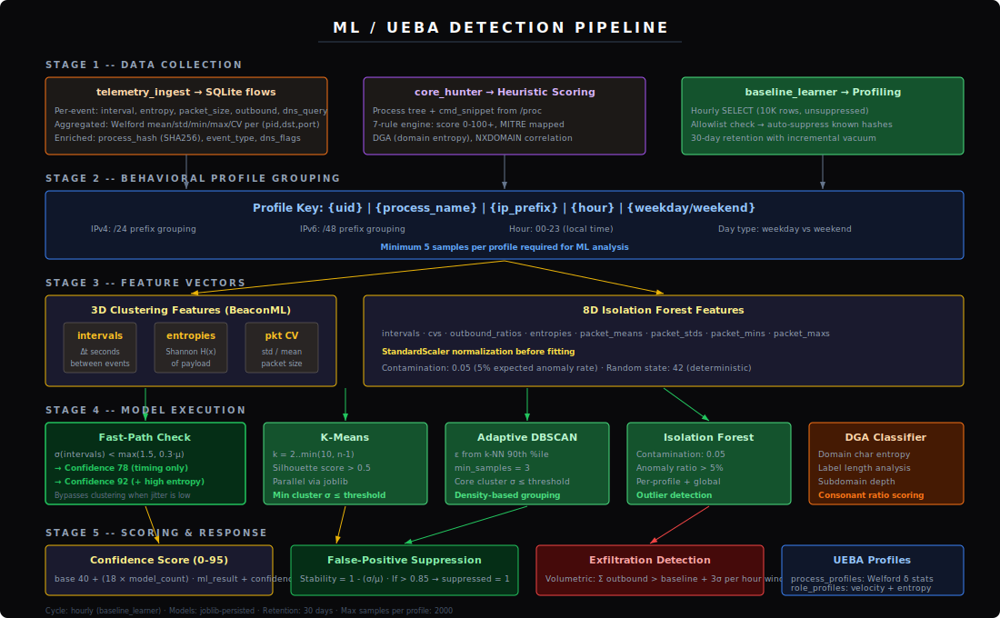

<div align="center">

# C2 Sensor

**Kernel-level C2 beaconing detection and active defense platform.**

[]()
[]()
[](https://python.org)
[]()
[]()
[]()

</div>

---

C2 Sensor combines eBPF wire-speed telemetry, Rust high-throughput processing, and Python machine learning to detect, classify, and mitigate Command and Control infrastructure in real time. It operates as a containerized stack on any BTF-enabled Linux host, requiring no agents, no kernel modules, and no network taps.

The intent of this project is to enhance c2 beacon observability when linux sentinel detects potential beaconing activity on an endpoint.  Designed to be a drop in sensor deployed on suspected compromised hosts to observe beaconing activity and collect additional information before containment protocols are enacted.

Linux Sentinel v1 will incorporate this as a deployable ephemeral payload during detection of c2/data exfil anomalous behavior to gather more granular proc/tcp|udp stack information.  **Note**: Development of this sensor as standalone will not continue anymore, this is a historical reference.

ebpf probes & python on sensor machine learning is redacted.

> [!CAUTION]
> This project is in **Alpha Release (Stable)**. The architecture is subject to breaking changes between releases. Validate thoroughly before deploying to production workloads.


<video src="img/demo.mp4" width="100%" controls></video>


---

## Architecture


The platform follows a pipeline architecture coordinated through a centralized SQLite WAL broker. Each component reads and writes to a shared `baseline.db` with WAL-mode concurrency, exponential-backoff busy handlers, and transaction batching to eliminate lock contention under sustained event loads.

### Component Summary

| Component | Language | Runtime | Responsibility |
|-----------|----------|---------|----------------|
| `c2_probe.bpf.c` | C (BPF) | Kernel | Tracepoint/kprobe telemetry collection, XDP packet dropping, in-kernel interval computation |
| `telemetry_ingest` | Rust | Userspace | Ring buffer consumption, zero-copy parsing, SHA256 hashing, Welford aggregation, batch INSERT |
| `core_hunter` | Rust | Userspace | 7-rule heuristic engine, process tree reconstruction, MITRE ATT&CK mapping, DGA/NXDOMAIN correlation |
| `active_defender` | Rust | Userspace | Threat containment via SIGKILL and XDP blocklist map mutation (IPv4 + IPv6) |
| `baseline_learner` | Python | Userspace | UEBA profiling, Isolation Forest fitting, BeaconML integration, exfiltration detection, false-positive suppression |
| `BeaconML` | Python | Userspace | K-Means, DBSCAN, and Isolation Forest clustering over a 3D feature space (interval × entropy × packet CV) |
| `nexus_forwarder` | Python | Userspace | Off-sensor telemetry export via Parquet spool and NATS JetStream |

### Data Flow

```text
Kernel syscall/kprobe
  → eBPF event_t (160 bytes, ring buffer)
  → RawEvent (zero-copy cast)
  → KernelEvent (parsed strings, entropy, dns_query, process_hash)
  → FlowEvent (Welford-aggregated per pid+dst+port batch)
  → SQLite INSERT (19 columns, WAL mode)
  → core_hunter UPDATE (score, MITRE, process_tree, reasons)
  → baseline_learner UPDATE (ml_result, suppressed)
  → API SELECT → Dashboard JSON
  → nexus_forwarder SELECT → Parquet → NATS JetStream

```

---

## Deployment Profiles (Modes)

C2 Sensor can be deployed in three distinct modes by altering the `mode` parameter in `config.toml`. The orchestrator (`run.sh`) dynamically selects the appropriate daemons, container images, and Compose manifests based on this setting.

| Mode | Active Daemons | Footprint | Primary Use Case |
| --- | --- | --- | --- |
| **collector** | `telemetry_ingest` + `nexus_forwarder` | ~50MB | Lightweight endpoints forwarding to central JetStream clusters. Bypasses local ML scoring and heuristics. |
| **standard** | `telemetry_ingest` + `baseline_learner` + `core_hunter` + `api_server` | Normal | Passive monitoring and detection engine with full UI. XDP mitigations disabled. |
| **full** | ALL (Including `active_defender`) | Normal | Autonomous execution environments. Evaluates scores and injects malicious tuples into XDP blocklist. |

---

## ML / UEBA Detection Pipeline



### Profile Grouping

Telemetry is segmented into behavioral profiles keyed by:

```text
{uid} | {process_name} | {ip_prefix} | {hour} | {weekday|weekend}

```

IPv4 addresses are grouped by /24 prefix, IPv6 by /48. A minimum of 5 samples is required before any ML model is applied to a profile.

### Detection Models

**Fast-Path Beaconing** -- When interval standard deviation is below `max(1.5, 0.3 × mean)`, the profile is flagged immediately without clustering. Confidence: 78 (timing only) or 92 (timing + high entropy).

**K-Means Clustering** -- Adaptive k selection (2 to min(10, n-1)) via silhouette scoring. Only clusters with silhouette > 0.5 are accepted. The minimum intra-cluster standard deviation determines beacon detection.

**Adaptive DBSCAN** -- Epsilon derived from the 90th percentile of k-nearest-neighbor distances, making it self-tuning to the data density. Core clusters with low interval variance indicate beaconing.

**Isolation Forest** -- Fitted per-profile on an 8-dimensional feature vector (intervals, CVs, outbound ratios, entropies, packet size statistics). Contamination parameter: 0.05. Anomaly ratios exceeding 5% trigger flagging.

**DGA Classifier** -- Domain character entropy, label length, subdomain depth, and consonant ratio are combined into a weighted score. Domains scoring ≥ 50 are classified as DGA-generated.

**NXDOMAIN Correlation** -- DNS response codes are captured via `dns_flags` from the eBPF probe. Core_hunter counts NXDOMAIN (RCODE=3) responses per process per hour. Rates above 20/hour with DGA indicators receive maximum scoring.

### False-Positive Suppression

Profiles with stability > 0.85 (computed as `1 - σ/μ` of intervals) are automatically suppressed. Processes matching the SHA256 allowlist are suppressed at the start of each learning cycle.

### Exfiltration Detection

Volumetric anomaly detection runs per (process, destination, uid) tuple. Outbound byte totals are compared against historical baselines stored in `flow_volumes`. Transfers exceeding `baseline + 3σ` trigger MITRE T1041 classification.

---

## Heuristic Engine (core_hunter)

| Rule | Trigger | Score | MITRE Mapping |
| --- | --- | --- | --- |
| R1 -- Encrypted Payload | Shannon entropy > 7.5 | +40 | T1573 Encrypted Channel |
| R2 -- Beacon Interval | 0-60s: aggressive, 60-3600s: sparse | +30 / +20 | T1071 Application Layer Protocol |
| R3 -- LOLBin Activity | Known binary + outbound_ratio > 0.8 | +25 | T1059 Command and Scripting Interpreter |
| R4 -- DNS Tunneling | Port 53 + entropy > 6.0 | +50 | T1071.004 DNS |
| R5 -- DGA Detection | Domain entropy > 3.5 + label > 20 chars | +45 | T1568.002 Domain Generation Algorithms |
| R5b -- NXDOMAIN Burst | > 20 NXDOMAIN/hour per process | +50 | T1568.002 Domain Generation Algorithms |
| R6 -- Masquerading | cmd > 150 chars or systemd with high PID | +35 | T1036 Masquerading |
| R7 -- Exfiltration Volume | > 10 MB outbound per process+dst per hour | +35 | T1041 Exfiltration Over C2 Channel |

Scores are cumulative. Multiple rules can fire on the same flow. The `active_defender` acts on flows exceeding `containment_threshold` (configurable in `config.toml`).

---

## Active Defense

When deployed in **Full** mode (`mitigation.enabled = true`), the defender polls for high-scoring flows and executes containment:

**Process Termination** -- `SIGKILL` via `nix::sys::signal` against the offending PID. Idempotent (ESRCH is silently ignored for already-exited processes).

**Network Blackholing** -- Destination IPs are injected into pinned eBPF LRU_HASH maps (`blocklist_v4` for IPv4, `blocklist_v6` for IPv6). The XDP program drops matching packets at the NIC driver level before they reach the network stack.

**State Persistence** -- All mitigations are written to the `mitigations` table and restored on daemon restart. Duplicate actions are prevented via in-memory HashSets seeded from the database.

**Dry-Run Mode** -- When `mitigation.dry_run = true`, all containment decisions are logged but not executed. Recommended during initial deployment to validate scoring accuracy.

---

## Deployment

### Prerequisites

* Linux kernel 5.8+ with BTF support (`/sys/kernel/btf/vmlinux` must exist)
* Root privileges
* Podman or Docker with Compose support
* `openssl` and `curl` available on the host

### Quick Start

```bash
# Edit target interface, mode, and thresholds
vim deploy/config.toml

# Launch
sudo ./run.sh

# Optional Supply Chain Scan (Writes JSON results to guarddog-results/)
SCAN_DEPS=1 sudo ./run.sh

```

The `run.sh` orchestrator performs:

1. Root and dependency verification
2. CA-signed TLS certificate generation (4096-bit RSA)
3. Configuration parsing (determining `collector`, `standard`, or `full` mode)
4. vmlinux.h acquisition for eBPF CO-RE compilation
5. Dynamic port allocation (scans 8000-9000)
6. Conditional container image build and launch

### Container Architecture

| Container | Image | Network | Capabilities |
| --- | --- | --- | --- |
| `c2-sensor-collector` | `collector.Dockerfile` | `host` | `BPF`, `PERFMON`, `NET_ADMIN`, `SYS_ADMIN`, `SYS_PTRACE`, `IPC_LOCK` |
| `c2-sensor-core` | `ebpf.Dockerfile` | `host` | `BPF`, `PERFMON`, `NET_ADMIN`, `SYS_ADMIN`, `SYS_PTRACE`, `IPC_LOCK` |
| `c2-api-dashboard` | `dashboard.Dockerfile` | Port-mapped (localhost only) | None (unprivileged) |

*Note: `c2-sensor-collector` is only built/launched if `mode = "collector"`. Otherwise, `c2-sensor-core` and `c2-api-dashboard` are used.*

---

## Configuration Reference

All configuration is centralized in `deploy/config.toml`:

```toml
[global]
sensor_name = "c2-sensor-alpha"
mode = "full"                         # collector | standard | full
db_path = "/app/data/baseline.db"
auth_db_path = "/app/data/auth.db"    # Required for standard/full modes
log_level = "info"                    # trace | debug | info | warn | error

[ebpf]
bpf_object_path = "/app/ebpf/probes/c2_probe.bpf.o"
target_interface = "eth0"             # Physical NIC for XDP attachment
ring_buffer_max_entries = 65536
capture_loopback = false

[api_dashboard]
bind_address = "0.0.0.0"
port = 8443
tls_cert_path = "/app/certs/cert.pem"
tls_key_path = "/app/certs/key.pem"
static_ui_path = "/app/ui/static"
jwt_secret = "CHANGE_ME_IN_PRODUCTION" # Auto-rotated by run.sh if left default
default_admin_password = "admin"

[mitigation]
enabled = false                       # Set true for Active Defense (Full mode)
dry_run = true                        # Log-only mode (no SIGKILL/XDP)
containment_threshold = 90            # Minimum score to trigger action

[nexus]
enabled = false                       # Set true for NATS Export (Collector mode)
nats_url = "nats://nexus-server:4222"
stream_name = "C2_TELEMETRY"
subject_prefix = "nexus.telemetry"
spool_dir = "/app/data/spool"
max_backoff_sec = 60.0
publish_delay_sec = 0.2

```

---

## Dashboard

When running in **Standard** or **Full** mode, the UI is accessible at `https://127.0.0.1:<DASH_PORT>` after deployment. The dynamic port and default login credentials are displayed at the end of the `run.sh` output.

**Endpoints:**

* `GET /api/v2/metrics` -- Total events, critical anomaly count, active mitigations, hourly distribution
* `GET /api/v2/anomalies?limit=250&min_score=0` -- Full detection records with MITRE mapping, process trees, and ML results
* `GET /api/v2/profiles` -- UEBA process and role behavioral profiles
* `POST /api/v2/auth/login` -- JWT generation for API access

---

## Directory Structure

```text
c2_sensor_workspace/
├── Cargo.toml                     # Workspace definition + release profile
├── crates/
│   ├── shared_models/             # KernelEvent, FlowEvent, Detection, Config
│   ├── telemetry_ingest/          # eBPF → SQLite pipeline
│   ├── core_hunter/               # Heuristic scoring engine
│   ├── active_defender/           # Mitigation daemon
│   └── api_server/                # REST API, JWT Auth, static file server
├── ebpf_probes/
│   ├── c2_probe.bpf.c             # eBPF CO-RE probe
│   ├── vmlinux.h                  # Kernel type definitions
│   └── Makefile                   # Clang BPF compilation
├── python_engine/
│   ├── BeaconML.py                # Clustering detection engine
│   ├── baseline_learner.py        # UEBA + ML orchestrator
│   ├── nexus_forwarder.py         # NATS JetStream publisher
│   └── requirements.txt
├── ui/static/
│   └── index.html                 # Chart.js + Tailwind dashboard
├── deploy/
│   ├── config.toml
│   ├── ebpf.Dockerfile
│   ├── dashboard.Dockerfile
│   ├── collector.Dockerfile
│   ├── docker-compose.yaml
│   ├── docker-compose.standard.yaml
│   ├── docker-compose.collector.yaml
│   ├── start_core.sh
│   ├── entrypoint-dashboard.sh
│   └── generate_sensor_certs.sh
├── run.sh                         # One-command deployment orchestrator
└── docs/
    ├── architecture.svg
    ├── ml_pipeline.svg
    └── data_schema.md             # Unified field mapping across all layers

```

---

## SQLite Schema Overview

The canonical schema is defined in `baseline_learner.py:_init_db()` and documented exhaustively in `docs/data_schema.md`. Key tables:

| Table | Writer(s) | Purpose |
| --- | --- | --- |
| `flows` | telemetry_ingest (INSERT), core_hunter (UPDATE), baseline_learner (UPDATE) | Primary telemetry store -- 30 columns covering raw metrics, enrichment, ML results, and MITRE classification |
| `mitigations` | active_defender | Persisted containment actions (PID kills + IP blocks) |
| `allowlist` | Manual / future automation | SHA256 hashes of known-good binaries for suppression |
| `ueba_process_profiles` | baseline_learner | Per-binary Welford delta statistics |
| `ueba_role_profiles` | baseline_learner | Per-process-name velocity and entropy baselines |
| `flow_volumes` | baseline_learner | Hourly outbound/inbound byte totals for exfiltration baselining |
| `users` | api_server | API authentication and dashboard access control |

---

## Performance Characteristics

* **eBPF ring buffer:** 1 MB, ~6,250 events before overflow
* **Ingestor channel:** 100,000 events bounded, backpressure drops on overflow
* **Batch size:** 500 events per SQLite transaction
* **Core hunter cycle:** 250ms polling, 100 rows per batch, single transaction
* **ML cycle:** Hourly, 10,000 most recent unsuppressed flows
* **WAL concurrency:** All writers use exponential-backoff busy handlers (1ms → 100ms cap, 50 attempts)
* **Retention:** 30 days with incremental vacuum

<div align="center">
<sub>C2 Sensor is a prototype R&D project and limited in scope, full feature production baselines will not be uploaded in the future.</sub>
</div>