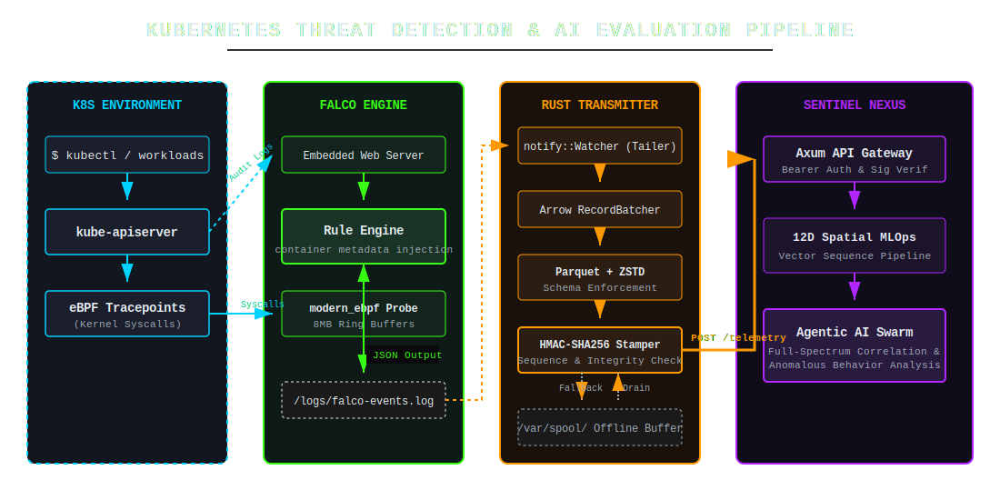

### Falco / k8s

  

---

The intent of the architecture is to create a highly resilient, real-time pipeline that bridges low-level kernel observability with advanced AI evaluation. It captures raw behavior at the edge, securely packages it, and feeds it into a swarm-intelligence model to identify complex, distributed attacks.

* **1. Capture (Kubernetes Environment):** The system monitors both the control plane and the workload plane. Administrative actions are captured via the `kube-apiserver` audit logs, while granular workload behavior is intercepted directly at the kernel level using eBPF tracepoints.
* **2. Frontline Detection (Falco Engine):** Falco acts as the immediate filtering layer. It evaluates the incoming streams of syscalls and audit logs against its rule engine, enriches the events with container metadata, and writes any rule violations to a local JSON log file.
* **3. Edge Logistics (Rust Transmitter):** This is the secure delivery mechanism. It tails the Falco log, batches the raw JSON into highly compressed Parquet formats (via Arrow and ZSTD), and applies an HMAC-SHA256 stamp to guarantee cryptographic integrity. If the downstream network fails, it safely spools the data locally to prevent data loss.
* **4. Swarm Evaluation (Sentinel Nexus):** The data arrives at the Axum API gateway, where signatures are verified. It is then fed into a 12D spatial MLOps pipeline. Finally, the **Agentic AI Swarm** takes over, evaluating the vectors to correlate threats across the entire cluster and analyze the data for anomalous behavior that static rules might miss.