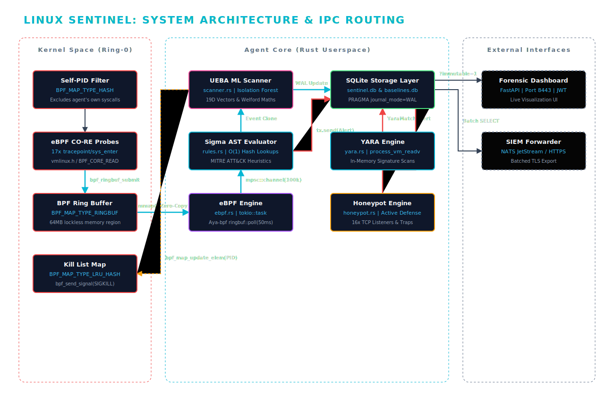
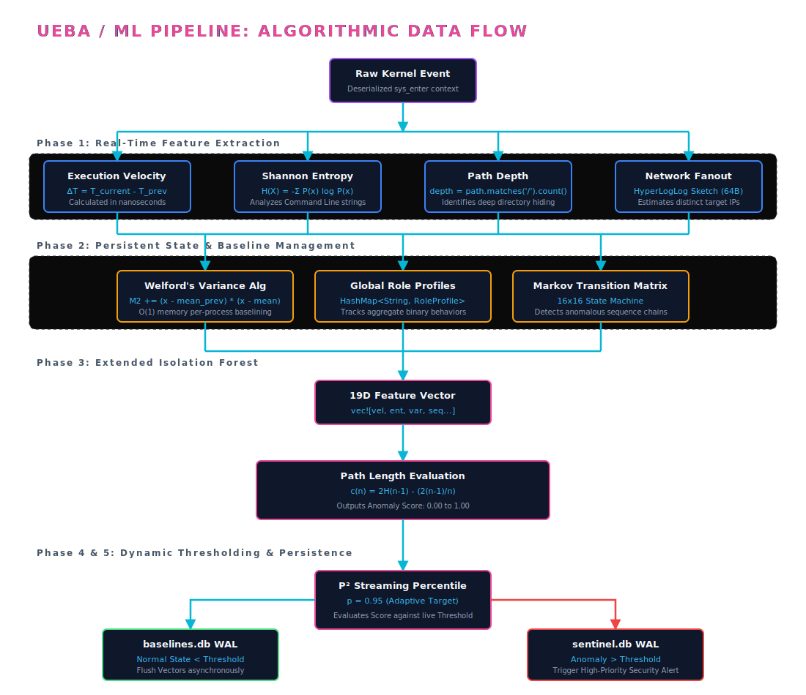
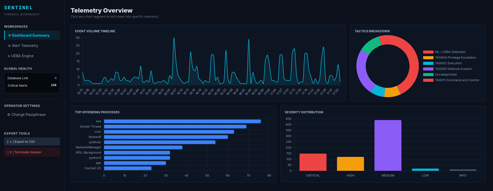
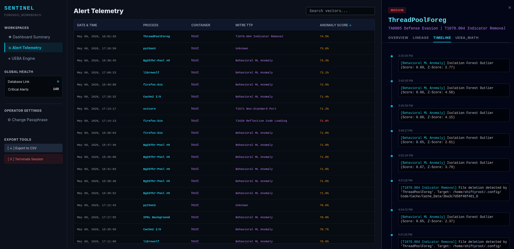
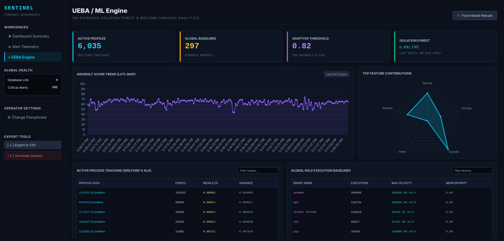

<div align="center">

# Linux Sentinel

### Kernel-Native Extended Detection and Response for Linux

[]()
[]()
[]()
[]()
[]()

**An eBPF-powered EDR agent that traces execution lineage, detects fileless attacks, and profiles behavioral anomalies at the kernel level with minimal CPU overhead.**

</div>

---

> [!NOTE]
> v0.4.0 -> v1.0.0 development is a private project.  This is a historical reference archive.

> [!CAUTION]
> This project is in **Alpha Release (Stable)**. The architecture is subject to breaking changes between releases. Validate thoroughly before deploying to production workloads.

## Table of Contents

- [Overview](#overview)
- [Architecture](#architecture)
- [Prerequisites](#prerequisites)
- [Deployment](#deployment)
- [Configuration Reference](#configuration-reference)
- [Operations Guide](#operations-guide)
- [Directory Layout](#directory-layout)
- [Roadmap](#roadmap)

---

## Overview

Linux Sentinel is a high-performance host-based EDR agent built in Rust. It hooks directly into the Linux kernel via eBPF CO-RE (Compile Once -- Run Everywhere) probes to capture syscall telemetry across 17 critical vectors, including IPv6 network events and container namespace manipulation.

Telemetry is routed through a zero-copy userspace pipeline combining MITRE ATT&CK rule evaluation, DGA payload parsing, YARA static scanning, Cryptographic File Integrity Monitoring (FIM), 19-Dimensional Isolation Forest anomaly detection, Docker/Podman container tracking, and active deception honeypots.

The agent compiles to a single statically-linked binary targeting `musl-libc` on Alpine 3.23. The runtime image contains zero shells or diagnostic utilities to strictly limit the operational attack surface. Deployment is supported across cloud, bare-metal, and fully airgapped offline environments.

---

## Architecture

<p align="center">
  
</p>


**Data flow summary:** Kernel probes emit events into a 64MB lockless BPF ring buffer. The eBPF engine polls the buffer from a dedicated OS thread and forwards raw events to the detection pipeline over a 100K-depth backpressure channel. The scanner evaluates Sigma AST rules, extracts 19-dimensional feature vectors, computes anomaly scores via an Extended Isolation Forest, and manages state using Welford's variance algorithms. System state and alerts are decoupled: high-priority `SecurityAlert` structs are written to `sentinel.db` (SQLite WAL) and forwarded to the SIEM gateway in batches, while continuous ML state vectors are flushed asynchronously to `baselines.db` (SQLite WAL). The YARA and Honeypot engines feed alerts into the primary pipeline independently. An authenticated Axum API exposes query endpoints and accepts live config hot-reloads, while an unprivileged FastAPI server provides a read-only forensic UI. When active mitigation is enabled, the scanner can push target PIDs back into the in-kernel LRU map for immediate termination.

---

### ML/UEBA Detailed Workflow

#### How the pipeline evaluates events

Every raw eBPF kernel event passes through a seven-stage pipeline before it either produces an alert or is absorbed into the behavioral baseline. The first four stages are **stateless** -- they produce the same result regardless of how long the sensor has been running. The last three stages are **adaptive** -- they learn from the telemetry stream and will progressively suppress events that become statistically normal.

#### Stateless stages (deterministic, no decay)

**Process whitelist** drops all telemetry from known-safe processes (the agent itself, tokio workers, systemd-journald, containerd) before any evaluation. Bidirectional prefix matching survives the kernel's 15-character `TASK_COMM_LEN` truncation.

**Rule evaluation** compiles Sigma YAML rules into an Abstract Syntax Tree (AST) and evaluates them alongside hardcoded MITRE ATT&CK fast-path checks using O(1) hash lookups. Every event is tested against the full rule set every time -- there is no learning or caching at this stage.

**3D exception gate** checks whether a rule match should be suppressed based on the specific combination of `comm` + `technique` + `target`. This is the tuned exception system defined in `master.toml`. It only nullifies the rule match -- the event still flows through UEBA scoring. Exceptions are config-driven and deterministic: if the tuple matches, the rule is suppressed; if it doesn't, the rule fires. No adaptation, no decay.

#### Adaptive stages (learn over time -- can suppress persistent threats)

**Flood control cache** records the wall-clock time of the last alert for each `technique|comm` pair. If the same static rule fires for the same process within 3600 seconds, the rule match is nullified. The event still enters UEBA scoring, but no static alert is emitted. Effect: a persistent C2 beacon gets at most one static alert per hour per technique.

**UEBA state management & extraction** maintains three distinct mathematical models using strict O(1) memory budgets:

* **Welford's Algorithm (Process Profiles):** Maintains streaming mean delta and variance for per-process inter-event timing. As a process generates telemetry, variance shrinks and execution timing becomes predictable.
* **Global Role Baselines:** Maps aggregate binary behaviors (e.g., across all `bash` or `curl` instances), tracking global max execution velocity and mean Shannon entropy for the command line.
* **Markov Transition Matrix:** A 16x16 state machine modeling the probability of syscall sequence chains to detect unusual behavioral transitions.

**Extended Isolation Forest** is the unsupervised ML model that scores events across a 19-dimensional feature vector, incorporating `[execution_velocity, shannon_entropy, path_depth, network_fanout_hll, welford_variance, markov_probability...]`. The forest is rebuilt dynamically. If an attacker's behavioral pattern persists, the model absorbs it as part of the normal distribution, assigning it progressively lower path-length anomaly scores.

#### The adaptive anomaly threshold gate (P² Algorithm)

Hardcoded thresholds have been completely replaced by the P² streaming percentile estimator. The agent dynamically calculates the 95th percentile (P95) of anomaly scores based on the host's specific environmental noise (e.g., distinguishing between a quiet web server and a noisy CI/CD runner).

An event generates an ML-driven alert only if its `anomaly_score` dynamically exceeds the P95 adaptive threshold. If the score exceeds an absolute critical ceiling (e.g., `> 0.90`), it instantly triggers a deterministic out-of-band action, such as executing an in-memory YARA scan via `process_vm_readv` or writing the PID to the kernel kill list.

#### TTP correlation (stateless safety net)

The TTP correlation engine runs independently of the main rule/ML pipeline. It is a stateless pattern match on the sliding event-type buffer: if a process performs a `memfd_create` (EVENT_MEMFD) followed by an outbound network connection (EVENT_CONNECT or EVENT_UDP_SEND), a critical alert is generated immediately, bypassing all flood control, feature extraction, and ML scoring. This path cannot be suppressed by any adaptive mechanism.

#### Suppression timeline for a persistent threat

| Time since first detection | Flood control | Global Role / Markov State | Extended Isolation Forest | P² Adaptive Threshold | Static rules | TTP correlation |
| --- | --- | --- | --- | --- | --- | --- |
| 0–60 minutes | First alert fires | Highly anomalous / novel | High anomaly score (0.80+) | Exceeds P95 threshold | Fires | Fires if memfd→net |
| 1–6 hours | 1 alert/hr max | Updating mean variance | Still elevated | Adjusting upward | 1/hr | Always fires |
| 6–24 hours | 1 alert/hr max | Establishing new baseline | Absorbed into baseline | Baseline equalized | 1/hr | Always fires |
| 24+ hours | 1 alert/hr max | Statistically normalized | Low anomaly score | Below threshold | 1/hr | Always fires |

Static rules continue to fire once per hour indefinitely. The ML engine stops generating independent alerts after approximately 6–24 hours of consistent activity as the P² threshold adapts to the "new normal." TTP correlation (memfd→network) fires every time, regardless of duration.

## Logical Flow

<p align="center">
  
</p>


---

## Prerequisites

| Requirement | Minimum | Notes |
|---|---|---|
| Linux Kernel | 5.8+ | BTF support required (`CONFIG_DEBUG_INFO_BTF=y`) |
| Container Runtime | Docker 20.10+ / Podman 4.0+ | Must run as **root** (rootful) |
| Host Capabilities | `BPF`, `PERFMON`, `SYS_ADMIN`, `SYS_PTRACE` | Required for kernel probe attachment |
| Architecture | x86_64 | ARM64 support planned |
| Disk | 500 MB free | SQLite WAL + 72h telemetry retention |

---

## Deployment

### Quick Start (Agent Only)

```bash
# Optional: supply your own token; omit to auto-generate one
export SENTINEL_AUTH_TOKEN="$(openssl rand -hex 32)"

sudo ./run.sh
```

The script handles TLS certificate generation, threat intelligence staging (YARA signatures, Sigma rules, offline `vmlinux.h`), container image build, and deployment. The agent API will be available at `https://127.0.0.1:8080`.

### Full Stack (Agent + Forensic Dashboard)

```bash
sudo ./run_with_dashboard.sh
```

This additionally deploys the FastAPI-based forensic workbench on `https://127.0.0.1:8443` with default credentials `admin / admin`. The JWT secret is auto-rotated on first run.

<p align="center">
  
</p>

<p align="center">
  
</p>

<p align="center">
  
</p>

<video src="img/demo.mp4" width="100%" controls></video>

---

**Validate Intel Staged**

```bash
podman logs linux-sentinel-agent | grep -iE "Sigma Parsing Complete|PIPELINE VALIDATION|diagnostic passed|Compiled Native Sigma|Threat Intel|baseline YARA"
```

**Run test to validate data collection:**
```bash
chmod +x sentinel_tester.sh
./sentinel_tester.sh
```

**Verify data collection in db:**
```python
podman exec -it sentinel-api-dashboard python3 -c "
import sqlite3
import os

DB_PATH = '/var/log/linux-sentinel/sentinel.db'
if not os.path.exists(DB_PATH):
    print(f'Database not found at {DB_PATH}')
    exit()

conn = sqlite3.connect(f"file:{DB_PATH}?immutable=1", uri=True)
conn.row_factory = sqlite3.Row
cursor = conn.cursor()

# Expanded query to capture all phases of sentinel_tester.sh
# Searching for T1078 (Shadow), T1059 (Shell), T1571 (C2 Ports), and T1620 (Memfd)
query = '''
    SELECT
        datetime(timestamp, 'unixepoch') as time,
        comm,
        mitre_technique,
        message,
        anomaly_score
    FROM events
    WHERE comm IN ('nc', 'curl', 'python3', 'cat', 'touch', 'bash', 'socat')
       OR mitre_technique LIKE '%T1078%'
       OR mitre_technique LIKE '%T1059%'
       OR mitre_technique LIKE '%T1571%'
       OR mitre_technique LIKE '%T1620%'
       OR message LIKE '%Sigma%'
    ORDER BY timestamp DESC
    LIMIT 200
'''

cursor.execute(query)
rows = cursor.fetchall()

if not rows:
    print('[-] No test detections found in the last 200 events.')
else:
    print(f'[+] Found {len(rows)} potential test detections:')
    print('=' * 120)
    print(f'{\"TIME\":20} | {\"PROCESS\":10} | {\"TECHNIQUE\":30} | {\"SCORE\":5} | {\"MESSAGE\"}')
    print('-' * 120)
    for row in rows:
        print(f'[{row[\"time\"]}] | {row[\"comm\"]:10} | {row[\"mitre_technique\"]:30} | {row[\"anomaly_score\"]:5.2f} | {row[\"message\"]}')
"
```

| Endpoint | URL | Auth |
|---|---|---|
| Agent API | `https://127.0.0.1:8080` | Bearer token (`SENTINEL_AUTH_TOKEN`) |
| Forensic Dashboard | `https://127.0.0.1:8443` | Username / password (JWT) |

### Kubernetes

Apply the provided DaemonSet manifest to deploy Sentinel across all nodes:

```bash
kubectl apply -f linux-sentinel-deployment.yml
```

Mount the `SENTINEL_AUTH_TOKEN` via a Kubernetes `Secret`. TLS certificate paths can be overridden with the `SENTINEL_API_TLS_CERT` and `SENTINEL_API_TLS_KEY` environment variables.

---

## Configuration Reference

All runtime behavior is controlled by `master.toml`, mounted read-only into the container at `/opt/linux-sentinel/master.toml`. The agent supports live reload via `SIGHUP` or the `/api/config/reload` endpoint.

| Section | Key | Default | Description |
|---|---|---|---|
| `engine` | `enable_ebpf` | `true` | Attach eBPF kernel probes |
| `engine` | `enable_yara` | `true` | Periodic YARA file scanning |
| `engine` | `enable_honeypots` | `true` | TCP deception listeners |
| `engine` | `enable_anti_evasion` | `true` | UEBA behavioral profiling |
| `engine` | `enable_active_mitigation` | `false` | In-kernel PID termination |
| `engine` | `performance_mode` | `false` | Reduce scan frequency |
| `api` | `bind_addr` | `0.0.0.0` | API listen address |
| `api` | `port` | `8080` | API listen port |
| `api` | `tls_cert` / `tls_key` | -- | PEM paths; empty = plaintext HTTP |
| `honeypot` | `max_connections_per_minute` | `100` | Per-port rate limit |
| `storage` | `sqlite_db_path` | `/var/log/linux-sentinel/sentinel.db` | Telemetry database location |
| `siem` | `middleware_gateway_url` | -- | HTTPS endpoint for batch forwarding |
| `siem` | `auth_token` | `${SENTINEL_AUTH_TOKEN}` | Supports env-var interpolation |
| `files` | `exclude_paths` | `/proc`, `/sys`, `/dev` | Paths excluded from YARA scans |
| `files` | `critical_paths` | `/etc/shadow`, `/etc/passwd` | Paths scanned every 5 minutes |

---

## Operations Guide

### Token Rotation (Zero Downtime)

1. Update the `SENTINEL_AUTH_TOKEN` environment variable on the host or in the Kubernetes Secret.
2. Trigger a config reload:
```bash
   # Via signal
   kill -HUP $(pidof linux-sentinel)

   # Via API (use the current token)
   curl -k -X POST \
     -H "Authorization: Bearer $OLD_TOKEN" \
     https://127.0.0.1:8080/api/config/reload
```
3. The agent re-reads `master.toml`, resolves the new env var, and applies it in memory. Subsequent API requests and SIEM transmissions use the updated token immediately.

### YARA Rule Updates

Drop new `.yar` / `.yara` files into the mounted rules directory and trigger a reload:

```bash
curl -k -X POST \
  -H "Authorization: Bearer $SENTINEL_AUTH_TOKEN" \
  https://127.0.0.1:8080/api/rules/reload
```

Rules are compiled in a background thread. If any rule contains a syntax error, the entire reload is aborted to prevent partial coverage.

### Log Locations

| Log | Path | Format |
|---|---|---|
| Diagnostics | `/var/log/linux-sentinel/diagnostics/sentinel-diagnostics.log` | JSON (daily rotation) |
| Telemetry DB | `/var/log/linux-sentinel/sentinel.db` | SQLite WAL (Alerts & Events) |
| ML State DB | `/var/log/linux-sentinel/baselines.db` | SQLite WAL (Welford & Role Profiles) |
| Behavioral artifacts | `/var/log/linux-sentinel/Behavior/Categories/` | JSON |

### Graceful Shutdown

The agent handles `SIGTERM` and `SIGINT` by draining the in-flight alert queue, flushing the SQLite WAL to disk (3-second checkpoint window), and closing the database pool. No telemetry is lost during orchestrated shutdowns.

---

## Directory Layout

```
linux-sentinel/
├── src/
│   ├── main.rs                    # Supervisor, signal handling, pipeline wiring
│   ├── config.rs                  # TOML deserialization, env-var resolution, hot-reload
│   ├── api/
│   │   └── server.rs              # Axum HTTPS API with constant-time auth
│   ├── bpf/
│   │   ├── sentinel.bpf.c         # eBPF kernel probes (17 syscall vectors)
│   │   └── vmlinux.h              # BTF header (generated or staged offline)
│   ├── engine/
│   │   ├── ebpf.rs                # Ring buffer poller, kill-list map writer
│   │   ├── rules.rs               # Sigma AST evaluator, static port matching
│   │   ├── scanner.rs             # 19D Isolation Forest UEBA profiler
│   │   ├── baselines.rs           # Persistent ML State & Profile Management
│   │   ├── honeypot.rs            # Async TCP trap listeners (16 ports)
│   │   └── yara.rs                # File integrity scanner, rule hot-swap
│   ├── siem/
│   │   ├── models.rs              # SecurityAlert, AlertLevel, MitreTactic
│   │   └── transmitter.rs         # SQLite WAL writer, SIEM batch forwarder
│   └── utils/
│       └── logging.rs             # Structured JSON tracing (file + stdout)
├── dashboard/
│   ├── Dockerfile                 # FastAPI forensic workbench container
│   ├── api_server.py              # Query engine, auth, clustering endpoints
│   ├── generate_dashboard_certs.sh
│   └── requirements.txt
├── build.rs                       # libbpf-cargo eBPF compilation & BTF fallback
├── Cargo.toml                     # Rust Edition 2024, pinned FFI dependencies
├── Dockerfile                     # Multi-stage Alpine 3.23 agent image
├── docker-compose.yaml            # Agent + Dashboard orchestration
├── master.toml                    # Runtime configuration
├── run.sh                         # Standalone agent deployment
└── run_with_dashboard.sh          # Full-stack deployment with forensic workbench
```

---

## Roadmap

| Feature | Description | Status |
|---|---|---|
| 19D Feature Vectors | Sliding-window syscall diversity, HyperLogLog network cardinality, file write-depth | Validating |
| Dual-Band EWMA | Exponentially Weighted Moving Averages for temporal anomaly detection | Validating |
| Adaptive P² Thresholds | Streaming percentile estimation replacing static anomaly cutoffs | Validating |
| Markov Sequence Modeling | 16×16 transition matrices for syscall sequence anomaly detection | Validating |
| ARM64 Support | Cross-compilation targeting `aarch64-unknown-linux-musl` | Planned |


<div align="center">
<sub>Linux Sentinel is a prototype R&D project and limited in scope, full feature production baselines will not be uploaded in the future.</sub>
</div>