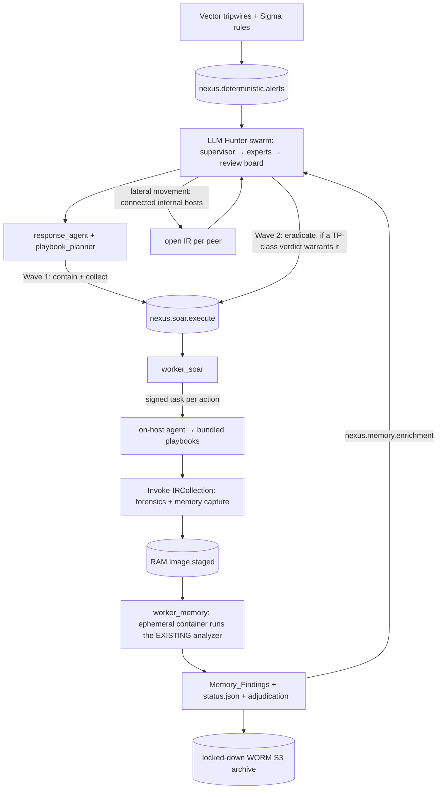
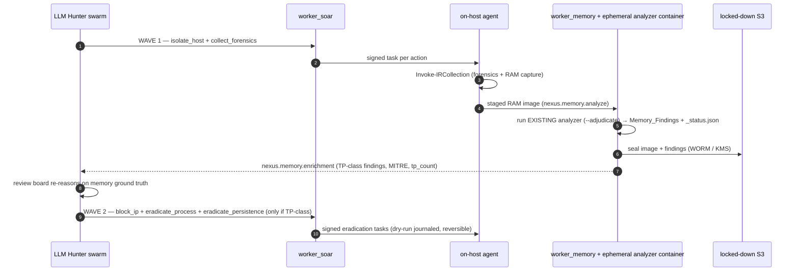
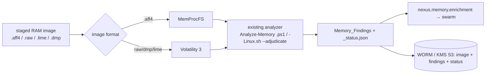
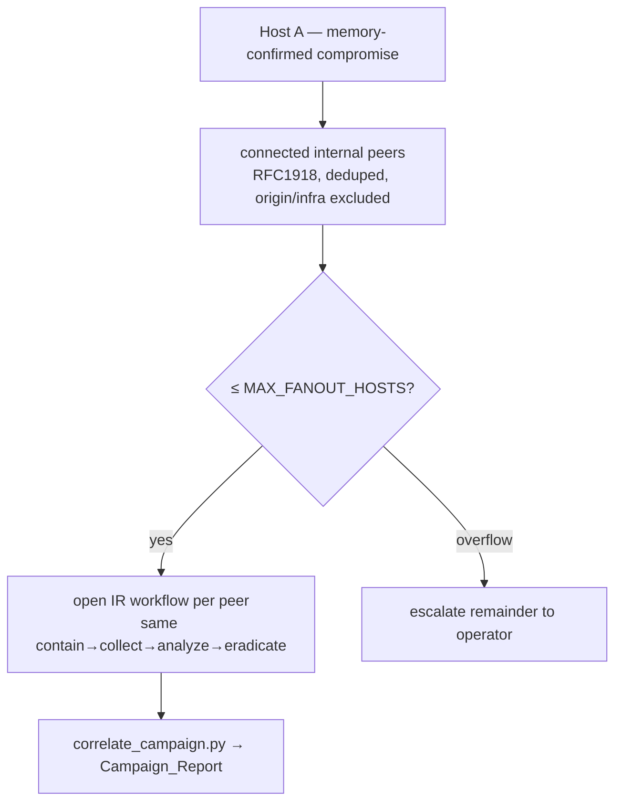

# SOAR / IR Workflow — Guide

How Sentinel Nexus goes from a detection to an evidence-first, thoroughly
investigated, autonomously contained incident. The agentic stack **orchestrates
the proven IR toolkit** (`operations/playbooks`) across hosts and feeds its output
to the swarm for the verdict — it does not reimplement the toolkit.

Companion: **[SOAR_IR_DATAFLOW.md](SOAR_IR_DATAFLOW.md)** — the concrete
logic / calls / subjects / data at each stage.

> **Precondition — air-gapped, staged offline.** The stack has no internet. The IR
> playbooks and analysis tools (winpmem/AVML, YARA, Volatility 3 wheels, kernel ISF
> symbols, MemProcFS, LOLDrivers) are staged in advance with `Build-OfflineToolkit`
> before any analysis runs. Telemetry comes in; nothing reaches out.

---

## 1. The loop

The swarm runs the same lifecycle the toolkit defines — contain → collect →
analyze (off-target) → adjudicate → eradicate → restore — and re-enters itself on
the memory enrichment so eradication acts on ground truth, not first sight.

---

## 2. The proven IR lifecycle (operations/playbooks)

Each platform (`WORKFLOW-WINDOWS.md` · `WORKFLOW-LINUX.md` · `WORKFLOW-CLOUD.md`)
follows one shape; the agentic stack drives it:

1. **Stage 0 — Offline staging.** `Build-OfflineToolkit` stages tools + symbols to the host.
2. **Stage 1 — Contain + Collect (on target).** Firewall lockdown (Windows), `00_collect_forensics`, persistence/Autoruns, event-log/journal analysis, EDR/fileless hunt, remote-access triage, container hunt, Amcache/ShimCache, **memory capture** (`.aff4` winpmem · `.raw`/`.lime` AVML), `_clock.json`, evidence-custody seal. Every module emits the shared finding schema (`Type · Target · Verdict · MITRE`).
3. **Stage 2 — Adjudication.** The verdict ladder (False Positive → Likely FP → Indeterminate → Likely TP → True Positive) adds on-host context. Emits `IOCs.json`, `Principals.json`, `Incident_Report`, `Attack_Graph`, `Timeline`, and `_status.json` (`status` + `tp_count`) — the SOAR gating signal.
4. **Stage 3 — Memory analysis (off target).** `Analyze-Memory.ps1` (`.aff4`→MemProcFS, `.raw`/`.dmp`→Volatility 3) / `Analyze-Memory-Linux.sh` (ephemeral Volatility 3 venv + ISF + YARA + PID correlation), `--adjudicate`. Produces `Memory_Findings_<stamp>.json` → merged → re-adjudicated.
5. **Stage 4 — Eradication (on target).** `Invoke-Eradication --apply` — dry-run by default, `-MinVerdict` gate, reversible rollback journal.
6. **Stage 5 — Restoration.** Firewall/quarantine restore, sha256-verified.

---

## 3. Evidence-first, two-wave response

Volatile evidence is captured before anything destructive runs (RFC 3227 order of
volatility), and eradication waits for a thorough, adjudicated verdict.

Wave 1: `isolate_host` (host stays up so RAM is intact) + `collect_forensics`.
Wave 2: eradication, gated on `memory_threat` (an adjudicated TP-class memory
finding or `_status.json` `tp_count > 0`). If memory clears the host, nothing is
eradicated — the verdict can flip to `restore`.

---

## 4. Memory analysis bridge (worker_memory)

`worker_memory` extends the toolkit's Stage 3 to the stack:

- **Verified ingress, no side channel.** Evidence is its own data class: the agent streams the image to `core_ingress POST /api/v1/evidence` (JWT + HMAC + SHA-256 custody); the gateway streams it to the WORM archive and publishes a small verified `nexus.memory.intake` handle. worker_memory pulls + re-checks custody before analysis.
- Routes by **image format**, not OS guesswork (`.aff4`→MemProcFS is the default winpmem path).
- Runs the **existing analyzer** in an ephemeral, network-less container holding the offline-staged toolkit; consumes its shared-schema output.
- **Storage lock modes:** the RAM **image** is **GOVERNANCE**-locked (privacy-sensitive — holds cleartext creds — so an operator can purge it post-case); the **findings/status/custody record** is **COMPLIANCE**-locked (immutable). KMS-encrypted, deny-delete.
- **Cleanup:** on conclusion an **operator** purges the image (audited `BypassGovernanceRetention`); the record persists. Never autonomous.
- Publishes the adjudicated findings as advisory enrichment; the **swarm** makes the verdict.

---

## 5. Lateral-movement fan-out

A confirmed compromise is the seed of a campaign. Once memory confirms the threat,
the host_expert identifies the **internal** hosts the compromised host talked to
and opens the same IR workflow on each, bounded so it cannot become a mass action.

---

## 6. Bounded-autonomy guardrails

- The adversarial **review board** must confirm a TP before any containment; cited evidence must ground to retrieved artifacts (fail-closed to monitor).
- The **HitL circuit breaker** (DisruptionIndex, TIER-1 asset, fleet-%) demotes to `manual_review_required` and clears all autonomous playbooks.
- Every host action is an **HMAC-signed task**; the agent runs only a fixed bundled playbook from an allowlist.
- Eradication is **dry-run-journaled and reversible**; a verdict flip triggers `restore`.
- Tamper-evident verdict lineage + chain-of-custody seal over the evidence manifest.

## 7. Tailored containment protocol (cross-class)

After the verdict, `build_containment_protocol` (analytics/llm_hunter/agents/containment_protocol.py)
turns the confirmed-TP entities into a per-target, per-entity plan that closes the kill chain
across target classes, not just the alerting host:

- **Target classes.** Each entity resolves (target_class.py) to a class + environment:
  endpoint (windows/linux), cloud_instance (aws/azure/gcp), container (k8s), identity
  (entra/iam/gcp/local), network (cloud SG / on-prem). The host artifacts (pid/hash/file) ride
  along as eradication params on the host they live on.
- **Capability contract.** Every step is chosen from operations/infra/capability_matrix.toml, so
  the planner only ever emits actions an executor can actually run. A (class, environment) with no
  entry is escalated, never silently dropped.
- **Tailored verbs.** isolate_host, collect_forensics, eradicate_process/persistence (endpoint);
  snapshot_volume + isolate (SG) + revoke_instance_role (cloud instance); cordon_node /
  quarantine_container / kill_pod (container); block_ip + dns_sinkhole (network);
  disable_user + revoke_sessions (identity).
- **Coverage gate.** The protocol marks `kill_chain_closed` only when every TP entity has an
  executable step; anything uncovered is listed in `escalations` for an operator.
- **Assurance gate ("beyond a shadow of doubt").** A step fires autonomously only when the
  entity's certainty (malicious < corroborated < confirmed) meets the action's `certainty_floor`;
  disruptive/destructive actions need corroboration or memory confirmation, else operator approval.
- **Lateral unification.** Internal peers the host reached are contained in the same protocol
  (operator-gated, fan-out-capped) rather than as separate incidents.
- **Reversibility + idempotency.** Each step carries its rollback action (`reversible_by`) and a
  per (incident, target, action) idempotency key; `build_rollback_protocol` reverses the plan on
  an FP flip. The HitL breaker forces every step to operator approval rather than dropping the plan.

worker_soar dispatches each step to its executor (signed agent task for endpoint playbooks;
cloud lambda/function for cloud instances; the Identity/DNS/K8s n8n workflows for the rest).
