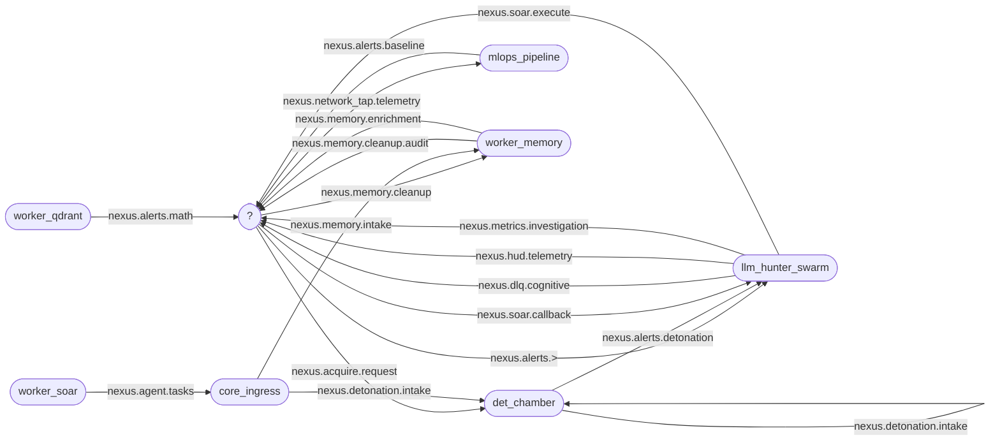

# Code Graph — how Sentinel Nexus is wired together

> **Generated** from source by `gen_code_graph.py` (do not edit by hand; `--check` drift-guards it in CI). Machine-readable twin: `code_graph.json`.

## How to use this

Start a change by finding the **logic flow**, not the file. This repo is event-driven across Python + Rust, so the fastest trace is the **NATS subject bus** below: pick the subject your change touches → see who *publishes* and who *consumes* it → that is the call chain across services. The **component index** then maps each service to its path, language, Dockerfile/test section, and the subjects it speaks. `code_graph.json` is the same data for `jq`/grep.

## NATS subject bus (the nervous system)

## Subjects

| Subject | Producers | Consumers | Stream | Also mentions |
|---|---|---|---|---|
| `$2` | — | — | $1 | — |
| `middleware.dlq.>` | — | — | MiddlewareStream_DLQ | nats_streams |
| `middleware.telemetry.*` | — | — | MiddlewareStream | nats_streams |
| `nexus.*.telemetry` | — | — | Tier5_Telemetry | nats_streams, worker_s3_archive |
| `nexus.acquire.request` | — | det_chamber | Nexus_Acquire_Request | llm_hunter_swarm, nats_streams |
| `nexus.agent.tasks` | worker_soar | core_ingress | — | — |
| `nexus.alerts.>` | — | llm_hunter_swarm | — | — |
| `nexus.alerts.baseline` | mlops_pipeline | — | Nexus_Baseline_Alerts | nats_streams |
| `nexus.alerts.detonation` | det_chamber | llm_hunter_swarm | Nexus_Alerts_Detonation | nats_streams |
| `nexus.alerts.math` | worker_qdrant | — | Nexus_Math_Alerts | nats_streams |
| `nexus.c2.telemetry` | — | — | — | mlops_pipeline |
| `nexus.deepsensor.telemetry` | — | — | — | mlops_pipeline |
| `nexus.detonation.intake` | core_ingress, det_chamber | det_chamber | Nexus_Detonation_Intake | nats_streams |
| `nexus.dlq` | — | — | — | lib_siem_core, worker_rlhf, worker_s3_archive |
| `nexus.dlq.>` | — | — | Nexus_DLQ | nats_streams |
| `nexus.dlq.cognitive` | llm_hunter_swarm | — | — | — |
| `nexus.hud.telemetry` | llm_hunter_swarm | — | — | — |
| `nexus.macos.telemetry` | — | — | — | mlops_pipeline |
| `nexus.memory.cleanup` | — | worker_memory | — | — |
| `nexus.memory.cleanup.audit` | worker_memory | — | — | — |
| `nexus.memory.enrichment` | worker_memory | — | Nexus_Memory_Enrichment | nats_streams |
| `nexus.memory.intake` | core_ingress | worker_memory | Nexus_Memory_Intake | nats_streams |
| `nexus.metrics.investigation` | llm_hunter_swarm | — | Nexus_Metrics_Investigation | nats_streams |
| `nexus.network_tap.telemetry` | — | mlops_pipeline | — | — |
| `nexus.pyrit` | — | — | — | mlops_pipeline |
| `nexus.rsi` | — | — | — | mlops_pipeline |
| `nexus.sensor.telemetry` | — | — | — | mlops_pipeline |
| `nexus.sentinel.telemetry` | — | — | — | mlops_pipeline |
| `nexus.soar.callback` | — | llm_hunter_swarm | Nexus_SOAR_Callback | nats_streams |
| `nexus.soar.execute` | llm_hunter_swarm | — | Nexus_SOAR_Execute | nats_streams, worker_soar |
| `nexus.telemetry` | — | — | — | lib_siem_core |
| `nexus.ti.status` | — | — | — | worker_ti_ingest |
| `nexus.training.rlhf` | — | — | — | worker_rlhf |
| `nexus.training.rlhf.judge_scores` | — | — | — | mlops_pipeline |
| `nexus.training.rlhf.records` | — | — | Nexus_RLHF_Training | nats_streams, worker_rlhf |
| `nexus.trellix.telemetry` | — | — | — | mlops_pipeline |

## HTTP endpoints (service ↔ caller)

| Endpoint | Service | Methods | Callers |
|---|---|---|---|
| `/api/v1/artifact` | core_ingress | post | det_chamber |
| `/api/v1/evidence` | core_ingress | post | nats_streams, worker_memory |
| `/api/v1/tasks` | core_ingress | get | det_chamber, on_host_agent, worker_soar |
| `/api/v1/telemetry` | core_ingress | post | middleware |

## Stores (who touches each S3 bucket / Qdrant collection)

| Store | Kind | Touched by |
|---|---|---|
| `qdrant_swarm_memory` | qdrant | llm_hunter_swarm |
| `qdrant_ti_corpus` | qdrant | worker_ti_ingest |
| `s3_cold_archive` | s3 | llm_hunter_swarm, worker_s3_archive |
| `s3_memory_evidence` | s3 | core_ingress, worker_memory |
| `s3_quarantine` | s3 | det_chamber |

## Component index

Each component: language, how it's **built** (Dockerfile), **deployed** (Ansible role + host group), **tested** (run_tests.sh section), and the subjects it speaks.

| Component | Lang | Build | Deploy (role @ host) | Test section | Pub → Sub | Files |
|---|---|---|---|---|---|---|
| **core_ingress** | rust | services/core_ingress/Dockerfile | rust_ingress @ ingress | services | 2→1 | 2 |
| **det_chamber** | python | — | — | detchamber | 2→2 | 14 |
| **ir_playbooks** | mixed | — | — | services | 0→0 | 88 |
| **lib_siem_core** | rust | — | — | services | 0→0 | 2 |
| **llm_hunter_swarm** | python | analytics/llm_hunter/Dockerfile | nexus_hunter @ analytics | analytics | 4→3 | 34 |
| **middleware** | rust | — | — | services | 0→0 | 10 |
| **mlops_pipeline** | python | — | — | offline | 1→1 | 51 |
| **nats_streams** | shell | infrastructure/nats/Dockerfile | — | services | 0→0 | 1 |
| **on_host_agent** | python | — | — | services | 0→0 | 2 |
| **worker_memory** | python | services/worker_memory/Dockerfile | memory_worker @ analytics | memory | 2→2 | 3 |
| **worker_qdrant** | rust | services/worker_qdrant/Dockerfile | rust_podman_worker @ workers | services | 1→0 | 1 |
| **worker_rlhf** | rust | services/worker_rlhf/Dockerfile | rust_podman_worker @ workers | services | 0→0 | 1 |
| **worker_rules** | rust | services/worker_rules/Dockerfile | rust_podman_worker @ workers | services | 0→0 | 1 |
| **worker_s3_archive** | rust | services/worker_s3_archive/Dockerfile | rust_podman_worker @ workers | services | 0→0 | 1 |
| **worker_soar** | rust | services/worker_soar/Dockerfile | rust_podman_worker @ workers | services | 1→0 | 2 |
| **worker_ti_ingest** | python | services/worker_ti_ingest/Dockerfile | ti_ingest_worker @ ti | mlops | 0→0 | 4 |

## Pipelines (ordered stages)

End-to-end flows run as numbered scripts: `deploy` (orchestration) and `mlops` (train → eval → serve → RSI → benchmark).

### deploy

| Stage | Script | Purpose |
|---|---|---|
| 01 | `render-templates` | Stage 1: Render Jinja2 templates using the environment YAML. |
| 02 | `provision-infra` | Stage 2: Provision infrastructure via Terraform, then build the Ansible inventory |
| 02b | `build-inventory` | Bridge: Terraform outputs + environment YAML → Ansible inventory.yml |
| 03 | `harden-os` | Stage 3: OS hardening across all provisioned hosts (Layer 0). |
| 04 | `deploy-core` | Stage 4: Deploy core infrastructure — NATS, Redis, Qdrant, MinIO, Rust workers, |
| 05 | `deploy-middleware` | Stage 5: Deploy the Zero-Trust Middleware layer (Layer 1.5). |
| 06 | `trigger-mlops` | Stage 6: Sovereign MLOps Training Pipeline |
| 07 | `deploy-inference` | Stage 7: Deploy Trained Models to Inference Nodes |
| 07b | `deploy-detchamber` | Stage 7b: Deploy the Det Chamber (live acquisition & detonation) |

### mlops

| Stage | Script | Purpose |
|---|---|---|
| 01 | `spool_datasets` | 01_spool_datasets.py — Multi-Track Dataset Spooler for Sovereign MLOps |
| 02 | `train_dpo_critic` | 02_train_dpo_critic.py — Model D: SOAR Critic (DPO/IPO Alignment) |
| 02 | `train_network` | 02_train_network.py — Model B: Network Adversarial (QLoRA + Dual-Track Curriculum) |
| 02 | `train_qlora` | 02_train_qlora.py — Model C: Spatial Endpoint (QLoRA + Multi-Head Projector) |
| 02 | `train_sft_cot` | 02_train_sft_cot.py -- Chain-of-Thought SFT with Response Masking |
| 03 | `eval_critic` | 03_eval_critic.py — Model D: SOAR Critic Evaluation Suite |
| 03 | `eval_model` | 03_eval_model.py — Model C: Spatial Endpoint Evaluation Suite |
| 03 | `eval_network` | 03_eval_network.py — Model B: Network Adversarial Evaluation Suite |
| 03 | `eval_pyrit` | 03_eval_pyrit.py — ADDON Phase 2: PyRIT Multi-Turn Attack Orchestrator |
| 04 | `merge_weights` | — |
| 04 | `reward_model` | 04_reward_model.py — Reward Model Training + LLM-as-Judge Evaluation |
| 05 | `critic_loop` | 05_critic_loop.py -- Generator→NeMo schema check→Critic→Regenerate cycle (Phase 2.3) |
| 05 | `mine_cloud_fps` | 05_mine_cloud_fps.py — Cloud False-Positive Mining Pipeline (M-17 SKELETON) |
| 05 | `serve_critic` | 05_serve_critic.py — Model D: SOAR Critic (Blast Radius Evaluator) |
| 05 | `serve_network` | 05_serve_network.py — Model B: Network Adversarial Pattern Classifier |
| 05 | `serve_sovereign` | 05_serve_sovereign.py — Model C: Spatial Endpoint Expert Inference Server |
| 05 | `synthetic_data_gen` | 05_synthetic_data_gen.py — Synthetic Hard Negative Generation + Validation |
| 06 | `sandbox_runner` | 06_sandbox_runner.py — Firecracker micro-VM atomic execution runner (PIPELINE Phase 1) |
| 07 | `feed_ingest` | 07_feed_ingest.py — Continuous threat feed pipeline (PIPELINE Phase 1) |
| 08 | `rsi_loop` | 08_rsi_loop.py -- ADDON Phase 4: Closed-Loop Recursive Self-Improvement |
| 09 | `benchmark_runner` | 09_benchmark_runner.py — WS-A M-26 benchmark runner + registry. |
| 11 | `join_outcomes` | 11_join_outcomes.py — WS-A M-27 delayed-ground-truth join. |

## Python intra-repo imports

Module → local modules it imports (call-chain within the Python planes).

- `analytics/llm_hunter/agents/__init__.py` → `agents.cloud_expert`, `agents.host_expert`, `agents.net_expert`, `agents.nettap_expert`, `agents.response`, `agents.review_board`, `agents.supervisor`
- `analytics/llm_hunter/agents/active_learning.py` → `agents.controls`
- `analytics/llm_hunter/agents/bias_audit.py` → `agents.controls`
- `analytics/llm_hunter/agents/calibration_ledger.py` → `agents.controls`
- `analytics/llm_hunter/agents/cloud_expert.py` → `agents.expert_base`, `state`, `tools`, `tools.query_cookbook`, `tools.siem_cookbook`
- `analytics/llm_hunter/agents/energy_accounting.py` → `agents.controls`
- `analytics/llm_hunter/agents/expert_base.py` → `agents.llm_providers`, `tools.sanitizer`
- `analytics/llm_hunter/agents/host_expert.py` → `agents.expert_base`, `state`, `tools`, `tools.query_cookbook`, `tools.siem_cookbook`
- `analytics/llm_hunter/agents/llm_providers.py` → `agents.controls`, `tools.nexus_config`
- `analytics/llm_hunter/agents/net_expert.py` → `agents.expert_base`, `state`, `tools`, `tools.query_cookbook`, `tools.siem_cookbook`
- `analytics/llm_hunter/agents/nettap_expert.py` → `agents.expert_base`, `state`, `tools`, `tools.query_cookbook`, `tools.siem_cookbook`
- `analytics/llm_hunter/agents/response.py` → `agents.active_learning`, `agents.controls`, `agents.energy_accounting`, `agents.llm_providers`, `agents.playbook_planner`, `agents.verdict_ledger`, `state`, `tools.sanitizer`
- `analytics/llm_hunter/agents/review_board.py` → `agents.controls`, `agents.llm_providers`, `state`, `tools.nexus_config`, `tools.siem_query`
- `analytics/llm_hunter/agents/supervisor.py` → `agents.controls`, `agents.llm_providers`, `state`, `tools.nexus_config`
- `analytics/llm_hunter/agents/verdict_ledger.py` → `agents.controls`
- `analytics/llm_hunter/orchestrator.py` → `agents.cloud_expert`, `agents.host_expert`, `agents.net_expert`, `agents.nettap_expert`, `agents.response`, `agents.review_board`, `agents.supervisor`, `detonation_enrichment`, `investigation_metrics`, `state`, `tools.sanitizer`
- `analytics/llm_hunter/tools/__init__.py` → `tools.acquire_detonate`, `tools.duckdb_query`, `tools.entity_manager`, `tools.nexus_config`, `tools.qdrant_search`, `tools.sanitizer`, `tools.siem_query`, `tools.ti_lookup`
- `analytics/llm_hunter/tools/acquire_detonate.py` → `state`
- `analytics/llm_hunter/tools/duckdb_query.py` → `tools.nexus_config`, `tools.sanitizer`
- `analytics/llm_hunter/tools/qdrant_search.py` → `tools.sanitizer`
- `analytics/llm_hunter/tools/siem_cookbook.py` → `tools.nexus_config`, `tools.siem_query`
- `analytics/llm_hunter/tools/siem_query.py` → `tools.nexus_config`, `tools.sanitizer`
- `analytics/llm_hunter/tools/ti_lookup.py` → `tools.nexus_config`, `tools.sanitizer`
- `mlops/scripts/01_spool_datasets.py` → `corpus_utils`
- `mlops/scripts/02_train_dpo_critic.py` → `model_config`
- `mlops/scripts/02_train_network.py` → `model_config`
- `mlops/scripts/02_train_qlora.py` → `model_config`
- `mlops/scripts/02_train_sft_cot.py` → `model_config`
- `mlops/scripts/03_eval_critic.py` → `model_config`
- `mlops/scripts/03_eval_model.py` → `model_config`
- `mlops/scripts/03_eval_network.py` → `model_config`
- `mlops/scripts/04_merge_weights.py` → `model_config`
- `mlops/scripts/04_reward_model.py` → `agents.llm_providers`, `model_config`
- `mlops/scripts/05_critic_loop.py` → `corpus_utils`, `model_config`
- `mlops/scripts/05_serve_critic.py` → `model_config`
- `mlops/scripts/05_serve_network.py` → `model_config`
- `mlops/scripts/05_serve_sovereign.py` → `model_config`
- `mlops/scripts/08_rsi_loop.py` → `corpus_utils`
- `mlops/scripts/projector.py` → `model_config`
- `mlops/scripts/stage_active_directory_behavioral.py` → `corpus_utils`
- `mlops/scripts/stage_bypass_behavioral.py` → `corpus_utils`
- `mlops/scripts/stage_c2_behavioral.py` → `corpus_utils`
- `mlops/scripts/stage_exfiltration_behavioral.py` → `corpus_utils`
- `mlops/scripts/stage_lateral_movement_behavioral.py` → `corpus_utils`
- `mlops/scripts/stage_linux_exploitation_behavioral.py` → `corpus_utils`
- `mlops/scripts/stage_lotl_behavioral.py` → `corpus_utils`
- `mlops/scripts/stage_malware_behavioral.py` → `corpus_utils`
- `mlops/scripts/stage_persistence_behavioral.py` → `corpus_utils`
- `mlops/scripts/stage_recon_behavioral.py` → `corpus_utils`
- `mlops/scripts/stage_windows_exploitation_behavioral.py` → `corpus_utils`
- `services/worker_memory/main.py` → `evidence_intake`, `memory_analysis`
