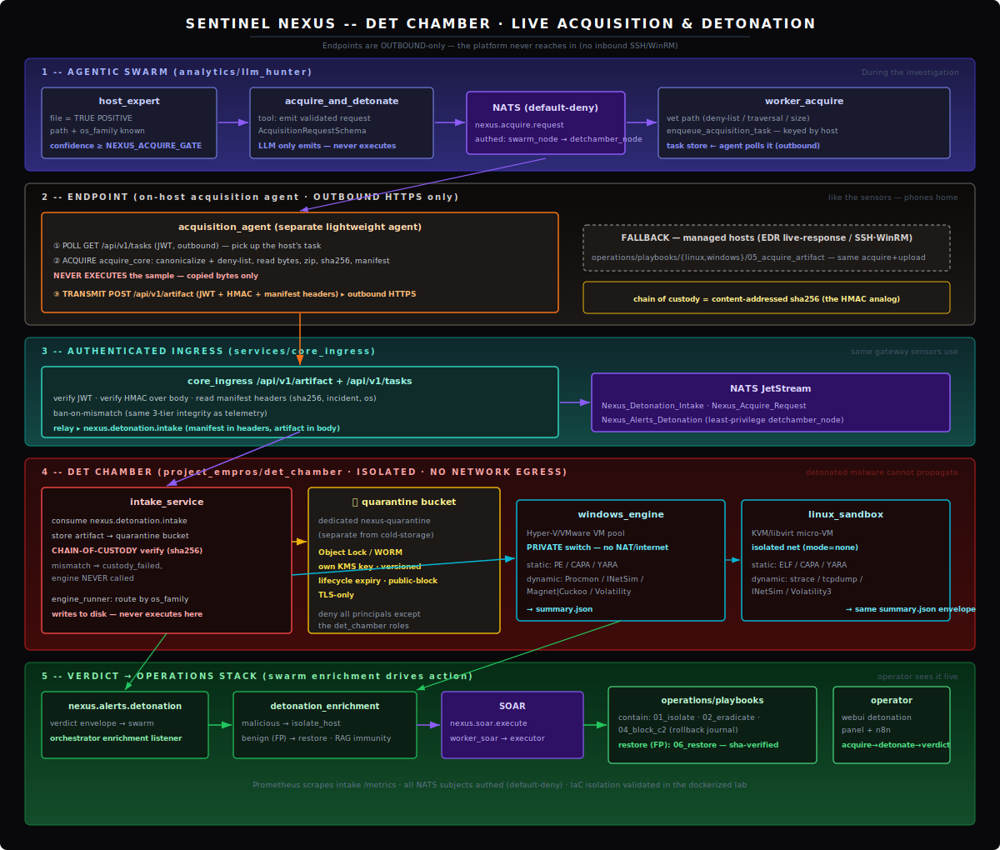

# Det Chamber

The detonation chamber for the Sentinel Nexus platform. When the agentic swarm
confirms, **during an investigation**, that a file on a Linux/Windows host is a true
positive, the on-host agent grabs that file and ships it to the Det Chamber, which
detonates it in an isolated VM and returns a verdict the swarm uses to harden its
conclusion and drive evidence-backed containment (or, on a benign verdict, an
automatic restore).

This component owns the **engine** (analysis), the **acquisition agent + worker**,
the **intake service** (the bridge from an acquired artifact to a detonation), and its
**deploy manifests**. VM provisioning/IaC lives under `infrastructure/`; the swarm
trigger + verdict loop live in `analytics/llm_hunter`; the authenticated transport
runs through `services/core_ingress` and `operations/`.

> Full design, phase status, and findings ledger:
> [`planning_docs/DET_CHAMBER_INTEGRATION_PLAN.md`](../planning_docs/DET_CHAMBER_INTEGRATION_PLAN.md).

## Workflow



Endpoints are **outbound-only** (no inbound SSH/WinRM), so acquisition rides the same
authenticated outbound channel the sensors use — the platform never reaches into a host:

1. **Swarm** — `host_expert` confirms a file TP (confidence ≥ gate) → the
   `acquire_and_detonate` tool emits a validated `nexus.acquire.request` →
   `worker_acquire` vets the path and **enqueues a task keyed by host**.
2. **Endpoint** — the separate `acquisition_agent` **polls** `GET /api/v1/tasks`, runs
   `acquire_core` locally (validate path → zip → sha256 → manifest; **never executes**),
   and **transmits** `POST /api/v1/artifact` **outbound over HTTPS** with JWT + HMAC.
   *(Fallback for managed hosts: the `05_acquire_artifact` SSH/WinRM playbook.)*
3. **Ingress** — `core_ingress` verifies JWT + HMAC, then relays
   `nexus.detonation.intake` (manifest in headers, artifact in body).
4. **Chamber** — `intake_service` stores the artifact to the **locked-down quarantine
   bucket**, verifies the chain of custody (sha256), and `engine_runner` routes to the
   isolated `windows_engine` / `linux_sandbox` VM (no network egress).
5. **Verdict → operations** — `nexus.alerts.detonation` → `detonation_enrichment` →
   **contain** (malicious) or **restore** (benign FP) via the operations playbooks; the
   operator sees acquire→detonate→verdict live in the webui detonation panel.

## Layout

```
det_chamber/
├─ engine/    detonation engine (analysis only; runs on the isolated analysis VMs)
│   ├─ malware_sandbox.py   Windows engine (static PE/CAPA/YARA + dynamic Procmon/Magnet|Cuckoo/Vol)
│   ├─ linux_analyzer.py    Linux ELF analyzer (static ELF/CAPA/YARA + dynamic strace/net/Vol3)
│   ├─ engine_runner.py     os_family → analyzer dispatch (writes bytes, never executes here)
│   ├─ summary_schema.py    the shared result envelope both platforms emit
│   ├─ sandbox_config.py    config resolution (defaults < detchamber.toml < DETCHAMBER_* env)
│   ├─ targets.py           single-file (--malware) vs whole-dir selection
│   └─ compile_yara_rules.py / filter_yara_rules.ps1 / download_tools.ps1   (image-build assets)
├─ agents/    acquire_core.py (path-safety + manifest + zip), acquisition_agent.py
│             (outbound poll + HTTPS transmit), acquire_worker.py (enqueue task / fallback dispatch)
├─ intake/    intake_service.py (NATS in/out, chain-of-custody verify, /metrics), manifest.py
├─ config/    detchamber.toml
├─ deploy/    Dockerfile.windows-engine, Dockerfile.intake, docker-compose.yml, kubernetes-deployment.yaml
└─ img/       det_chamber_workflow.svg
```

Owned by the platform (not here):
- `infrastructure/terraform/det_chamber/` — Windows VM (private switch) + Linux KVM sandbox
  (isolated libvirt net) + the **locked-down `nexus-quarantine`** bucket.
- `infrastructure/ansible/{roles/det_chamber_sandbox,roles/det_chamber_linux,det_chamber.yml}`.
- `services/core_ingress` — the `/api/v1/artifact` + `/api/v1/tasks` endpoints (JWT + HMAC).
- `analytics/llm_hunter` — the `acquire_and_detonate` tool, `AcquisitionRequestSchema`,
  `detonation_enrichment` verdict→action, orchestrator `nexus.alerts.detonation` listener.
- `operations/playbooks` — `05_acquire_artifact` (fallback) + `06_restore` + the n8n detonation workflow.

## Configuration

Config-driven, no hard-coded paths. Order: **defaults < `config/detchamber.toml` <
`DETCHAMBER_*` env** (env wins for container/orchestration overrides). See
`engine/sandbox_config.py`.

| Setting | TOML key (`[detchamber]`) | Env | Default |
|---|---|---|---|
| Sample intake dir | `malware_dir` | `DETCHAMBER_MALWARE_DIR` | `C:\Malware` |
| Output dir | `collection_dir` | `DETCHAMBER_COLLECTION_DIR` | `C:\Collections` |
| Tools dir | `tools_dir` | `DETCHAMBER_TOOLS_DIR` | `E:\Tools\Windows` |
| Detonation window (s) | `pcap_time` | `DETCHAMBER_PCAP_TIME` | `180` |
| Evidence tool | `evidence_tool` | `DETCHAMBER_EVIDENCE_TOOL` | `magnet` |
| Network simulation | `simulate_network` | `DETCHAMBER_SIMULATE_NETWORK` | `false` |

Service env (`infrastructure/ansible/roles/det_chamber_linux/templates/detchamber.env.j2`):
`NATS_USER=detchamber_node` + creds, quarantine S3, `INTEGRITY_HMAC_SECRET`, metrics port.

## Running the engine

```bash
# Detonate ONE acquired artifact (what intake invokes):
python engine/malware_sandbox.py --config config/detchamber.toml --malware evil.exe
# Whole-directory batch:
python engine/malware_sandbox.py --config config/detchamber.toml --parallel 4 --simulate-network
```
Both analyzers emit the same envelope (`summary_schema`: `{timestamp, host_ip, files:[{file, static, dynamic}]}`).

## Security model

- **Authenticated transmission, end to end** — the agent transmits the artifact **outbound over
  HTTPS** to ingress with **JWT + HMAC** (the same integrity primitive sensors use); the
  chain-of-custody `sha256` is re-verified at intake. Service-to-service traffic rides the
  **default-deny NATS broker** as the least-privilege `detchamber_node`.
- **Chain of custody** — intake detonates only bytes whose `sha256`+size match the manifest; a
  mismatch yields `custody_failed` and **no detonation** (the engine is never called).
- **Never executed off the sandbox** — acquisition reads/zips bytes only; `engine_runner` writes
  the sample to a temp file but never runs it; it executes solely inside the isolated VM.
- **No network egress (anti-propagation)** — Windows VM on a PRIVATE Hyper-V switch / isolated
  VMware port group; Linux VM on an isolated libvirt network (`mode="none"`); k8s default-deny
  `NetworkPolicy`; compose `internal: true`. Terraform validations *refuse* the internet-connected
  `"Default Switch"` / `"VM Network"`.
- **Locked-down malware storage** — `nexus-quarantine` is a **dedicated** bucket (never the
  telemetry cold-storage lake): own KMS key, versioning, lifecycle auto-expiry, public-access-block,
  TLS-only, **Object Lock/WORM**, and a policy denying every principal except the det_chamber roles.
- **Bounded autonomy** — acquisition fires only on a review-board-confirmed TP at/above `NEXUS_ACQUIRE_GATE`;
  path traversal / wildcards / OS-critical files / oversize are refused before any collection.

## Testing

Test-first (TDD). The dockerized lab mocks the real deployment and runs real IaC validators
(terraform/yamllint/ansible-lint). The Phase 7 capstone walks the whole lifecycle with the real
modules; the endpoint outbound path + ingress endpoints have their own contracts.

```bash
cd project_empros && pytest tests/lab_det_chamber/ -v          # fast host run
cd project_empros/tests && ./run_tests.sh --section detchamber # dockerized (CI)
```
Lab details + per-file coverage: [`tests/lab_det_chamber/readme.md`](../tests/lab_det_chamber/readme.md).

## Known follow-ups (see the plan's Progress Log)

- `cargo build` the `core_ingress` artifact/tasks endpoints in CI (validated here as source-contract only).
- Wire `GET /api/v1/tasks` to the shared task store + the agent poll loop.
- Intake's storage of the relayed artifact into the quarantine bucket — integration test.
