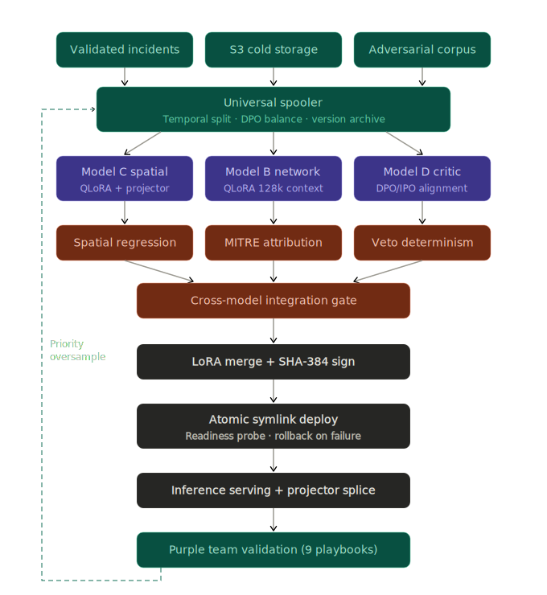
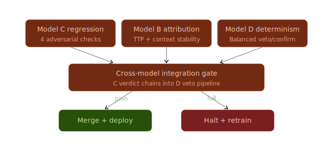

### Nexus Integrity Verification Flow

  

* **Sensor Trust Boundary**: Every sensor (Linux Sentinel, C2, DeepSensor, Arkime) applies an HMAC-SHA256 stamp--including a monotonic sequence and timestamp--at the point of origin.
* **Ingress Gateway Boundary**: Upon receiving telemetry, the gateway performs a multi-tier validation:
* **Tier 1 (HMAC)**: Recomputes the signature using a constant-time comparison to prevent timing attacks.
* **Tier 2 (Temporal/Sequence)**: Rejects telemetry with clock skew >120s or non-monotonic sequences to prevent replay attacks.
* **Tier 3 (Cross-OS)**: Validates that the schema columns (e.g., Windows vs. Linux attributes) are consistent with the sensor source.
* **Final Processing**: Only once all tiers pass is the data published to NATS JetStream for consumption by the AI analytics pipeline.

---

### Nexus MLOps Pipeline Overview

  

* **Data Foundation**: Validated incidents, S3-stored cold storage, and adversarial corpora are funneled into the **Universal Spooler**, which handles temporal splitting, DPO class balancing, and version archiving.
* **Model Training**: The architecture bifurcates into three specialized tracks: **Model C** (Spatial QLoRA + Projector), **Model B** (Network SPI with 128k context), and **Model D** (Critic with DPO alignment).
* **Validation & Deployment**: Each model passes through a "Cross-model integration gate" to ensure consensus before weights are merged, cryptographically signed with SHA-384, and deployed via atomic symlink swap to the vLLM engine.
* **Feedback Loop**: A green dashed line indicates the "Priority Oversampling" path, where incidents that successfully evade detection are tagged to be aggressively oversampled in the next training cycle.

---

### Nexus Evaluation Gate Convergence

  

* **Multi-Input Gating**: The system requires successful passes from three distinct validation gates: **Model C** (adversarial checks), **Model B** (attribution stability), and **Model D** (deterministic veto logic).
* **Integration Gate**: The output of Model C’s verdict is chained into the Model D veto pipeline.
* **Deployment Trigger**: Only if all integration gates pass does the pipeline proceed to the **Merge + Deploy** stage. If any gate fails, the system triggers an automatic **Halt + Retrain** process, ensuring the model never operates in a degraded or unverified state.