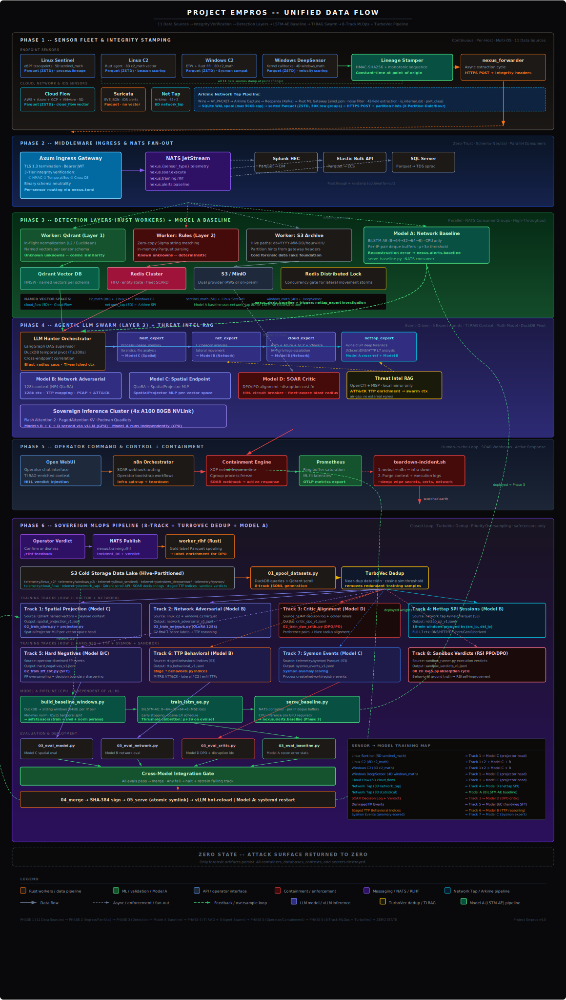

### What is the point of this project?

The future of cybersecurity is defined by autonomous, machine-speed engagements where AI-driven offensive agents (Red AI) clash with AI-driven **defensive systems (Blue AI)**. Because human-operated tools can no longer keep pace with the scale of modern cyberattacks, artificial intelligence is now the primary driving force on both sides of the digital battleground.

AI is both the master key and the unpickable lock; the winner is simply whoever turns it faster.

### Sensor to LLM Data Flow

> [!NOTE]
> This logical data flow diagram is updated to represent the current architecture.

<p align="center">
  
</p>

---

### Directory Structure:
```bash
PROJECT_EMPROS/
├── analytics/                             # Advanced data analysis and correlation engines
│   ├── llm_hunter/                        # Layer 3: Agentic AI Swarm (Python-based DAG for attack graph building)
├── orchestration/
│   ├── templates/
│   │   ├── global.env.j2                  # Master env-var template -- rendered to orchestration/rendered/global.env
│   │   ├── backend.tf.j2                  # Terraform remote state: S3 (aws-ec2/eks) or local (vmware), infra-target-aware
│   │   └── inventory.yml.j2               # Reference template only -- authoritative inventory built by 02b-build-inventory.py
│   ├── pipelines/
│   │   └── master-ci.yml                  # GitLab CI/CD: 7 stages -- configure→provision→harden→deploy_core→deploy_middleware→mlops_train→mlops_deploy
│   ├── scripts/
│   │   ├── 01-render-templates.sh         # Renders global.env.j2 + backend.tf.j2 from env YAML (skips inventory.yml.j2)
│   │   ├── 02-provision-infra.sh          # Terraform init/apply → captures output JSON → calls 02b-build-inventory.py
│   │   ├── 02b-build-inventory.py         # Bridge: terraform output -json + env YAML → orchestration/rendered/inventory.yml (includes inference_nodes group)
│   │   ├── 03-harden-os.sh                # Runs site.yml --tags hardening (common_hardening role, Layer 0)
│   │   ├── 04-deploy-core.sh              # Runs site.yml --skip-tags hardening (NATS/Redis/Qdrant/Workers/TI/LLM, Layer 1)
│   │   ├── 05-deploy-middleware.sh        # Runs middleware/deploy/ansible/main.yml (ETL fanout layer, Layer 1.5)
│   │   ├── 06-trigger-mlops.sh            # Runs on analytics node: data spool → train-all → eval gates → OCI artifact push
│   │   └── 07-deploy-inference.sh         # Runs from CI runner: Ansible → inference_nodes (Model A→analytics, B/C/D→GPU cluster)
│   └── environments/
│       ├── dev.yaml                       # Dev: vmware, cluster_size=1, log_only, GPU inference disabled (mlops_deploy_model_b/d=false)
│       └── production.yaml                # Prod: aws-ec2, cluster_size=3, isolate_and_quarantine, full 4-model GPU inference cluster
├── infrastructure/                        # Core infrastructure definitions and configuration management (Non-Public)
│   ├── ansible/                           # Automated provisioning and deployment playbooks
│   │   ├── group_vars/                    # Environment-specific variables, tuning parameters, and encrypted secrets
│   │   │   ├── all/vault.yml              # Ansible Vault: NATS NKey, AWS keys, JWT secret, OpenAI key, MinIO root/worker secrets
│   │   │   └── ti/vault.yml               # Ansible Vault: OpenCTI admin/agent tokens, Elasticsearch heap, connector UUIDs
│   │   ├── inventory/
│   │   │   └── hosts.yml                  # Static inventory: ingress(10.0.10.x), nats(10.0.20.x), redis(10.0.30.x),
│   │   │                                  #   qdrant(10.0.50.x), workers(10.0.60.x), storage(10.0.70.x), ti(10.0.90.x)
│   │   │                                  #   analytics/management/inference_nodes defined in orchestration/rendered/inventory.yml
│   │   ├── roles/                         # Modular Ansible roles for specific infrastructure components
│   │   │   ├── common_hardening/          # Full OS hardening pipeline: packages → kernel → sysctl-tuning → SSH → users → firewall → audit → services → THP → node_exporter → CA trust
│   │   │   ├── haproxy_node/              # L4 Load Balancer provisioning for edge routing and DDoS shielding
│   │   │   ├── internal_networking/       # VPC, internal firewall, and subnet routing configurations
│   │   │   ├── minio_node/                # On-prem S3-compatible object storage: binary install, systemd, TLS, bucket lifecycle, service accounts
│   │   │   ├── nats_node/                 # Deployment of the JetStream high-velocity persistent binary bus
│   │   │   ├── nexus_hunter/              # Swarm orchestration daemon: Python agent environment + all agents (supervisor, host/net/cloud/nettap expert, review_board, response) + tool registry
│   │   │   ├── observability_node/        # Setup for Prometheus exporters, Grafana, and system metrics scraping
│   │   │   ├── opencti_node/              # Air-gapped OpenCTI 6.8 TI stack: docker-compose, .env template, MITRE ATT&CK import, agent token propagation
│   │   │   ├── podman_setup/              # Installation and daemonless configuration of the Podman container engine
│   │   │   ├── qdrant_node/               # Provisioning of the vector database for mathematical anomaly hunting
│   │   │   ├── redis_node/                # Deployment of the in-memory key-value store for deduplication and rule triggers
│   │   │   ├── rust_ingress/              # Setup for the Axum Zero-Trust Gateway
│   │   │   └── rust_podman_worker/        # systemd Quadlet generation with JetStream auto-scaler for isolated Rust containers
│   │   └── site.yml                       # Master playbook: hardening → ingress → NATS/Redis → Qdrant (readiness gate + init) →
│   │                                      #   MinIO → workers → LLM swarm → baseline detector → TI stack (opencti) → observability
│   ├── certs/                             # Nexus Root CA (generated by operations/scripts/cert-gen.sh -- gitignored, never committed)
│   ├── haproxy/                           # Specific HAProxy configuration definitions (e.g., haproxy.cfg)
│   ├── nats/                              # Specific NATS JetStream server configurations and storage limits
│   ├── prometheus/
│   │   └── prometheus.yml                 # Static scrape config (dev docker-compose + TI stack at 10.0.90.x); production rendered by Ansible
│   ├── qdrant/
│   │   └── qdrant_init.sh                 # Collection creation with named vectors + KEYWORD indexes on endpoint_id, source_type, vector_name
│   └── terraform/
│       ├── main.tf                        # AWS EKS cluster, VPC, node groups (stateless + stateful NVMe), S3 data lake, IRSA for archive worker
│       ├── iam.tf                         # IAM roles with prefix-scoped S3 policies (telemetry/*, models/*, training/*)
│       ├── aws/
│       │   └── main.tf                    # AWS EC2 fleet: ingress, NATS, Redis, Qdrant, workers, analytics (r6i.2xlarge), management (t3.large) + all outputs
│       └── vmware/
│           └── main.tf                    # vSphere VM fleet: ingress, NATS, Redis, Qdrant, workers, MinIO (10.0.70.x), TI (10.0.90.x), analytics (10.0.80.10) + all outputs
├── specs.md                               # System specifications, constraints, and rigid engineering requirements
├── todos.md                               # Backlog of pending tasks, technical debt, and planned enhancements
├── libs/                                  # Shared libraries and dependencies
│   └── lib_siem_core/                     # Common Rust library ensuring binary schema neutrality and shared structs
│       └── src/
│           ├── lib.rs                     # Crate root
│           └── models.rs                  # DynamicUebaVector with source_type field and regex validation
├── planning_docs/                         # Strategic roadmaps, design documents, and structural outlines
├── services/                              # Layer 1 & Layer 2 High-Speed Rust Services
│   ├── config/
│   │   └── nexus.toml                     # Local dev config for cargo run fallback and build.sh staging -- production config is Ansible-templated
│   ├── core_ingress/                      # Axum Zero-Trust Gateway handling TLS termination, JWT, and 3-tier integrity verification
│   │   └── src/
│   │       ├── main.rs                    # Axum router with HMAC/temporal/sequence/cross-OS validation
│   │       └── integrity.rs               # LineageStamper verification: HMAC-SHA256, drift ±30s, monotonic sequence, collision detection
│   ├── worker_qdrant/                     # Rust worker mapping telemetry to vector space (Layer 1 Math Tripwires)
│   │   └── src/
│   │       └── main.rs                    # Parquet→Arrow→Qdrant with flat payload schema, per-field indexing, source_type routing
│   ├── worker_rules/                      # Rust worker executing deterministic Sigma string matches (Layer 2)
│   ├── worker_s3_archive/                 # Rust worker spooling Parquet to cold storage with Hive-partitioned paths
│   │   └── src/
│   │       └── main.rs                    # NATS consumer → Hive paths (dt=YYYY-MM-DD/hour=HH/) with partition hint headers, backpressure semaphore, DLQ
│   ├── worker_soar/                       # Rust worker executing SOAR containment actions via n8n webhooks
│   └── worker_rlhf/                       # Rust worker spooling gold-label Parquet for DPO training feedback
├── mlops/                                 # Sovereign Multi-Model Training & Inference Pipeline (Non-Public -- the secret sauce)
│   ├── Makefile                           # Full pipeline: data-all→train-all→eval-critic-full→deploy; targets for every TTP corpus, model, and eval stage
│   ├── PIPELINE.md                        # MLOps workflow documentation: data flow, training sequence, eval gates, roadmap
│   ├── model_config.toml                  # Central model selection: base model IDs, adapter paths, display names, projector hidden_dim
│   ├── corpus_config.toml                 # Model B corpus staging config: PCAP dirs, Suricata rule dirs, MITRE source, enrichment options
│   ├── data/
│   │   ├── pcaps/                                   # PCAP intake -- recursive subdirectories define campaign labels
│   │   ├── suricata_rules/                          # Suricata rule intake (et_open/, custom/, local/)
│   │   ├── staging/                                 # Intermediate artifacts: per-TTP JSONL corpora + query indices
│   │   │   ├── recon_behavioral_v1.jsonl                 # 1_Recon: 20 cls, 240 recs
│   │   │   ├── persistence_behavioral_v1.jsonl           # 2_Persistence: 27 cls, 312 recs
│   │   │   ├── c2_behavioral_v1.jsonl                    # 3_C2: 27 cls, 312 recs
│   │   │   ├── bypass_behavioral_v1.jsonl                # 4_Bypass: 31 cls, 348 recs (incl. CrossOsSchemaInjection)
│   │   │   ├── lateral_movement_behavioral_v1.jsonl      # 5_Lateral_Movement: 24 cls, 288 recs
│   │   │   ├── exfiltration_behavioral_v1.jsonl          # 7_Exfiltration: 20 cls, 240 recs
│   │   │   ├── active_directory_behavioral_v1.jsonl      # Active-Directory: 20 cls, 240 recs
│   │   │   ├── tools_supplemental_v1.jsonl               # tools/: 15 cls, 180 recs
│   │   │   ├── malware_behavioral_v1.jsonl               # 6_Malware_Tradecraft: 14 cls, 168 recs
│   │   │   ├── windows_exploitation_behavioral_v1.jsonl  # Windows_Exploitation: 20 cls, 240 recs
│   │   │   ├── linux_exploitation_behavioral_v1.jsonl    # Linux_Exploitation: 13 cls, 156 recs
│   │   │   ├── lotl_behavioral_v1.jsonl                  # 6_LOTL/LOLBAS: 24 cls, 288 recs
│   │   │   ├── cross_source_temporal_v1.jsonl            # Cross-source temporal: 3 cls, 36 recs (multi-sensor kill chains)
│   │   │   └── *_query_index.json                        # S3 behavioral query indices (Track 6 in 01_spool_datasets.py)
│   │   ├── training/                                # Final training datasets
│   │   │   ├── spatial_telemetry_train.jsonl        # Track 1: Qdrant vectors + context across all source types
│   │   │   ├── spatial_tensors_v1.safetensors       # Track 1: Tensor registry keyed by {vector_name}_{event_id}
│   │   │   ├── network_adversarial_v1.jsonl         # Track 2: C2 flow stats + MITRE labels (Model B)
│   │   │   ├── nettap_spi_v1.jsonl                  # Track 4: 42-field L7 session windows (Model B)
│   │   │   ├── rlhf_preferences_v1.jsonl            # Track 3: DPO preference pairs (Model D)
│   │   │   ├── hard_negatives_sft_v1.jsonl          # CoT-format SFT hard negatives
│   │   │   ├── hard_negatives_operator_v1.jsonl     # Track 5: RLHF-sourced operator-dismissed FPs
│   │   │   ├── synthetic_hard_negatives_v1.jsonl    # Claude-API-generated hard negatives
│   │   │   ├── baseline_train_windows.safetensors   # Model A: Sliding windows [N x 64 x 8]
│   │   │   └── baseline_normalization.safetensors   # Model A: Per-feature min/max/range
│   │   └── evals/
│   │       ├── spatial_telemetry_eval.jsonl        # Track 1 held-out eval (temporal split, 15%)
│   │       ├── network_adversarial_eval.jsonl      # Track 2 held-out eval
│   │       ├── adversarial_edge_cases.jsonl        # 5 adversarial eval cases
│   │       └── critic_judge_eval.jsonl             # Phase 3 eval export for LLM-as-judge
│   ├── models/
│   │   ├── base_model/                             # Downloaded base model weights
│   │   ├── adapters/                               # LoRA checkpoints, merged weights, atomic production symlinks
│   │   └── baseline/                               # Model A: LSTM-AE weights + threshold + normalization + SHA-384 manifest
│   ├── scripts/
│   │   ├── validate_pipeline.py                      # End-to-end pipeline interoperability validator (34 checks: syntax, schema, indices, configs, containers)
│   │   ├── generate_golden_datasets.py               # Synthetic seed data generator: all sensor types with Chain-of-Thought
│   │   ├── stage_pcap_corpus.py                      # PCAP → tshark session windows (requires --pcap-dir)
│   │   ├── stage_suricata_rules.py                   # Suricata .rules → structured records (requires --rules-dir)
│   │   ├── stage_mitre_attack.py                     # MITRE ATT&CK STIX 2.1 ingestion (downloads enterprise-attack.json)
│   │   ├── stage_recon_behavioral.py                 # 1_Recon TTP corpus: 20 classes, 240 records (offline)
│   │   ├── stage_persistence_behavioral.py           # 2_Persistence TTP corpus: 27 classes, 312 records
│   │   ├── stage_c2_behavioral.py                    # 3_C2 TTP corpus: 27 classes, 312 records
│   │   ├── stage_bypass_behavioral.py                # 4_Bypass_Detection TTP corpus: 31 classes, 348 records
│   │   ├── stage_lateral_movement_behavioral.py      # 5_Lateral_Movement TTP corpus: 24 classes, 288 records
│   │   ├── stage_exfiltration_behavioral.py          # 7_Exfiltration TTP corpus: 20 classes, 240 records
│   │   ├── stage_active_directory_behavioral.py      # Active-Directory TTP corpus: 20 classes, 240 records
│   │   ├── stage_tools_supplemental.py               # Tools supplemental corpus: 15 classes, 180 records
│   │   ├── stage_malware_behavioral.py               # 6_Malware_Tradecraft corpus: 14 classes, 168 records
│   │   ├── stage_windows_exploitation_behavioral.py  # Windows_Exploitation corpus: 20 classes, 240 records
│   │   ├── stage_linux_exploitation_behavioral.py    # Linux_Exploitation corpus: 13 classes, 156 records
│   │   ├── stage_lotl_behavioral.py                  # 6_LOTL/LOLBAS corpus: 24 classes, 288 records
│   │   ├── build_model_b_corpus.py                   # Combines PCAP + Suricata + MITRE into Track 2/4 training JSONL
│   │   ├── build_baseline_windows.py                 # Model A data prep: DuckDB → sliding windows → safetensors
│   │   ├── 01_spool_datasets.py                      # 7-track dataset spooler: spatial(T1), network(T2), critic(T3), nettap(T4), hard-neg(T5), TTP behavioral(T6), sysmon(T7)
│   │   ├── model_config.py                # Central model loader: env var → model_config.toml → fallback
│   │   ├── projector.py                   # Multi-head SpatialProjector MLP: per-vector-space heads → MODEL_C_HIDDEN_DIM
│   │   ├── 02_train_qlora.py              # Model C: QLoRA 4-bit SFT, vector_name routing, per-head gradient tracking, SHA-384 integrity
│   │   ├── 02_train_sft_cot.py            # Model C CoT SFT: response masking, spatial + hard_negatives + all 9 TTP corpora + sysmon live
│   │   ├── 02_train_network.py            # Model B: QLoRA on Mistral-Small-3.1-24B, dual-track curriculum (Track 2 + Track 4)
│   │   ├── 02_train_dpo_critic.py         # Model D: DPO/IPO alignment -- governance + hard negatives + compute_reward_score()
│   │   ├── train_lstm_ae.py               # Model A: BiLSTM-AE training, μ+3σ threshold calibration, normalization export
│   │   ├── 03_eval_model.py               # Model C: Regression -- hallucination, schema, injection, spatial math, cross-vector
│   │   ├── 03_eval_network.py             # Model B: Track 2 ≥98% + Track 4 ≥95% independent gates
│   │   ├── 03_eval_critic.py              # Model D: 4-phase eval -- DPO + governance + P/R/F1 + 5-fold k-fold
│   │   ├── 04_merge_weights.py            # Fuses LoRA adapters to base weights; atomic OUTPUT_DIR swap
│   │   ├── 04_reward_model.py             # Bradley-Terry reward model + LLM-as-judge ensemble; publishes to NATS
│   │   ├── 05_serve_sovereign.py          # Model C: HF Transformers inference (port 8000), spatial vector splice
│   │   ├── 05_serve_network.py            # Model B: vLLM AsyncEngine (port 8001), 128k context, GPUs 0-1
│   │   ├── 05_serve_critic.py             # Model D: vLLM inference (port 8002), fails CLOSED, 3-token decision space
│   │   ├── 05_synthetic_data_gen.py       # Claude-API synthetic hard negative generator (requires ANTHROPIC_API_KEY)
│   │   └── serve_baseline.py              # Model A: NATS consumer, CPU-only, nexus.alerts.baseline
│   ├── corpus_templates/                  # Training corpus source templates (one directory per TTP phase)
│   │   ├── 1_Recon/                       # manifest.md + stage_recon_behavioral.py (with inline model-teaching annotations)
│   │   ├── 2_Persistence/                 # manifest.md + stage_persistence_behavioral.py
│   │   ├── 3_C2/                          # manifest.md + stage_c2_behavioral.py
│   │   ├── 4_Bypass_Detection/            # manifest.md + stage_bypass_behavioral.py
│   │   ├── 5_Lateral_Movement/            # manifest.md + stage_lateral_movement_behavioral.py
│   │   ├── 7_Exfiltration/                # manifest.md + stage_exfiltration_behavioral.py
│   │   ├── Active-Directory/              # manifest.md + stage_active_directory_behavioral.py
│   │   ├── tools/                         # manifest.md + stage_tools_supplemental.py
│   │   ├── 6_Malware_Tradecraft/          # manifest.md + stage_malware_behavioral.py (10 malware family behaviors)
│   │   ├── corpus_utils.py                # Shared prompt formatters for all sensor types (canonical: mlops/scripts/corpus_utils.py)
│   │   ├── cross_source_temporal.py       # Cross-source temporal corpus generator (mirrors mlops/scripts/stage_cross_source_temporal.py)
│   │   └── readme.md                      # How to add a new TTP corpus stage
│   ├── adversarial_edge_cases.jsonl       # Static adversarial training data injected by 01_spool_datasets.py
│   ├── deployment/
│   │   ├── vllm-inference.container       # Podman Quadlet -- Model C (GPUs 2-3, HF Transformers, port 8000)
│   │   ├── vllm-network.container         # Podman Quadlet -- Model B (GPUs 0-1, vLLM 128k, port 8001)
│   │   ├── vllm-critic.container          # Podman Quadlet -- Model D (GPUs 2-3 shared, vLLM, port 8002)
│   │   ├── baseline-detector.container    # Podman Quadlet -- Model A (CPU-only, NATS consumer, analytics node)
│   │   └── ansible-deployment.yml         # Multi-host Ansible playbook: OCI pull → SHA-384 verify → atomic swap → ordered restart
│   ├── serve_vllm.sh                      # Unified launcher: dispatches to correct Python server by MODEL_TYPE env var
│   └── requirements.txt                   # Torch, vLLM, Transformers, PEFT, TRL, BitsAndBytes, FastAPI, flash-attn, DuckDB, nats.py, safetensors
├── operations/                            # Layer 4: Event-Driven Command & Control (C&C) Interface
│   ├── nexus.conf                         # Central config: domains, network CIDR, TLS paths, limits, TTLs, SSH settings
│   ├── Makefile                           # Full lifecycle: init, deploy, teardown, redeploy, test-lint/containment/env/tls, status, logs
│   ├── operators.md                       # Architecture reference: lifecycle diagram, inference matrix, SOAR routing, RLHF loop
│   ├── img/
│   │   └── nexus_operations_lifecycle.svg # SVG lifecycle diagram (detection → containment → teardown)
│   ├── infra/                             # Ephemeral core infrastructure (Traefik edge proxy + Authentik IdP)
│   │   ├── docker-compose.yml             # Traefik + Authentik on deepnet: health checks, resource limits, tmpfs RAM DBs
│   │   ├── authentik-blueprint.yaml       # Zero-touch IdP provisioning: OAuth2 app, OIDC providers, ForwardAuth outpost, keys
│   │   ├── containment.toml               # Capability schema: EDR/FW HTTP contracts, Jinja templates, retry policies, validation rules
│   │   └── traefik/                       # Edge proxy configuration (traefik.yaml, tls.yaml, middlewares.yaml)
│   ├── n8n/                               # Ephemeral SOAR execution engine
│   │   ├── Dockerfile                     # Extends n8n: adds openssh-client + python3 for playbook delivery
│   │   ├── docker-compose.yml             # n8n deployment: health check, resource limits, execution pruning, volume mounts
│   │   └── workflows/
│   │       ├── Master_Containment.json    # Primary workflow: parse → HTTP execute → error branch → aggregate → callback
│   │       └── Fallback_Containment.json  # SSH/WinRM fallback: enriched IOCs → run_containment.sh per target
│   ├── playbooks/                         # Out-of-band containment scripts (delivered via SSH/WinRM by Fallback workflow)
│   │   ├── linux/                         # 00_collect_forensics → 04_block_c2 (iptables isolation, process eradication)
│   │   └── windows/                       # 00_Collect-Forensics → 04_Block-C2 (PowerShell, WinRM)
│   ├── webui/                             # Sovereign operator intelligence terminal (Open WebUI)
│   │   └── config/config.yml              # Multi-model routing: sovereign vLLM endpoint + frontier models, OIDC, RBAC
│   └── scripts/                           # Lifecycle automation: env-gen.sh, cert-gen.sh, trigger-incident.sh, teardown-incident.sh
├── tests/                                 # 550+ tests: offline contract suites, docker lab harnesses, simulation playbooks
│   ├── docker-compose.yml                 # Full local cluster: HAProxy, ingress, NATS, Redis, Qdrant, MinIO, workers, LLM hunter, Prometheus, Grafana
│   ├── test_worker_contracts.py           # P3 hardening + infra contracts: NATS auth, RLHF stream, DR snapshot, Terraform S3 (51 tests, offline)
│   ├── test_s3_query_alignment.py         # Lab 1: Track 6 staging query column alignment gate (10 tests, offline)
│   ├── test_track6_dryrun.py              # Lab 2: Track 6 TTP corpora dry-run against synthetic Parquet (160+ tests)
│   ├── test_e2e_sensor_pipeline.py        # Sensor schema + schema evolution guard (offline)
│   ├── test_model_regression.py           # Live inference regression (requires vLLM endpoint)
│   ├── test_windows_xdr_sensor.py         # Windows XDR sensor schema contracts
│   ├── test_data_flow.py                  # Data flow end-to-end smoke test
│   ├── lab_nats_ingress/                  # Lab 3: Sensor → NATS integrity pipeline (27 tests, requires NATS)
│   ├── lab_qdrant_pipeline/               # Lab 4: Qdrant vector worker pipeline (22 tests, requires NATS+Qdrant)
│   ├── lab_middleware/                    # Lab 5: Middleware ETL fanout correctness (25 tests)
│   ├── lab_sensor_transmission/           # Lab 6: HMAC canonical protocol + sensor schema (22 tests, offline)
│   ├── lab_mlops_train/                   # Lab 7: QLoRA + SpatialProjector smoke test (28 tests, requires GPU)
│   ├── lab_worker_rules/                  # Lab 9: worker_rules dual-layer rule engine contracts (54 tests, offline)
│   ├── lab_analytics_hunter/              # Lab 10: LLM hunter schemas + sanitizer + security invariants (71 tests, offline)
│   ├── lab_operations_contracts/          # Lab 11: containment.toml capability schema + 9 NATS stream contracts (39 tests, offline)
│   ├── lab_infra_contracts/               # Lab 12: Ansible hardening roles + cluster quorum invariants (37 tests, offline)
│   ├── lab_mlops_serving/                 # Lab 13: model_config.toml + pipeline scripts + air-gap compliance (40 tests, offline)
│   ├── lab_orchestration/                 # Lab 14: CI/CD stage ordering + TRIGGER_MLOPS gate (42 tests, offline)
│   ├── mlops_eval_minilab/                # Corpus quality gate: DuckDB + Qdrant + LLM-as-judge eval pipeline
│   ├── simulation/                        # Adversarial red-team playbooks (require live stack)
│   │   ├── Detonate-MathTripwire.py          # Math tripwire trigger + anomaly alert validation
│   │   ├── Execute-CognitiveBypass.sh        # Cognitive sanitizer bypass attempt
│   │   ├── Inject-BenignBaselineFlood.py     # Baseline noise flood for FP rate calibration
│   │   ├── Invoke-CrossPollinationStress.py  # Swarm agent cross-contamination stress test
│   │   ├── Invoke-NexusC2Simulation.ps1      # Windows C2 beacon simulation
│   │   ├── Invoke-SoarLatencyRace.ps1        # SOAR dispatch latency measurement
│   │   ├── Simulate-NamespaceEscape.sh       # Container namespace escape detection
│   │   ├── Test-SovereignAirGap.py           # Air-gap compliance: verifies zero outbound calls at runtime
│   │   └── Validate-ActiveDefenseHUD.ps1     # Active defense HUD telemetry validation
│   └── integration/                          # Rust NATS JetStream integration tests (requires NATS + cargo)
│       ├── Cargo.toml
│       └── test_durable_consumer.rs       # Durable JetStream consumer correctness + redelivery semantics
├── deploy.sh                              # Single-shot deployment entrypoint: chains stages 1-7 with SSH/NATS/Qdrant/middleware/inference health gates
├── build.sh                               # Optimized glibc compilation script for the Rust toolchain
└── Cargo.toml                             # Workspace manifest: 14 Rust crates, 35 pinned dependencies (RUSTSEC-pinned)
```

---

### Core Architecture: The Autonomous Triad

Sentinel Nexus operates on a multi-tier correlation engine designed to shift the kill chain left, eliminating the noise of 50,000+ endpoints and delivering deterministic attack graphs at machine speed.

**1. Layer One: Vector Tripwires (The Unknown Unknowns)**
High-speed mathematical filtering via Qdrant. Edge agents stream multi-dimensional UEBA telemetry (5D Sentinel, 8D C2) directly into memory-mapped HNSW indices. This layer triggers on purely behavioral anomalies (e.g., high-entropy execution followed by low-jitter beaconing) using Cosine similarity, catching zero-days and LotL attacks that bypass standard signatures.

**2. Layer Two: Deterministic Engine (The Known Unknowns)**
A zero-copy Rust worker (`worker_rules`) subscribed natively to the NATS JetStream Parquet bus. It performs high-speed, in-memory string evaluation against known IoCs and Sigma-style rules (e.g., specific DGAs, `uid=33` executing `wget`). Matches are pushed instantly to a distributed Redis queue.

**3. Layer Three: The Agentic Closer (LLM RAG Pivot)**
The `llm_hunter` daemon continuously monitors both the Qdrant anomalies and the Redis deterministic queue. Upon receiving a trigger, the LLM executes a time-bounded pivot against the historical Parquet data, extracting the correlated network flow and host execution to generate a zero-hallucination, definitive attack narrative.

**4. Sovereign Threat Intelligence (Air-Gapped OpenCTI)**
A permanent, air-gapped OpenCTI 6.8 STIX platform running on the `ti` tier (10.0.90.x). No external connectors. Pre-loaded with the MITRE ATT&CK enterprise bundle on first deploy. Agents query it via `ti_lookup.py` → `OpenCTIProvider` (GraphQL) to enrich observables with kill-chain phases, malware families, threat actor attribution, and TLP markings -- without leaving the sovereign environment. External TI providers (VirusTotal, AbuseIPDB, OTX, X-Force, GreyNoise) are also supported when API keys are available but are never required.

---

## End Game

### Sentinel Nexus: End-State Sovereign Multi-Model Architecture

### 1. Architectural Overview & Strategic Intent

The ultimate operational state of the Sentinel Nexus ecosystem utilizes a **Federated Swarm Topology**. Relying on a single Large Language Model (LLM) to perform network baseline anomaly detection, endpoint payload analysis, and automated containment evaluation introduces latency, context-window saturation, and logic degradation.

By organizing distinct, specialized neural networks (both generative and unsupervised) into a Directed Acyclic Graph (DAG), the architecture scales deterministically. This document details the technical specifications and integration points of the four primary models operating within the air-gapped environment.

---

### 2. System Integration Topology (The Multi-Model DAG)

<p align="center">
  
</p>

---

### 3. Detailed Model Specifications

#### Model A: The Network Baseline Engine (Math Tripwire)

* **Purpose:** Establish the mathematical definition of "normal" organic network traffic and trigger downstream generative analysis strictly upon deviation. Generative LLMs cannot inspect every network packet; this model acts as the high-throughput, low-latency pre-filter running ahead of the entire swarm.
* **Architecture:** Bidirectional LSTM Autoencoder -- encoder `BiLSTM(8→64) → Linear(128→32)`, decoder `BiLSTM(32→64) → Linear(128→8)`. Small enough (~1 MB weights) to run inference on CPU at wire speed with no GPU dependency.
* **Data Input:** 8-dimensional normalized flow feature vectors extracted from network_tap SPI events: `byte_ratio`, `avg_inter_arrival`, `variance_inter_arrival`, `ratio_small_packets`, `ratio_large_packets`, `payload_entropy`, `session_duration_ms`, `packets_src`. Per-feature min/max normalization parameters are computed at training time and saved alongside the weights.
* **Execution Logic:** Consumes events from NATS JetStream (`nexus.network_tap.telemetry`). Maintains per-IP-pair sliding window buffers (LRU-evicted, up to 500k tracked pairs for 50k+ endpoint deployments). Runs reconstruction inference every `stride` flows. Reconstruction error is compared against the calibrated μ+3σ threshold.
* **Trigger Condition:** When MSE exceeds the threshold, an anomaly alert is published to `nexus.alerts.baseline` containing the src/dst IP pair, reconstruction error, and normalized anomaly score. The `nettap_expert` swarm agent picks up this signal for L7 forensic analysis.
* **Deployment:** Runs on the **analytics node** (CPU-only) via `baseline-detector.service` Podman Quadlet. Co-located with the LLM Hunter swarm -- no GPU required.

#### Model B: The Adversarial Pattern Classifier

* **Purpose:** Classify adversarial network intent across two complementary domains -- C2 beacon/exfiltration flow statistics and full 42-field Layer 7 session forensics -- producing deterministic MITRE ATT&CK attribution with containment recommendations.
* **Architecture:** Configurable via `mlops/model_config.toml` (`[models.b]`). Default: **Mistral Small 3.1 24B**, QLoRA fine-tuned in 4-bit NF4 quantization. The genuine 128k long-context window (GQA-backed, improved over Nemo's SWA) allows the model to hold large arrays of sequential network sessions in a single forward pass without truncation.
* **Training Corpus (Dual-Track Curriculum):**
  * **Track 2 (C2 Beacons):** Linux/Windows C2 flow statistics (jitter CV, outbound ratio, DGA entropy, beacon interval) with MITRE TTP labels derived from live S3 archives. Eval gate: ≥98% TTP mapping accuracy.
  * **Track 4 (Nettap SPI):** Full 42-field L7 session windows with derived analyst responses: JA3 fingerprint analysis, TLS certificate anomalies, DNS tunneling indicators, ephemeral port usage, lateral movement classification. Eval gate: ≥95% forensic quality.
* **Integration Points:**
  * `net_expert` agent -- C2 flow analysis: jitter/beacon/exfil/DGA detection against `linux_c2`/`windows_c2` telemetry and Suricata IDS correlation.
  * `nettap_expert` agent -- Full-PCAP L7 session forensics including Model A baseline cross-reference path.
* **Deployment:** `vllm-network.service` on **Compute Node Beta GPUs 0-1** (160 GB NVLink). `tensor_parallel_size=2`, `max_model_len=131072`, `enforce_eager=false` for maximum PagedAttention KV cache throughput. Port 8001.

#### Model C: The Spatial Endpoint Expert

* **Purpose:** Execute deep forensic evaluation on host operating systems (Windows/Linux) when triggered by `worker_qdrant` math anomalies or Sigma/YARA rule matches, with the unique ability to "sense" raw sensor-space geometry directly in its latent state before processing text.
* **Architecture:** Configurable via `mlops/model_config.toml` (`[models.c]`). Default: **Llama-3.1 8B Instruct**, QLoRA fine-tuned with a **Multi-Head SpatialProjector** -- named MLP projection heads per sensor vector space mapping sensor math into the model's embedding space (dimension set by `model_c_hidden_dim`, default 4096 for Llama-3.1-8B):
  * `c2_math` (8D) → `hidden_dim` -- Windows/Linux C2 flow behavioral vector
  * `sentinel_math` (5D) → `hidden_dim` -- Linux Sentinel process anomaly vector
  * `windows_math` **(6D)** → `hidden_dim` -- Sysmon sensor: command_entropy, parent_child_score, integrity_score, anomaly_score, **grant_access_score** (EventID 10), **driver_trust_score** (EventID 6/7)
  * `deepsensor_math` **(4D)** → `hidden_dim` -- Windows DeepXDR EdrRow UEBA: score, avg_entropy, max_velocity, event_count
  * `trellix_math` **(4D)** → `hidden_dim` -- Trellix ENS proxy: severity_score, threat_score, action_score, anomaly_score
  * `cloud_flow` (5D) → `hidden_dim` -- Cloud VPC/audit behavioral vector
  * `network_tap` (8D) → `hidden_dim` -- Network tap statistical feature vector
  * `embedding_384` (384D) → `hidden_dim` -- Dense semantic embedding (MiniLM, golden dataset proxy)
* **Training Corpus:** Track 1 -- Qdrant vector+context pairs per named vector space with explicit `vector_name` routing; per-head gradient tracking ensures each projection head receives training signal. Also trained on all 13 TTP behavioral corpora (**3,730 SFT records, 266 active classes** -- 12 TTP phase corpora + cross-source temporal) for host forensic pattern recognition.
* **Integration Point:** `host_expert` agent -- receives process execution metadata with UEBA math vectors spliced at the `<|spatial_vector|>` token position. Outputs host-isolation recommendations, process termination lists, and lateral movement indicators.
* **Deployment:** `vllm-inference.service` on **Compute Node Beta GPUs 2-3** (160 GB NVLink, shared with Model D). Port 8000.

#### Model D: The SOAR Critic (Blast Radius Evaluator)

* **Purpose:** Serve as the final autonomous decision gate before any containment action is dispatched. Weighs confirmed threat evidence against operational blast radius -- preventing catastrophic self-inflicted outages from over-eager containment of critical infrastructure.
* **Architecture:** Configurable via `mlops/model_config.toml` (`[models.d]`). Default: **Gemma-3-4B**, fine-tuned with **Direct Preference Optimization (DPO/IPO)**. At 4B parameters (~8GB VRAM) it frees significant headroom on the GPU pair shared with Model C. IPO is selected over standard DPO for its stability in constrained, low-cardinality decision spaces. The model outputs exactly one of three decision tokens: `CONFIRM_QUARANTINE`, `MANUAL_REVIEW`, or `DISMISS_FALSE_POSITIVE`.
* **Training Corpus:** DPO preference pairs -- threat-based, governance-based, and baseline-triggered categories. Category 4 hard negatives (TP look-alikes that should be dismissed) are generated from the TTP behavioral corpus FP records.
* **Execution Logic:** The `response.py` agent computes the `DisruptionIndex = Σ(AssetValue x ContainmentImpact)` for the proposed target set. The critic **fails CLOSED** -- if the server is unreachable, the verdict is automatically demoted to `manual_review_required`.
* **HitL Circuit Breaker:** `CONFIRM_QUARANTINE` is overridden to `manual_review_required` if: DisruptionIndex > 0.5, any target has AssetValue ≥ 0.9, or the target set covers > 20% of the known fleet.
* **Deployment:** `vllm-critic.service` on **Compute Node Beta GPUs 2-3** (shared with Model C, `gpu_memory_utilization=0.45`). Temperature 0, `max_tokens=16`. Port 8002.

---

### 3a. Candidate Model Reference

Model selection is fully configurable via `mlops/model_config.toml` and `NEXUS_MODEL_*` environment variables. The tables below document every model evaluated for each role against the specific demands of an **Agentic AI Swarm SOC** operating at 50,000+ endpoint scale with sovereign air-gap requirements.

**How to switch:** Update `[models.b]`, `[models.c]`, or `[models.d]` in `mlops/model_config.toml` and re-run `make train-all`. No other file needs changing. For Model C, also update `hidden_dim` if switching to a different architecture family.

---

#### Model B Candidates -- Network Adversarial Pattern Classifier

**Hard requirements:** Genuine 128k+ context for L7 session arrays · vLLM compatible · QLoRA fine-tunable · Fits 2xA100 80GB

| Model | Params | Context | Key strength for this role | Key weakness | Status |
|-------|--------|---------|---------------------------|--------------|--------|
| **Mistral Small 3.1 24B** | 24B | 128k | GQA-backed long-context (improved over Nemo SWA), strong structured JSON, 24B reasoning depth | Larger than Nemo -- more VRAM per inference slot | **Active default** |
| Mistral-Nemo 12B (Jul 2024) | 12B | 128k SWA | Lighter, fast inference | SWA degrades effective recall past ~32k -- Track 4 windows often exceed this | Previous default |
| Gemma 3 27B (Mar 2025) | 27B | 128k | Google post-training quality, excellent structured output | 3B larger than Small 3.1, slightly tighter VRAM budget at 128k | Alternative |
| Qwen2.5-14B (Sep 2024) | 14B | 128k | Best-in-class RULER long-context score at weight class, excellent JSON fidelity | Smaller than Nemo at same task complexity | Alternative |
| Llama 4 Scout (Apr 2025) | 17B active / 109B MoE | 10M | Effectively unlimited context for session arrays | MoE QLoRA training is complex -- expert routing gradients are uneven | Future v2 |

---

#### Model C Candidates -- Spatial Endpoint Expert

**Hard requirements:** HF Transformers `inputs_embeds` path (no vLLM) · `hidden_dim` must match `model_c_hidden_dim` in config · QLoRA fine-tunable

| Model | Params | Context | `hidden_dim` | Projector change? | Key strength | Status |
|-------|--------|---------|--------------|-------------------|--------------|--------|
| **Llama-3.1-8B** | 8B | 128k | 4096 | None | Direct upgrade from Llama-3-8B: 8k→128k context, same architecture, zero projector work | **Active default** |
| Llama-3-8B (Apr 2024) | 8B | 8k | 4096 | None | Well-tested base | 8k context truncates long process trees | Previous default |
| DeepSeek-R1-Distill-Llama-8B | 8B | 128k | 4096 | None | Reasoning distillation -- richer chain-of-thought in forensic analysis | Thinking tokens add output length | Alternative |
| Gemma-3-9B (Mar 2025) | 9B | 128k | 3840 | Yes -- set `hidden_dim=3840` + retrain projector | Strong instruction quality, newer training data | Alternative |
| Qwen2.5-7B (Sep 2024) | 7B | 128k | 3584 | Yes -- set `hidden_dim=3584` + retrain projector | Smaller, strong structured output | Alternative |
| Llama-3.3-70B | 70B | 128k | 8192 | Yes -- set `hidden_dim=8192` + retrain projector | Substantially better forensic reasoning | Future |

---

#### Model D Candidates -- SOAR Critic (Blast Radius Evaluator)

**Hard requirements:** DPO/IPO alignable · Shares GPU 2-3 with Model C -- smaller = more headroom · Deterministic 3-class output

| Model | Params | Context | VRAM @bf16 | Key strength | Key weakness | Status |
|-------|--------|---------|-----------|--------------|--------------|--------|
| **Gemma-3-4B** | 4B | 128k | ~8 GB | Smallest viable option -- frees ~8 GB vs 8B models on shared GPU; Google instruction quality is strong at 4B | Edge-case blast-radius reasoning at 4B is weaker than larger models | **Active default** |
| Phi-4-mini 3.8B (Feb 2025) | 3.8B | 128k | ~7.5 GB | Exceptional reasoning-per-parameter ratio; smallest VRAM footprint | Less proven for DPO alignment in SOC context | Alternative |
| Gemma-3-9B (Mar 2025) | 9B | 128k | ~18 GB | Better edge-case reasoning; same family as default | Nearly 2.5x VRAM of Gemma-3-4B | Upgrade path |
| Qwen2.5-7B (Sep 2024) | 7B | 128k | ~14 GB | Excellent structured decision-making, strong DPO results | 6 GB more than Gemma-3-4B on shared GPU | Alternative |
| Llama-3.1-8B | 8B | 128k | ~16 GB | Same family as Model C -- shared base download | Largest of the practical options for shared GPU | Alternative |
| Llama-3.3-70B | 70B | 128k | ~140 GB | Highest reasoning quality for difficult blast-radius edge cases | Requires dedicated GPU node | Future |

---

### 4. Hardware and Computational Topology

The quad-model architecture runs across two physically separate compute tiers. Strict GPU-to-model allocation prevents VRAM contention and ensures each model's latency budget is met under concurrent investigation load.

#### The Inference Cluster Specifications

* **Analytics Node (CPU -- Model A + LLM Swarm):**
  * **Workload:** Model A BiLSTM-AE baseline detector (CPU inference) + the full LLM Hunter swarm orchestrator (LangGraph DAG, DuckDB pivots, Qdrant vector search, OpenCTI TI enrichment). Also the MLOps training node -- runs data spooling, all training tracks, evaluation gates, and OCI artifact push.
  * **Hardware:** CPU-optimized node. Recommended: `r6i.2xlarge` (AWS) or equivalent -- 64 GB RAM, 8 vCPU, NVMe scratch for DuckDB S3 queries. **No GPU required.**
  * **Memory Profile:** Dominated by DuckDB in-memory Parquet scans and Qdrant client connections. The BiLSTM-AE weights are under 1 MB.

* **Compute Node Beta (Generative Swarm -- 4x A100 80GB NVLink):**
  * **Workload:** Models B, C, and D -- the three fine-tuned LLM inference servers.
  * **Hardware:** 4x NVIDIA A100 80GB, interconnected via NVLink for high-bandwidth tensor sharding. 320 GB total VRAM.
  * **GPU Allocation (hard partition):**

| GPUs | Service | Role | Framework | `tensor_parallel` | VRAM Budget |
|------|---------|------|-----------|-------------------|-------------|
| 0, 1 | `vllm-network.service` | Model B -- Network Adversarial | vLLM AsyncEngine | 2 | scales with `MODEL_B_BASE` weights + 128k KV |
| 2, 3 | `vllm-inference.service` | Model C -- Spatial Endpoint Expert | HF Transformers (`device_map=auto`) | n/a | capped at `HF_MAX_MEMORY_PER_GPU` (default 36 GiB) |
| 2, 3 | `vllm-critic.service` | Model D -- SOAR Critic | vLLM AsyncEngine | 2 | `GPU_MEMORY_UTILIZATION=0.45` -- shared with C |

* **Threat Intelligence Node (TI -- OpenCTI Stack):**
  * **Host:** `10.0.90.10` (`ti` Ansible group)
  * **Workload:** Air-gapped OpenCTI 6.8 + Elasticsearch 8.19 + RabbitMQ 4.1 + MinIO. Runs permanently alongside core infra -- not ephemeral.
  * **Access:** Analytics agents query `http://10.0.90.10:8080/graphql` (HAProxy-proxied) using the read-only `OPENCTI_AGENT_TOKEN`. No external network access required after initial MITRE ATT&CK bundle import.

#### 5. Security & Isolation Controls

* **Prompt Injection Defense:** All adversary-controlled strings (command lines, DNS queries, file paths) retrieved from S3/Qdrant are HTML-escaped and wrapped in `<untrusted_payload>` tags by the DuckDB and Qdrant tools before reaching any LLM prompt. Every system prompt explicitly forbids obeying instructions found inside those tags. A per-investigation canary token is injected into agent prompts as a leak tripwire -- detection halts the SOAR pipeline.
* **Containerized Air-Gap:** All inference ports bind strictly to the `deepnet` overlay network. `TRANSFORMERS_OFFLINE=1` and `HF_DATASETS_OFFLINE=1` are set in every inference container -- no model can initiate outbound network calls at runtime.
* **Sovereign Threat Intelligence:** OpenCTI runs fully air-gapped (no external connectors). The analytics agents' TI enrichment path (`ti_lookup.py` → OpenCTIProvider → OpenCTI GraphQL) never leaves the sovereign network. External TI providers (VirusTotal etc.) are opt-in via API key environment variables only.
* **Model Checkpoint Integrity (ATLAS AML.T0044):** All `.safetensors` weight files are SHA-384 hashed at training time and verified before any weights are loaded into VRAM. Pickle-based weight files (`.pt`, `.pth`, `.bin`) are explicitly banned -- any detection halts the service with a `SECURITY BREACH` log entry. The integrity manifest is regenerated on every `make deploy` run.
