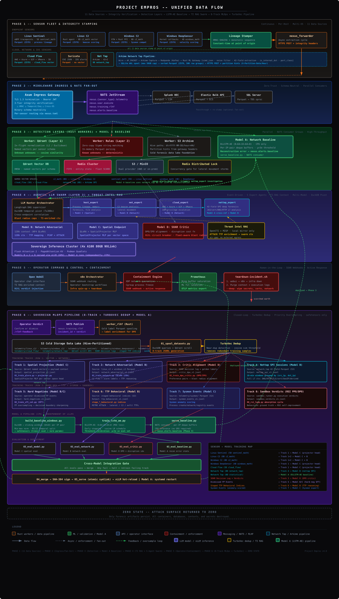

### What is the point of this project?

The future of cybersecurity is defined by autonomous, machine-speed engagements where AI-driven offensive agents (Red AI) clash with AI-driven **defensive systems (Blue AI)**. Because human-operated tools can no longer keep pace with the scale of modern cyberattacks, artificial intelligence is now the primary driving force on both sides of the digital battleground.

AI is both the master key and the unpickable lock; the winner is simply whoever turns it faster.

### Sensor to LLM Data Flow

> [!NOTE]
> This logical data flow diagram is updated to represent the current architecture.

<p align="center">
  
</p>

---

### Directory Structure:
```bash
PROJECT_EMPROS/
├── analytics/                  # Layer 3 agentic AI swarm
│   └── llm_hunter/             # LangGraph DAG: supervisor + host/net/cloud/nettap experts + review board + response; tools, controls, RAG memory
├── services/                   # Layer 1 & 2 high-speed Rust services
│                               #   core_ingress (Zero-Trust gateway) + workers: qdrant (math tripwires), rules (Sigma), s3_archive, soar, rlhf; shared nexus.toml
├── middleware/                 # Layer 1.5 Rust ETL fanout (own Cargo workspace, config, deploy, certs)
├── libs/                       # Shared Rust libraries (lib_siem_core: schema-neutral structs, NATS/integrity helpers)
├── det_chamber/                # Live acquisition + detonation: engine (Win/Linux sandbox), intake service, agents, config, deploy (isolated IaC)
├── mlops/                      # Sovereign multi-model training & inference pipeline
│                               #   data/ (pcaps, suricata_rules, staging, training, evals) · models/ (base, adapters, baseline) ·
│                               #   scripts/ (stage_* corpora, 0N_* train/eval/serve) · corpus_templates/ (per-TTP) · deployment/ (vLLM quadlets)
├── detection_training/         # SIEM detection content exports: sigma + datadog, elastic-security, google-secops, kql, sentinel_one, splunk, suricata
├── orchestration/              # Top-level deploy driver: templates, pipelines (GitLab CI), scripts (01–07 stages), environments (dev/prod)
├── infrastructure/             # IaC + config mgmt: ansible (roles, group_vars vault, inventory), terraform (aws/vmware), certs, haproxy, nats, prometheus, qdrant
├── hardening/                  # Reusable OS-hardening Ansible role (defaults, handlers, tasks, templates)
├── operations/                 # Layer 4 event-driven C&C: ephemeral infra (Traefik+Authentik), n8n SOAR, playbooks (linux/windows), webui, scripts
├── deployment_prep/            # Air-gap bundle builder: image manifests, scan, scripts, requirements (Docker + Podman)
├── tests/                      # 550+ tests: offline contract suites, docker lab harnesses (lab_*), simulation red-team playbooks, Rust integration
├── docs/                       # Reference docs & living trackers: infrastructure_specifications, security_controls,
│                               #   nist_ai_600_1_control_tracker, mlops_pipeline, mlops_maturation_plan
├── planning_docs/              # Consolidated BACKLOG.md (open items) + plan docs (Det Chamber, performance, test labs, ADDON) + archive/
├── change_logs/                # Detailed codebase changelogs (changelog_DDMONYY.md)
├── img/                        # Architecture/flow diagrams (SVG + planning_diagrams)
└── data/                       # Runtime data scratch (gitignored)
```

---

### Core Architecture: The Autonomous Triad

Sentinel Nexus operates on a multi-tier correlation engine designed to shift the kill chain left, eliminating the noise of 50,000+ endpoints and delivering deterministic attack graphs at machine speed.

**1. Layer One: Vector Tripwires (The Unknown Unknowns)**
High-speed mathematical filtering via Qdrant. Edge agents stream multi-dimensional UEBA telemetry (5D Sentinel, 8D C2) directly into memory-mapped HNSW indices. This layer triggers on purely behavioral anomalies (e.g., high-entropy execution followed by low-jitter beaconing) using Cosine similarity, catching zero-days and LotL attacks that bypass standard signatures.

**2. Layer Two: Deterministic Engine (The Known Unknowns)**
A zero-copy Rust worker (`worker_rules`) subscribed natively to the NATS JetStream Parquet bus. It performs high-speed, in-memory string evaluation against known IoCs and Sigma-style rules (e.g., specific DGAs, `uid=33` executing `wget`). Matches are pushed instantly to a distributed Redis queue.

**3. Layer Three: The Agentic Closer (LLM RAG Pivot)**
The `llm_hunter` daemon continuously monitors both the Qdrant anomalies and the Redis deterministic queue. Upon receiving a trigger, the LLM executes a time-bounded pivot against the historical Parquet data, extracting the correlated network flow and host execution to generate a zero-hallucination, definitive attack narrative.

**4. Sovereign Threat Intelligence (Air-Gapped OpenCTI)**
A permanent, air-gapped OpenCTI 6.8 STIX platform running on the `ti` tier (10.0.90.x). No external connectors. Pre-loaded with the MITRE ATT&CK enterprise bundle on first deploy. Agents query it via `ti_lookup.py` → `OpenCTIProvider` (GraphQL) to enrich observables with kill-chain phases, malware families, threat actor attribution, and TLP markings -- without leaving the sovereign environment. External TI providers (VirusTotal, AbuseIPDB, OTX, X-Force, GreyNoise) are also supported when API keys are available but are never required.

---

## End Game

### Sentinel Nexus: End-State Sovereign Multi-Model Architecture

### 1. Architectural Overview & Strategic Intent

The ultimate operational state of the Sentinel Nexus ecosystem utilizes a **Federated Swarm Topology**. Relying on a single Large Language Model (LLM) to perform network baseline anomaly detection, endpoint payload analysis, and automated containment evaluation introduces latency, context-window saturation, and logic degradation.

By organizing distinct, specialized neural networks (both generative and unsupervised) into a Directed Acyclic Graph (DAG), the architecture scales deterministically. This document details the technical specifications and integration points of the four primary models operating within the air-gapped environment.

---

### 2. System Integration Topology (The Multi-Model DAG)

<p align="center">
  
</p>

---

### 3. Detailed Model Specifications

#### Model A: The Network Baseline Engine (Math Tripwire)

* **Purpose:** Establish the mathematical definition of "normal" organic network traffic and trigger downstream generative analysis strictly upon deviation. Generative LLMs cannot inspect every network packet; this model acts as the high-throughput, low-latency pre-filter running ahead of the entire swarm.
* **Architecture:** Bidirectional LSTM Autoencoder -- encoder `BiLSTM(8→64) → Linear(128→32)`, decoder `BiLSTM(32→64) → Linear(128→8)`. Small enough (~1 MB weights) to run inference on CPU at wire speed with no GPU dependency.
* **Data Input:** 8-dimensional normalized flow feature vectors extracted from network_tap SPI events: `byte_ratio`, `avg_inter_arrival`, `variance_inter_arrival`, `ratio_small_packets`, `ratio_large_packets`, `payload_entropy`, `session_duration_ms`, `packets_src`. Per-feature min/max normalization parameters are computed at training time and saved alongside the weights.
* **Execution Logic:** Consumes events from NATS JetStream (`nexus.network_tap.telemetry`). Maintains per-IP-pair sliding window buffers (LRU-evicted, up to 500k tracked pairs for 50k+ endpoint deployments). Runs reconstruction inference every `stride` flows. Reconstruction error is compared against the calibrated μ+3σ threshold.
* **Trigger Condition:** When MSE exceeds the threshold, an anomaly alert is published to `nexus.alerts.baseline` containing the src/dst IP pair, reconstruction error, and normalized anomaly score. The `nettap_expert` swarm agent picks up this signal for L7 forensic analysis.
* **Deployment:** Runs on the **analytics node** (CPU-only) via `baseline-detector.service` Podman Quadlet. Co-located with the LLM Hunter swarm -- no GPU required.

#### Model B: The Adversarial Pattern Classifier

* **Purpose:** Classify adversarial network intent across two complementary domains -- C2 beacon/exfiltration flow statistics and full 42-field Layer 7 session forensics -- producing deterministic MITRE ATT&CK attribution with containment recommendations.
* **Architecture:** Configurable via `mlops/model_config.toml` (`[models.b]`). Default: **Llama-4 Scout 17B-16E** (17B active / 109B total MoE), QLoRA fine-tuned in 4-bit NF4 quantization. Long context well beyond the 128k session-array requirement; only 17B params active per token keeps inference cost near the prior 24B dense while the MoE holds broader learned coverage. Served 4-bit (`QUANTIZATION=bitsandbytes`) — the 109B weight set does not fit GPUs 0-1 in bf16. *(Promoted 2026-07 from Mistral Small 3.1 24B; VRAM fit + adapter-layer compatibility pending GPU validation on Node Beta — see `[models.b]` notes.)*
* **Training Corpus (Dual-Track Curriculum):**
  * **Track 2 (C2 Beacons):** Linux/Windows C2 flow statistics (jitter CV, outbound ratio, DGA entropy, beacon interval) with MITRE TTP labels derived from live S3 archives. Eval gate: ≥98% TTP mapping accuracy.
  * **Track 4 (Nettap SPI):** Full 42-field L7 session windows with derived analyst responses: JA3 fingerprint analysis, TLS certificate anomalies, DNS tunneling indicators, ephemeral port usage, lateral movement classification. Eval gate: ≥95% forensic quality.
* **Integration Points:**
  * `net_expert` agent -- C2 flow analysis: jitter/beacon/exfil/DGA detection against `linux_c2`/`windows_c2` telemetry and Suricata IDS correlation.
  * `nettap_expert` agent -- Full-PCAP L7 session forensics including Model A baseline cross-reference path.
* **Deployment:** `vllm-network.service` on **Compute Node Beta GPUs 0-1** (160 GB NVLink). `tensor_parallel_size=2`, `max_model_len=131072`, `enforce_eager=false` for maximum PagedAttention KV cache throughput. Port 8001.

#### Model C: The Spatial Endpoint Expert

* **Purpose:** Execute deep forensic evaluation on host operating systems (Windows/Linux) when triggered by `worker_qdrant` math anomalies or Sigma/YARA rule matches, with the unique ability to "sense" raw sensor-space geometry directly in its latent state before processing text.
* **Architecture:** Configurable via `mlops/model_config.toml` (`[models.c]`). Default: **Llama-3.1 8B Instruct**, QLoRA fine-tuned with a **Multi-Head SpatialProjector** -- named MLP projection heads per sensor vector space mapping sensor math into the model's embedding space (dimension set by `model_c_hidden_dim`, default 4096 for Llama-3.1-8B):
  * `c2_math` (8D) → `hidden_dim` -- Windows/Linux C2 flow behavioral vector
  * `sentinel_math` (5D) → `hidden_dim` -- Linux Sentinel process anomaly vector
  * `windows_math` **(6D)** → `hidden_dim` -- Sysmon sensor: command_entropy, parent_child_score, integrity_score, anomaly_score, **grant_access_score** (EventID 10), **driver_trust_score** (EventID 6/7)
  * `deepsensor_math` **(4D)** → `hidden_dim` -- Windows DeepXDR EdrRow UEBA: score, avg_entropy, max_velocity, event_count
  * `trellix_math` **(4D)** → `hidden_dim` -- Trellix ENS proxy: severity_score, threat_score, action_score, anomaly_score
  * `cloud_flow` (5D) → `hidden_dim` -- Cloud VPC/audit behavioral vector
  * `network_tap` (8D) → `hidden_dim` -- Network tap statistical feature vector
  * `embedding_384` (384D) → `hidden_dim` -- Dense semantic embedding (MiniLM, golden dataset proxy)
* **Training Corpus:** Track 1 -- Qdrant vector+context pairs per named vector space with explicit `vector_name` routing; per-head gradient tracking ensures each projection head receives training signal. Also trained on all 13 TTP behavioral corpora (**3,730 SFT records, 266 active classes** -- 12 TTP phase corpora + cross-source temporal) for host forensic pattern recognition.
* **Integration Point:** `host_expert` agent -- receives process execution metadata with UEBA math vectors spliced at the `<|spatial_vector|>` token position. Outputs host-isolation recommendations, process termination lists, and lateral movement indicators.
* **Deployment:** `vllm-inference.service` on **Compute Node Beta GPUs 2-3** (160 GB NVLink, shared with Model D). Port 8000.

#### Model D: The SOAR Critic (Blast Radius Evaluator)

* **Purpose:** Serve as the final autonomous decision gate before any containment action is dispatched. Weighs confirmed threat evidence against operational blast radius -- preventing catastrophic self-inflicted outages from over-eager containment of critical infrastructure.
* **Architecture:** Configurable via `mlops/model_config.toml` (`[models.d]`). Default: **Gemma-3-9B**, fine-tuned with **Direct Preference Optimization (DPO/IPO)**. At 9B (~18GB VRAM bf16) it trades some of the 4B's headroom on the GPU pair shared with Model C for stronger edge-case blast-radius reasoning. IPO is selected over standard DPO for its stability in constrained, low-cardinality decision spaces. The model outputs exactly one of three decision tokens: `CONFIRM_QUARANTINE`, `MANUAL_REVIEW`, or `DISMISS_FALSE_POSITIVE`. *(Promoted 2026-07 from Gemma-3-4B; re-check the shared-GPU VRAM budget vs Model C — see `[models.d]` notes.)*
* **Training Corpus:** DPO preference pairs -- threat-based, governance-based, and baseline-triggered categories. Category 4 hard negatives (TP look-alikes that should be dismissed) are generated from the TTP behavioral corpus FP records.
* **Execution Logic:** The `response.py` agent computes the `DisruptionIndex = Σ(AssetValue x ContainmentImpact)` for the proposed target set. The critic **fails CLOSED** -- if the server is unreachable, the verdict is automatically demoted to `manual_review_required`.
* **HitL Circuit Breaker:** `CONFIRM_QUARANTINE` is overridden to `manual_review_required` if: DisruptionIndex > 0.5, any target has AssetValue ≥ 0.9, or the target set covers > 20% of the known fleet.
* **Deployment:** `vllm-critic.service` on **Compute Node Beta GPUs 2-3** (shared with Model C, `gpu_memory_utilization=0.45`). Temperature 0, `max_tokens=16`. Port 8002.

---

### 3a. Candidate Model Reference

Model selection is fully configurable via `mlops/model_config.toml` and `NEXUS_MODEL_*` environment variables. The tables below document every model evaluated for each role against the specific demands of an **Agentic AI Swarm SOC** operating at 50,000+ endpoint scale with sovereign air-gap requirements.

**How to switch:** Update `[models.b]`, `[models.c]`, or `[models.d]` in `mlops/model_config.toml` and re-run `make train-all`. No other file needs changing. For Model C, also update `hidden_dim` if switching to a different architecture family.

**Hardware tiers.** Every candidate below is annotated with the minimum hardware tier it requires. Tiers are defined in [§4 Hardware and Computational Topology](#4-hardware-and-computational-topology):

| Tier | Platform | Aggregate VRAM | Unlocks |
|------|----------|----------------|---------|
| **T1** | 4x A100 80GB NVLink (current) | 320 GB | Everything marked *Active default* today |
| **T2** | 8x H200 141GB or 8x B200 192GB | 1.1–1.5 TB | Dense 70B at bf16, MoE up to ~400B, FP8 KV cache (B200 only) |
| **T3** | GB300 NVL72 (72x B300, 288GB each) | 20.7 TB unified | Frontier-scale MoE (Kimi K3 class), 1M context, on-site LoRA of 2.8T models |

A model's tier is set by **total** parameters, not active ones — an MoE must hold every expert resident even when only a fraction activate per token.

---

#### Model B Candidates -- Network Adversarial Pattern Classifier

**Hard requirements:** Genuine 128k+ context for L7 session arrays · vLLM compatible · QLoRA fine-tunable · Fits the deployed tier's Model B partition

| Model | Params | Context | Tier | Key strength for this role | Key weakness | Status |
|-------|--------|---------|------|---------------------------|--------------|--------|
| **Llama 4 Scout** | 17B active / 109B MoE | 10M | T1 (4-bit) / T2 (bf16) | Effectively unlimited context for session arrays; only 17B active params/token; broad MoE coverage | Served 4-bit to fit 2xA100; adapter targets must be re-verified against MoE attention names | **Active default** |
| Mistral Small 3.1 24B | 24B | 128k | T1 | GQA-backed long-context (improved over Nemo SWA), strong structured JSON, 24B reasoning depth | Larger than Nemo -- more VRAM per inference slot | Previous default |
| Mistral-Nemo 12B (Jul 2024) | 12B | 128k SWA | T1 | Lighter, fast inference | SWA degrades effective recall past ~32k -- Track 4 windows often exceed this | Previous default |
| Gemma 3 27B (Mar 2025) | 27B | 128k | T1 | Google post-training quality, excellent structured output | 3B larger than Small 3.1, slightly tighter VRAM budget at 128k | Alternative |
| Qwen2.5-14B (Sep 2024) | 14B | 128k | T1 | Best-in-class RULER long-context score at weight class, excellent JSON fidelity | Smaller than Nemo at same task complexity | Alternative |
| Llama-3.3-70B | 70B | 128k | T2 | Dense 70B reasoning depth on full-session forensics without MoE routing variance | ~140 GB at bf16 -- needs a dedicated H200/B200 pair, no longer shares the node | T2 upgrade |
| **Kimi K3** | 104B active / 2.8T MoE | 1M | **T3** | Frontier reasoning over whole-campaign session arrays; Kimi Delta Attention cuts long-context inference cost ~6x; native multimodal (PCAP graphs, screenshots) | 1.4 TB of MXFP4 weights; MXFP4 needs Blackwell-class FP4 silicon; not QLoRA-tunable on-site below T3 | See §3b |

---

#### Model C Candidates -- Spatial Endpoint Expert

**Hard requirements:** HF Transformers `inputs_embeds` path (no vLLM) · `hidden_dim` must match `model_c_hidden_dim` in config · QLoRA fine-tunable

> **Model C is constrained by architecture, not hardware.** The SpatialProjector injects UEBA vectors through `inputs_embeds`, which requires the HF Transformers path and a base whose `hidden_size` matches the projector's `output_dim`. No hardware tier relaxes this. Frontier MoE models (Kimi K3 and peers) are not candidates for this role at any budget — a projector rebuild plus full retrain is a training project in its own right, and MoE routing makes the injected-vector path unproven. Scaling Model C means moving up the `hidden_dim` ladder below and budgeting the projector retrain.

| Model | Params | Context | `hidden_dim` | Projector change? | Key strength | Status |
|-------|--------|---------|--------------|-------------------|--------------|--------|
| **Llama-3.1-8B** | 8B | 128k | 4096 | None | Direct upgrade from Llama-3-8B: 8k→128k context, same architecture, zero projector work | **Active default** |
| Llama-3-8B (Apr 2024) | 8B | 8k | 4096 | None | Well-tested base | 8k context truncates long process trees | Previous default |
| DeepSeek-R1-Distill-Llama-8B | 8B | 128k | 4096 | None | Reasoning distillation -- richer chain-of-thought in forensic analysis | Thinking tokens add output length | Alternative |
| Gemma-3-9B (Mar 2025) | 9B | 128k | 3840 | Yes -- set `hidden_dim=3840` + retrain projector | Strong instruction quality, newer training data | Alternative |
| Qwen2.5-7B (Sep 2024) | 7B | 128k | 3584 | Yes -- set `hidden_dim=3584` + retrain projector | Smaller, strong structured output | Alternative |
| Llama-3.3-70B | 70B | 128k | 8192 | Yes -- set `hidden_dim=8192` + retrain projector | Substantially better forensic reasoning | Future |

---

#### Model D Candidates -- SOAR Critic (Blast Radius Evaluator)

**Hard requirements:** DPO/IPO alignable · Shares GPU 2-3 with Model C -- smaller = more headroom · Deterministic 3-class output

> **Bigger is not better here.** Model D emits one of three tokens (`CONFIRM`/`MANUAL_REVIEW`/`DISMISS`) over a 4k window. Its quality ceiling is set by DPO alignment on the blast-radius preference set, not by base-model scale. Frontier models are a poor fit for this role regardless of budget: they add latency to the containment gate — the one path where a human is waiting — and cannot be DPO-aligned on-site at T3 scale. Spend a larger hardware budget on Model B and on the preference corpus, not on this slot.

| Model | Params | Context | VRAM @bf16 | Key strength | Key weakness | Status |
|-------|--------|---------|-----------|--------------|--------------|--------|
| Gemma-3-4B | 4B | 128k | ~8 GB | Smallest viable option -- frees ~8 GB vs 8B models on shared GPU; Google instruction quality is strong at 4B | Edge-case blast-radius reasoning at 4B is weaker than larger models | Previous default |
| Phi-4-mini 3.8B (Feb 2025) | 3.8B | 128k | ~7.5 GB | Exceptional reasoning-per-parameter ratio; smallest VRAM footprint | Less proven for DPO alignment in SOC context | Alternative |
| **Gemma-3-9B** | 9B | 128k | ~18 GB | Better edge-case reasoning; same family as prior default | Nearly 2.5x VRAM of Gemma-3-4B — re-check shared-GPU budget vs Model C | **Active default** |
| Qwen2.5-7B (Sep 2024) | 7B | 128k | ~14 GB | Excellent structured decision-making, strong DPO results | 6 GB more than Gemma-3-4B on shared GPU | Alternative |
| Llama-3.1-8B | 8B | 128k | ~16 GB | Same family as Model C -- shared base download | Largest of the practical options for shared GPU | Alternative |
| Llama-3.3-70B | 70B | 128k | ~140 GB | Highest reasoning quality for difficult blast-radius edge cases | Requires dedicated GPU node | Future |

---

### 3b. Frontier-Scale Models (Kimi K3 Class) -- Unconstrained Budget

This section answers a specific question: *if cost is not a constraint and maximum reasoning and training capacity is the goal, what changes?* The short answer is that the hardware ceiling moves, the **architectural** constraints do not, and the right place to spend is narrower than it first appears.

#### The reference frontier model

**Kimi K3** (Moonshot AI, open weights July 2026) is the current ceiling for a self-hostable model: 2.8T total / 104B active MoE, 1M-token context, native multimodal, Modified MIT license. Weights ship MXFP4 at roughly 1.4 TB. Kimi Delta Attention is the architectural advance that makes million-token serving tractable rather than theoretical.

Two properties matter more than the benchmark scores:

* **Total, not active, params set the memory floor.** 104B activate per token, but all 2.8T must be resident. This is the same rule that already governs Llama-4 Scout on T1 — it just lands 25x further out.
* **MXFP4 is silicon-dependent.** FP4 microscaling has native tensor-core support on Blackwell (B200/B300) and MI350X/MI355X. On Ampere and Hopper there is no native FP4 path, so the weights dequantize to bf16 and the 1.4 TB footprint balloons past 5 TB. **A100s cannot run this model at any quantization.** T3 is a silicon-generation requirement, not only a capacity one.

#### Serving topologies

Published vLLM and SGLang reference topologies for K3, all landing in the 2.3–3.1 TB aggregate range (1.4 TB weights plus KV cache, activations, and concurrency headroom):

| Topology | GPUs | Aggregate VRAM | Notes |
|----------|------|----------------|-------|
| B300 1x8 | 8x 288GB | 2.3 TB | Densest single-node option; native FP4 |
| MI355X 1x8 | 8x 288GB | 2.3 TB | AMD equivalent; ROCm vLLM path |
| GB300 2x4 | 8x 288GB | 2.3 TB | NVLink-coherent across the pair |
| B200 2x8 | 16x 192GB | 3.1 TB | Two nodes; needs fast inter-node fabric |
| H200 2x8 | 16x 141GB | 2.3 TB | **No native FP4** -- dequantization cost applies |
| H100 4x8 | 32x 80GB | 2.6 TB | Four nodes; communication-bound |

For production serving under real concurrency the practical floor is **64+ accelerators** — enough to form a communication domain that sustains throughput rather than merely loading the weights. A single **GB300 NVL72** (72x B300, 20.7 TB unified NVLink domain at 130 TB/s) is the cleanest fit: it holds K3 with room left over to co-resident Models B, C, and D on the same coherent fabric, eliminating the hard GPU partition that T1 requires.

#### What an unlimited budget does *not* buy

Three constraints survive T3, and they are the ones that actually shape the architecture:

1. **You still cannot fine-tune K3 on-site in any meaningful sense.** LoRA against a resident 2.8T base is feasible on an NVL72. A *full* fine-tune is a multi-rack, multi-week job — the domain adaptation that makes Models B and D valuable does not transfer to this scale. The fine-tuned 17B–70B models are not a compromise you escape by spending more; they are where the domain knowledge lives.
2. **Model C is closed to frontier models permanently** (see the note in §3a) — `inputs_embeds` injection is an architectural requirement, not a capacity one.
3. **Air-gap discipline is unchanged.** K3's permissive license allows sovereign self-hosting, but the model must be staged offline with SHA-384 manifests like every other base. Reaching for a hosted K3 API to avoid the hardware bill breaks the zero-egress invariant and is not an option this architecture supports.

#### Recommended T3 architecture

Do **not** substitute K3 into the B/C/D slots. Adopt it as a fifth role and keep the fine-tuned specialists:

* **Model E -- Campaign Reasoner (new).** K3 serving the LLM Hunter swarm's top-level orchestration: cross-investigation correlation, whole-campaign narrative synthesis over 1M-token windows spanning weeks of telemetry, and multimodal review of PCAP visualizations and analyst screenshots. This is work no current model in the swarm can do at all, rather than work they do less well.
* **Models B/C/D stay fine-tuned and specialized**, promoted to their T2 variants (Llama-3.3-70B for B, the `hidden_dim=8192` projector rebuild for C). They remain the latency-sensitive hot path.
* **K3 as offline teacher.** The highest-leverage use even before T3 hardware lands: run K3 on rented Blackwell capacity *outside* the enclave to generate labeled reasoning traces, then carry the **dataset** across the air gap — never the model — via `05_synthetic_data_gen.py`. This upgrades B and D on existing T1 hardware and preserves zero-egress.

#### Training tier

Maximum training capacity is a separate budget from inference. The analytics node currently doubles as the training node (CPU-only); at T2 and above this must split:

| Workload | T1 (current) | T2 | T3 |
|----------|--------------|----|----|
| Model A (BiLSTM-AE) | CPU, analytics node | unchanged | unchanged |
| Model B/D QLoRA | 2x A100 80GB, shared with serving | 8x H200 dedicated training node | 8x B300, or a partition of the NVL72 |
| Model C + projector retrain | not budgeted | 8x H200 (`hidden_dim=8192` rebuild) | same |
| K3 LoRA | not possible | not possible | GB300 NVL72, weeks-scale |
| K3 full fine-tune | not possible | not possible | **out of scope at single-site scale** |

Serving and training must not share GPUs above T1 — a training run that evicts a serving KV cache takes the containment gate offline mid-investigation.

---

### 4. Hardware and Computational Topology

The quad-model architecture runs across two physically separate compute tiers. Strict GPU-to-model allocation prevents VRAM contention and ensures each model's latency budget is met under concurrent investigation load.

The specifications below describe **Tier 1**, the deployed baseline. T2 and T3 upgrade paths are in [§4a](#4a-hardware-tier-upgrade-paths); the model capabilities each tier unlocks are in [§3a](#3a-candidate-model-reference) and [§3b](#3b-frontier-scale-models-kimi-k3-class----unconstrained-budget).

#### The Inference Cluster Specifications

* **Analytics Node (CPU -- Model A + LLM Swarm):**
  * **Workload:** Model A BiLSTM-AE baseline detector (CPU inference) + the full LLM Hunter swarm orchestrator (LangGraph DAG, DuckDB pivots, Qdrant vector search, OpenCTI TI enrichment). Also the MLOps training node -- runs data spooling, all training tracks, evaluation gates, and OCI artifact push.
  * **Hardware:** CPU-optimized node. Recommended: `r6i.2xlarge` (AWS) or equivalent -- 64 GB RAM, 8 vCPU, NVMe scratch for DuckDB S3 queries. **No GPU required.**
  * **Memory Profile:** Dominated by DuckDB in-memory Parquet scans and Qdrant client connections. The BiLSTM-AE weights are under 1 MB.

* **Compute Node Beta (Generative Swarm -- 4x A100 80GB NVLink):**
  * **Workload:** Models B, C, and D -- the three fine-tuned LLM inference servers.
  * **Hardware:** 4x NVIDIA A100 80GB, interconnected via NVLink for high-bandwidth tensor sharding. 320 GB total VRAM.
  * **GPU Allocation (hard partition):**

| GPUs | Service | Role | Framework | `tensor_parallel` | VRAM Budget |
|------|---------|------|-----------|-------------------|-------------|
| 0, 1 | `vllm-network.service` | Model B -- Network Adversarial | vLLM AsyncEngine | 2 | scales with `MODEL_B_BASE` weights + 128k KV |
| 2, 3 | `vllm-inference.service` | Model C -- Spatial Endpoint Expert | HF Transformers (`device_map=auto`) | n/a | capped at `HF_MAX_MEMORY_PER_GPU` (default 36 GiB) |
| 2, 3 | `vllm-critic.service` | Model D -- SOAR Critic | vLLM AsyncEngine | 2 | `GPU_MEMORY_UTILIZATION=0.45` -- shared with C |

* **Threat Intelligence Node (TI -- OpenCTI Stack):**
  * **Host:** `10.0.90.10` (`ti` Ansible group)
  * **Workload:** Air-gapped OpenCTI 6.8 + Elasticsearch 8.19 + RabbitMQ 4.1 + MinIO. Runs permanently alongside core infra -- not ephemeral.
  * **Access:** Analytics agents query `http://10.0.90.10:8080/graphql` (HAProxy-proxied) using the read-only `OPENCTI_AGENT_TOKEN`. No external network access required after initial MITRE ATT&CK bundle import.

### 4a. Hardware Tier Upgrade Paths

Three provisioning targets. T1 is deployed; T2 and T3 are specified so a budget decision maps directly onto a model roster rather than a vague "more GPUs".

| | **T1 -- Baseline (deployed)** | **T2 -- Performance** | **T3 -- Frontier** |
|---|---|---|---|
| **Accelerators** | 4x A100 80GB SXM4 | 8x H200 141GB or 8x B200 192GB | GB300 NVL72 (72x B300 288GB) |
| **Aggregate VRAM** | 320 GB | 1.1 TB (H200) / 1.5 TB (B200) | 20.7 TB unified |
| **Interconnect** | NVLink, 600 GB/s bidirectional | NVLink 4/5 within node | NVLink 5, 130 TB/s, 72-GPU coherent domain |
| **FP4 native** | No | B200 only | Yes |
| **Power (GPU only)** | 1.6 kW | ~5.6 kW (H200) / ~8 kW (B200) | ~120 kW per rack |
| **Cooling** | DLC recommended | DLC required | **DLC mandatory**, facility-level |
| **Serving/training split** | Shared (training evicts serving) | Separate training node required | Partitioned within the NVL72 domain |
| **Model B** | Llama-4 Scout @ 4-bit | Llama-3.3-70B @ bf16 or Scout @ bf16 | Llama-3.3-70B @ bf16 (hot path) |
| **Model C** | Llama-3.1-8B (`hidden_dim` 4096) | Llama-3.3-70B + projector rebuild (8192) | same as T2 |
| **Model D** | Gemma-3-9B, shared GPUs | Gemma-3-9B, dedicated slice | same as T2 |
| **Model E** | n/a | n/a | **Kimi K3** -- campaign reasoner, 1M context |
| **Frontier LoRA** | No | No | Yes (weeks-scale) |

**Facility prerequisites above T1.** These are the constraints that actually gate a T3 build, and they are not procurement line items:

* **Power.** A GB300 NVL72 rack draws ~120 kW. Standard enterprise cabinets are provisioned for 5–15 kW. This is a datacenter electrical project with a lead time measured in quarters, not a hardware order.
* **Cooling.** Direct liquid cooling is mandatory at T3 — air cooling cannot remove 120 kW from a single rack. Requires facility water loop, CDUs, and leak detection.
* **Floor loading.** A populated NVL72 exceeds 1,400 kg in a single rack footprint.
* **Air-gap unchanged.** Every tier keeps the sovereign posture from §5: offline weight staging with SHA-384 manifests, `TRANSFORMERS_OFFLINE=1`, no outbound calls at runtime. Larger hardware does not relax any control — it enlarges the attack surface that those controls cover.

**Recommended sequencing.** If the budget is genuinely unconstrained, the ordering that produces capability soonest is *not* buying T3 first:

1. **Rent Blackwell capacity off-site now** and run K3 as an offline teacher (§3b). This improves Models B and D on the existing T1 cluster within one training cycle, with no facility work.
2. **Provision T2** as a dedicated training node, unblocking the Model C projector rebuild and the Llama-3.3-70B promotion — both of which are currently listed as unbudgeted.
3. **Commission T3** in parallel with the facility work, on the understanding that its unique contribution is Model E, a capability the swarm does not have today, rather than a faster version of what it already does.

### 5. Security & Isolation Controls

* **Prompt Injection Defense:** All adversary-controlled strings (command lines, DNS queries, file paths) retrieved from S3/Qdrant are HTML-escaped and wrapped in `<untrusted_payload>` tags by the DuckDB and Qdrant tools before reaching any LLM prompt. Every system prompt explicitly forbids obeying instructions found inside those tags. A per-investigation canary token is injected into agent prompts as a leak tripwire -- detection halts the SOAR pipeline.
* **Containerized Air-Gap:** All inference ports bind strictly to the `deepnet` overlay network. `TRANSFORMERS_OFFLINE=1` and `HF_DATASETS_OFFLINE=1` are set in every inference container -- no model can initiate outbound network calls at runtime.
* **Sovereign Threat Intelligence:** OpenCTI runs fully air-gapped (no external connectors). The analytics agents' TI enrichment path (`ti_lookup.py` → OpenCTIProvider → OpenCTI GraphQL) never leaves the sovereign network. External TI providers (VirusTotal etc.) are opt-in via API key environment variables only.
* **Model Checkpoint Integrity (ATLAS AML.T0044):** All `.safetensors` weight files are SHA-384 hashed at training time and verified before any weights are loaded into VRAM. Pickle-based weight files (`.pt`, `.pth`, `.bin`) are explicitly banned -- any detection halts the service with a `SECURITY BREACH` log entry. The per-version SHA-384 manifest is written by `make publish` and re-verified by the serving-plane `model_steward` before any swap.
