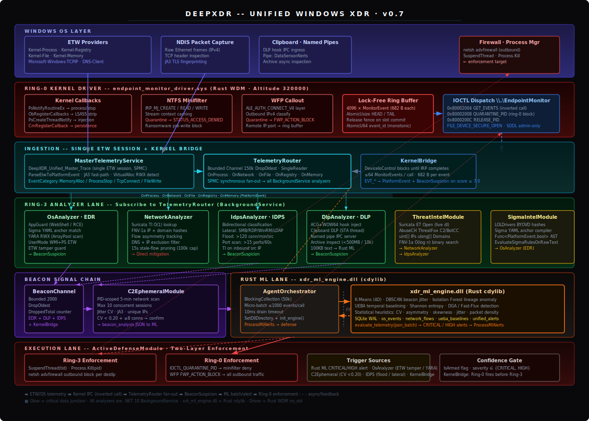

# DeepXDR -- Unified Windows XDR Agent

**Version:** 0.0.7 &nbsp;|&nbsp; **Platform:** Windows x64 &nbsp;|&nbsp; **Runtime:** .NET 10 + Rust (cdylib + WDM)

> [!NOTE]
> This repo is a backup (behind current dev version), a historical reference for in case recovery to a point in time is needed.

Converges four legacy standalone sensors (`edr_sensor`, `c2_sensor`, `dlp_sensor`, `idps_sensor`) into a single .NET 10 Windows Service backed by a native Rust ML engine and an optional ring-0 enforcement driver. One ETW session, one ML pipeline, five configurable detection modules, two enforcement layers.

---

## Architecture



---

## Logical Data Flow

```
Windows Kernel Events
 ├─ ETW async session ──────────────────────────────────────────────────┐
 └─ Ring-0 synchronous kernel callbacks (process/file/network/registry) │
         │                                                              │
         │  Lock-free ring buffer (4096 × 682-byte MonitorEvent)        │
         │  IOCTL inverted-call (GET_EVENTS blocks until data ready)    │
         ▼                                                              ▼
    KernelBridge                                     MasterTelemetryService
    (C# BackgroundService)                           DeepXDR_Unified_Master_Trace
    EVT_* → PlatformEvent                            ParseEtwToPlatformEvent
         │                                                        │
         └──────────────── TelemetryRouter ◄──────────────────────┘
                          Bounded Channel 150k · DropOldest
                          OnProcess | OnNetwork | OnFile | OnRegistry | OnMemory
                                   │
             ┌─────────────────────┼───────────────────────┼──────────────────┐
             ▼                     ▼                       ▼                  ▼
        OsAnalyzer (EDR)    NetworkAnalyzer         IdpsAnalyzer         DlpAnalyzer
        Sigma · YARA · AppGuard   Suricata TI       Bidirectional        Hook · Clip · Archive
             │                     │                       │                  │
             └────────── BeaconChannel (2000 cap) ─────────┘──────────────────┘
                                   │
                          C2EphemeralModule
                          5-min PID-scoped scan
                          Jitter CV · JA3 · ML context
                                   │
                                   ▼
                    AgentOrchestrator (BlockingCollection 50k)
                    Micro-batch ≤1000 events/call
                                   │ FFI
                                   ▼
                       xdr_ml_engine.dll (Rust cdylib)
                       K-Means · DBSCAN · Isolation Forest · UEBA
                       SQLite WAL: os_events / network_flows / unified_alerts
                                   │
                                   ▼
                         ActiveDefenseModule
                   ┌──────────────┴────────────────┐
                   ▼                               ▼
              Ring-3                           Ring-0
          SuspendThread                  IOCTL_QUARANTINE_PID
          Process.Kill                   → Minifilter ACCESS_DENIED
          netsh firewall                 → WFP FWP_ACTION_BLOCK
```

---

## Module Inventory

| Module | Source sensor | Capabilities |
|---|---|---|
| **OsAnalyzer** (EDR) | `edr_sensor` | AppGuard webshell/RCE; Sigma YAML anchor match; YARA RWX (ArrayPool); UserMode WMI+PS ETW; ETW tamper guard |
| **NetworkAnalyzer** | `c2_sensor` | Suricata ET Open + AbuseCH TI; FNV-1a O(log n) lookup; flow asymmetry; DNS/IP exclusions; 15s pruning (100k cap) |
| **IdpsAnalyzer** (IDPS) | `idps_sensor` | Bidirectional Ingress/Egress/Lateral; lateral on SMB/RPC/WinRM/RDP/LDAP/Kerberos; flood >120/min; port scan >15/60s |
| **DlpAnalyzer** (DLP) | `dlp_sensor` | ACG+WOW64 hook inject; clipboard STA; named pipe IPC; archive inspect (500MB/10k guard); 100KB text to Rust ML |
| **C2EphemeralModule** | `c2_sensor` | Idle until BeaconSuspicion; PID-scoped 5-min scan; jitter CV; beacon JSON to ML; max 10 concurrent sessions |
| **KernelBridge** | `ring0_driver` | Inverted-call IPC; 682-byte MonitorEvent parse; QUARANTINE_PID/RELEASE_PID; graceful driver-absent fallback |
| **MasterTelemetryService** | all | Single `DeepXDR_Unified_Master_Trace`; JA3 NDIS fast-path; VirtualAlloc RWX; event-name direction fallback |
| **ThreatIntelModule** | `c2_sensor` / `idps_sensor` | Live Suricata ET C2+Malware+BotCC + AbuseCH ThreatFox; FNV-1a sorted binary-search arrays |
| **SigmaIntelModule** | `edr_sensor` | LOLDrivers BYOVD hashes; Sigma YAML anchor-string compiler; `EvaluateSigmaRulesOnRawText` |
| **AgentOrchestrator** | all | `xdr_ml_engine.dll` FFI; 1000-event micro-batching; Rust alert dispatch |
| **ActiveDefenseModule** | all | Ring-0 quarantine (kernel) → Ring-3 suspend/kill → firewall block (ordered) |
| **endpoint_monitor_driver.sys** | `ring0_driver` | PsNotify, ObCallbacks (LSASS+strip 7 rights), Minifilter, WFP (ALE_AUTH_CONNECT_V4), lock-free ring buffer |

---

## Beacon Suspicion Triggers

EDR, IDPS, DLP, and KernelBridge each publish to `BeaconChannel` when behavioral confidence crosses a threshold, activating a 5-minute PID-focused C2 investigation scan.

| Code | Score | Source | Description |
|---|---|---|---|
| `YARA_RWX:<rule>` | 8.5 | EDR | YARA hit on RWX memory (ArrayPool-allocated scan) |
| `WEB_SHELL_DETECTED` | 9.5 | EDR | Shell spawned by web daemon (AppGuard) |
| `DB_RCE_DETECTED` | 9.5 | EDR | Shell spawned by database daemon |
| `MALICIOUS_PIPE:<name>` | 8.5 | EDR | Known C2 named pipe (Cobalt Strike / Sliver / Mythic) |
| `HIGH_ENTROPY_PIPE` | 7.5 | EDR | Pipe name Shannon entropy > 3.5 |
| `ETW_TAMPER` | 9.5 | EDR | Process attempted to kill/stop ETW session |
| `SIGMA_CRITICAL:<rule>` | 9.0 | EDR | Sigma critical match |
| `SIGMA_USERMODE:<rule>` | 8.5 | EDR | Sigma match on WMI/PowerShell UserMode ETW |
| `DLP_HOOK_HIT` | 8.5 | DLP | `ACTION_REQUIRED` from injected hook DLL |
| `DLP_CLIPBOARD_HIT` | 8.0 | DLP | Clipboard matched DLP patterns |
| `DLP_ARCHIVE_HIT` | 8.0 | DLP | Sensitive content in archive (zip-bomb-guarded) |
| `INGRESS_FLOOD:<src>` | 8.5 | IDPS | >120 connections/min from one source |
| `PORT_SCAN:<src>` | 8.0 | IDPS | >15 distinct destination ports in 60 s |
| `LATERAL_SMB / RDP / WINRM` | 8.5 | IDPS | Private→private lateral movement |
| `IDPS_INGRESS_TI_SRC:<ip>` | 9.5 | IDPS | Inbound connection from Suricata-listed IP |
| `K0_LSASS_ACCESS` | 9.5 | KernelBridge | Ring-0 ObCallback stripped credential-theft access rights |
| `K0_THREAD_INJECT` | 8.0 | KernelBridge | Cross-process thread creation detected by PsThreadNotify |
| `K0_QUARANTINE` | 10.0 | KernelBridge | Minifilter / WFP blocked a quarantined PID |

---

## Configuration -- `DeepXDR_Config.ini`

| Section | Key | Default | Description |
|---|---|---|---|
| `[Agent]` | `DllDirectory` | `C:\ProgramData\DeepSensor\Bin` | Path to `xdr_ml_engine.dll` and `DataSensor_Hook.dll` |
| `[Agent]` | `EnableKernelDriver` | `false` | Enable ring-0 kernel bridge -- requires driver installed |
| `[Agent]` | `EnableHookInjection` | `true` | Enable DLP ring-3 hook injection |
| `[Agent]` | `EnableUebaLedger` | `false` | Write all events to a JSONL forensic log |
| `[Agent]` | `IntelRefreshHours` | `24` | Hours between live TI refreshes |
| `[AppGuardDefinitions]` | `WebDaemons` | `w3wp,nginx,…` | Daemons whose child-shell spawn triggers CRITICAL |
| `[NetworkExclusions]` | `DnsExclusions` | `microsoft.com,…` | Suffix-matched DNS query exclusions |
| `[NetworkExclusions]` | `IpExclusions` | `^127\.,^10\.,…` | Regex IP exclusion patterns |
| `[SuspiciousPaths]` | `SuspiciousPaths` | `\temp\,\programdata\,…` | Launch-path heuristic triggers |

---

## Deployment

**Requirements:** Windows 10/11 or Server 2019+ x64 · Local System · .NET 10 self-contained · `xdr_ml_engine.dll` in `DllDirectory`

```powershell
# Build .NET agent
dotnet publish agent/XdrAgent.csproj -c Release -r win-x64

# Build ring-0 driver (requires WDK + Rust nightly)
cd ring0_driver
cargo build --release --features=registry,threads,objects,network

# Sign driver (EV certificate required for HVCI / Secure Boot)
signtool sign /fd SHA256 /tr http://timestamp.digicert.com /td SHA256 `
    target/release/endpoint_monitor_driver.sys

# Install driver
devcon install driver.inf endpoint_monitor_driver

# Enable in config
# Set EnableKernelDriver = true in DeepXDR_Config.ini

# Install Windows Service
sc.exe create DeepXDR_Service_v0.0.7 binpath="C:\DeepXDR\XdrAgent.exe" start=auto
sc.exe start DeepXDR_Service_v0.0.7
```

---

## Source Sensor Mapping

| Legacy sensor | Ported to | Capabilities consolidated |
|---|---|---|
| `edr_sensor/migration_net10_rust` | `agent/OsAnalyzer.cs` | UEBA, Isolation Forest, YARA, Sigma, AppGuard, ETW tamper |
| `c2_sensor/C2Sensor.cs` | `agent/NetworkAnalyzer.cs` + `agent/C2EphemeralModule.cs` | Suricata TI, JA3, beacon analysis, AppGuard |
| `dlp_sensor/DataSensor.cs` | `agent/DlpAnalyzer.cs` | DLL injection, clipboard DLP, named pipe IPC, archive inspection |
| `idps_sensor/IDPSSensor.cs` | `agent/IdpsAnalyzer.cs` | Bidirectional flows, lateral movement, Ingress flood/scan |
| `planning/v3_dev/ring0_driver/` | `ring0_driver/src/lib.rs` | Minifilter, ObCallbacks, WFP, lock-free ring buffer, IOCTL IPC |
